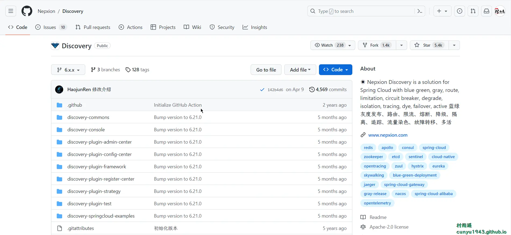
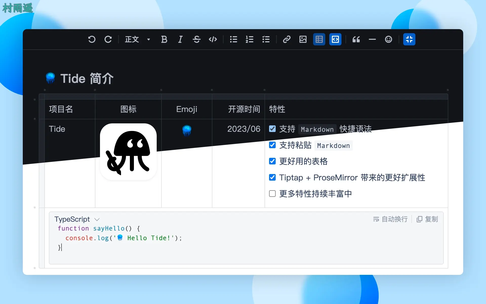
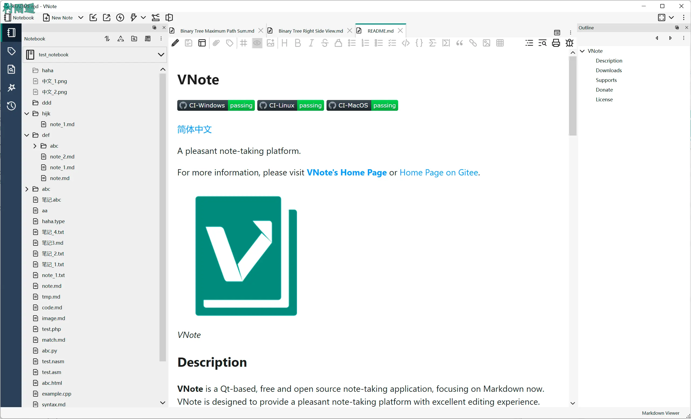
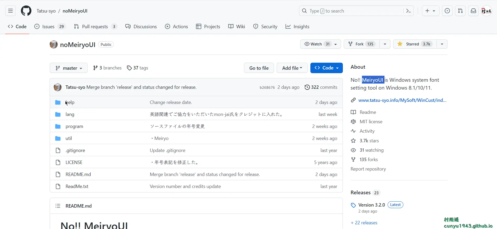
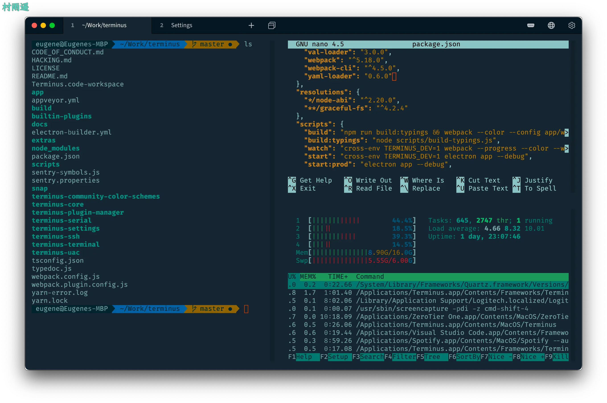
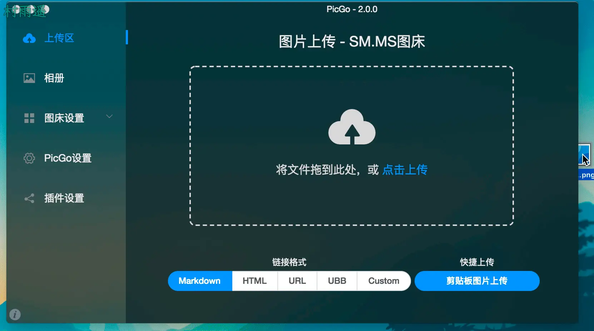
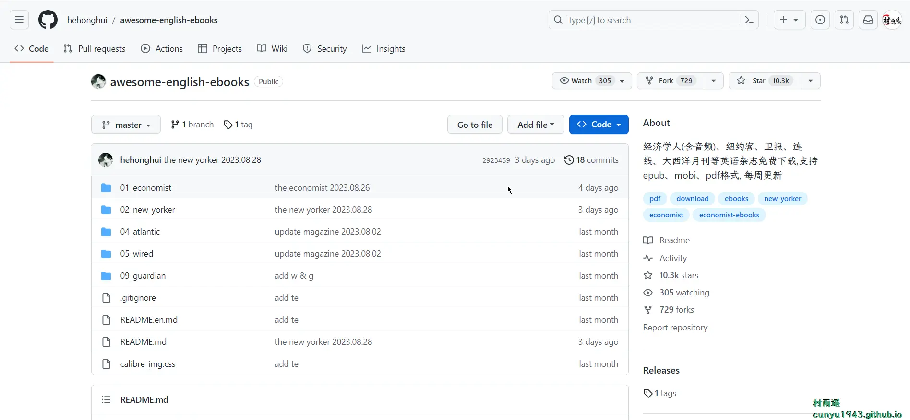
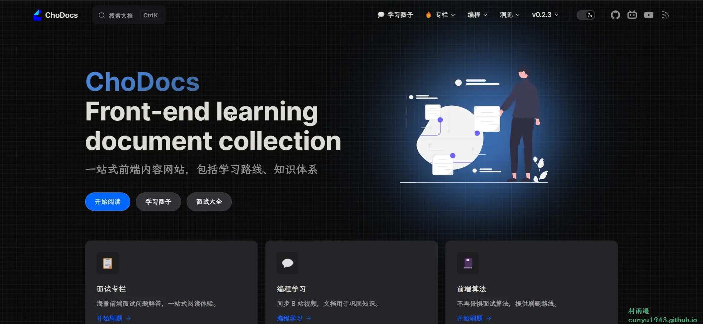
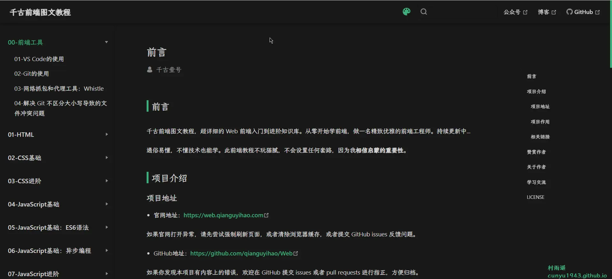

# 好物周刊#21：前端学习资料

::: info 共勉
不要哀求，学会争取。若是如此，终有所获。
:::

::: tip 原文
https://mp.weixin.qq.com/s/p-tN_OM8nbh6IbjF5d6nyw
:::

## 一、项目

### 1. [Discovery](https://github.com/Nepxion/Discovery)

云原生微服务解决方案，支持蓝绿灰度发布、路由、限流、熔断、降级、隔离、追踪、流量染色、故障转移、多活。

### 2. [Tide](https://gitee.com/oschina/tide)

开箱即用、扩展性强、支持 `Markdown` 语法、基础功能完善的 `React` 富文本编辑器。

### 3. [VNote](https://gitee.com/tamlok/vnote)

一个专注于 `Markdown` 的基于 `Qt` 的开源免费的笔记应用，愿景是希望能提供一个拥有完美编辑体验的舒适的笔记平台。支持 `macOS`、`Windows`、`Linux` 三大平台。

## 二、软件

### 1. [noMeiryoUI](https://github.com/Tatsu-syo/noMeiryoUI)

Windows 系统字体修改工具，支持 Windows 8/8.1/10/11 系统的的字体修改，软件只是对主题字体风格设置进行修改，而不是对系统字体本身的渲染、修改，所以无风险，无占用，渲染美化系统字体风格。

### 2. [Tabby](https://tabby.sh/)

一个可高度配置的终端模拟器和 SSH 或串口客户端，支持 Windows，macOS 和 Linux，支持如下功能：

-   集成 SSH，Telnet 客户端和连接管理器
-   集成串行终端
-   定制主题和配色方案
-   完全可配置的快捷键和多键快捷键
-   分体式窗格
-   自动保存标签页
-   支持 PowerShell（和 PS Core）、WSL、Git-Bash、Cygwin、MSYS2、Cmder 和 CMD
-   在 SSH 会话中通过 Zmodem 进行直接文件传输
-   完整的 Unicode 支持，包括双角字符
-   不会因快速的输出而卡住
-   Windows 上舒适的 shell 体验，包括 tab 自动补全（通过 Clink）
-   为 SSH secrets 和设置集成了加密容器
-   SSH、SFTP 和 Telnet 客户端可用作 Web 应用（也可托管）

### 3. [PicGo](https://github.com/Molunerfinn/PicGo)

一个用于快速上传图片并获取图片 URL 链接的工具，目前支持如下图床：

-   七牛图床
-   腾讯云 COS
-   又拍云
-   Github
-   SM.MS
-   阿里云 OSS
-   Imgur

## 三、网站

### 1. [Wappalyzer](https://www.wappalyzer.com/)

一个跨平台程序，能够发现网站上使用的技术。检测网站的内容管理系统、Web 框架、服务器软件、分析工具等等。

### 2. [Photopea](https://www.photopea.com/)

一个在线版的 PhotoShop，支持 PSD、AI、XD、sketch、PDF、XCF、RAW 等多种图片格式。

### 3. [中国亲戚关系计算器](https://passer-by.com/relationship/)

逢年过节遇到三姑六婆，拒绝叫不出口的尴尬！轻松搞定亲戚关系。当前亲戚称呼大全已收录约 **76602** 条亲戚关系。

## 四、插件

### 1. [YouTube Dubbing](https://www.youtube-dubbing.com/)

一个帮你把外语视频变成中文视频的神奇插件，具有如下特点：

-   **中文优化**
-   **多语种支持**
-   **更自然的声音**
-   **多种语音风格**
-   **多平台支持**
-   **视频下载**

### 2. [PT Plugin Plus](https://microsoftedge.microsoft.com/addons/detail/pt-plugin-plus/ekhingnlcjebipkdcgkkheigmljefepn)

一款浏览器插件，主要用于辅助下载 `PT` 站的种子。适用于各 `PT` 站，可使下载种子等各项操作变化更简单、快捷。配合下载服务器（如 `Transmission`、`µTorrent` 等），可一键下载指定的种子。

### 3. [网课小工具](https://chrome.google.com/webstore/detail/网课小工具/kkicgcijebblepmephnfganiiochecfl?hl=zh-CN)

一个超星(学习通)/智慧树(知到)/中国大学 `mooc` 学习工具。支持火狐、谷歌油猴。全自动完成任务，视频倍速秒过，作业考试题库，验证码自动打码。

## 五、资料

### 1. [awesome-english-ebooks](https://github.com/hehonghui/awesome-english-ebooks)

经济学人(含音频)、纽约客、卫报、连线、大西洋月刊等英语杂志免费下载,支持 epub、mobi、pdf 格式, 每周更新。

### 2. [ChoDocs](https://github.com/chodocs/chodocs)

一站式前端内容网站，包括学习路线、知识体系。用专栏形式更新，主要包含以下方面内容：

-   面试专栏
-   编程学习
-   前端算法
-   备忘录
-   学习圈子
-   编程工具
-   技术视野
-   拥抱开源
-   ……

### 3. [Web](https://github.com/qianguyihao/Web)

千古前端图文教程，超详细的前端入门到进阶知识库。从零开始学前端，做一名精致优雅的前端工程师。

## ✍️ 说明

周刊专栏相关信息：

- **项目地址**：[Github](https://github.com/cunyu1943/JavaPark/) | [Gitee](https://gitee.com/cunyu1943/JavaPark/) ，觉得不错麻烦给我一个**Star**，感谢 ❤️
- **浏览地址**：公众号 | [电子书](https://cunyu1943.github.io/) | [电子书（国内）](https://cunyu1943.gitee.io/)

如果你阅读到这里，说明我的工作没有白费。如果你想推荐项目/网站/软件/资源，欢迎提交 **[issue](https://github.com/cunyu1943/JavaPark/issues)** 或者添加我 **个人微信：cunyu1943** 与我交流。

---

## 🎬️ 广告
当前大环境下，就业形势严峻，尤其针对即将毕业的大学生。作为一个技术求职者，求职前应该做好哪些准备呢，一些面试实战技巧也十分有必要！而刚好最近掘金出了一本《技术人求职指南》小册，相信一定会对在找工作的你有所帮助。

从求职到拿下 `Offer`，一本职场的全方位攻略，快来和我一起学习吧！

## ⏳ 联系

想解锁更多知识？不妨关注我的微信公众号：**村雨遥（id：JavaPark）**。

扫一扫，探索另一个全新的世界。

<Share colorful />

