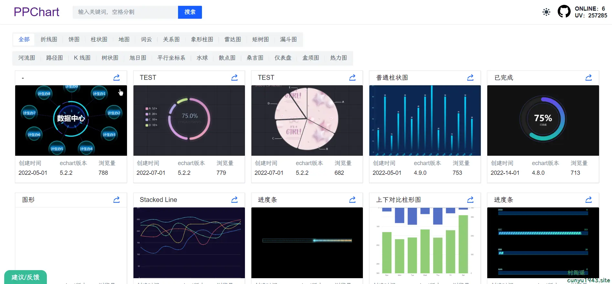
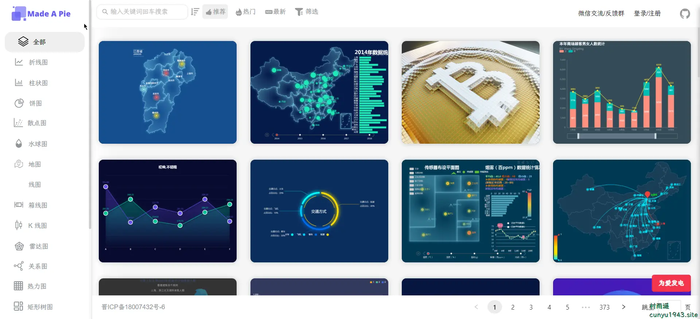
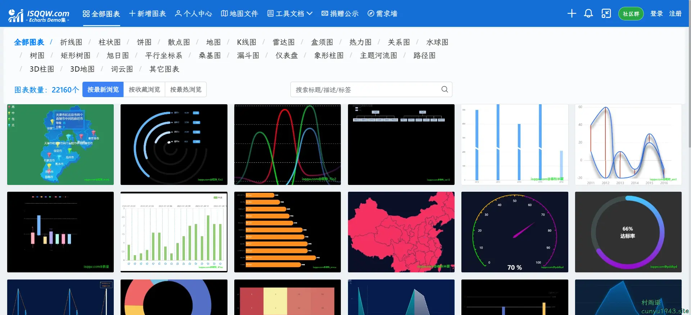

# 好物周刊#22：

::: info 共勉
不要哀求，学会争取。若是如此，终有所获。
:::
::: tip 原文

:::

## 一、项目

## 二、软件

## 三、网站

### [PPChart](http://ppchart.com/#/)

让图表更简单。PPChart 提供 Echarts 收录、图表制作等服务。

### [Made A Pie](https://madeapie.com/#/)

Echarts 图表制作、案例分享、教程分享。汇聚了超多 Echarts 绘制案例，主要有以下类别：

### [ISQQW](https://www.isqqw.com/)

一个 ECharts 图表集，ECharts demo 集，Echarts gallery 社区。同时，在这里还可以分享你的可视化作品。

## 四、插件

## 五、资料

## ✍️ 说明

周刊专栏相关信息：

- **项目地址**：[Github](https://github.com/cunyu1943/weekly/) | [Gitee](https://gitee.com/cunyu1943/weekly/) ，觉得不错麻烦给我一个**Star**，感谢 ❤️
- **浏览地址**：公众号 | [电子书](https://cunyu1943.github.io/weekly)

如果你阅读到这里，说明我的工作没有白费。如果你想推荐项目/网站/软件/资源，欢迎提交 **[issue](https://github.com/cunyu1943/weekly/issues)** 或者添加我 **个人微信：cunyu1943** 与我交流。

---

## 🎬️ 广告
作为程序员，掌握数据结构与算法的重要性就不言而喻了。掌握了数据结构与算法，可以说你的编程能力就会有质的飞跃。任凭各种热门技术的如何变化，只要掌握了核心技能，那都可以见招拆招，做一个“赢家”。

专栏共分为 4 个由浅入深的模块：

-   入门篇
-   基础篇
-   高级篇
-   实战篇

作者采用最适合工程师的学习方式，不拘泥于某一特定编程语言，从实际开发场景出发，由浅入深教你学习数据结构与算法的方法，帮你搞懂基本概念和核心理论，深入理解算法精髓，帮你提升使用数据结构和算法思维解决问题的能力。

想要进一步提升自己的竞争力么，那就赶紧加入和我一起学习吧！

<Share colorful />