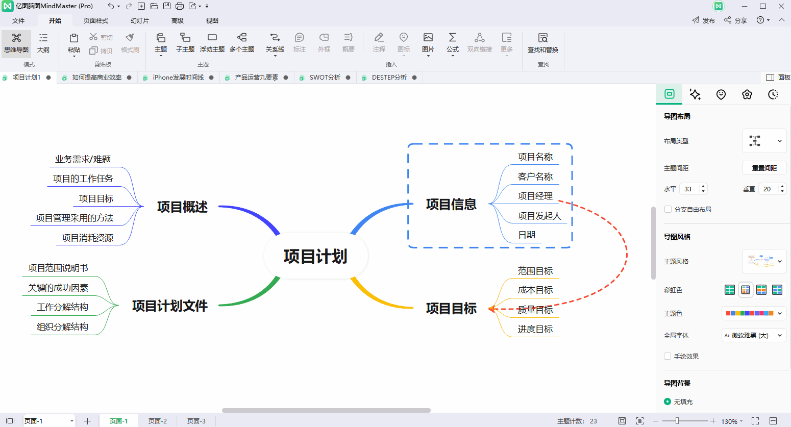

# 好物周刊#22：代码阅读辅助工具

::: info 共勉
不要哀求，学会争取。若是如此，终有所获。
:::
::: tip 原文
https://mp.weixin.qq.com/s/nxRy7y81YYbQwbvdWCVB_w
:::

## 一、项目

### 1. [PaoPao](https://github.com/rocboss/paopao-ce)

一个清新文艺的微社区。后端采用 `Go` + `Zinc` 框架搭建，前端则由 `Vue3` + `TS` 构建，整体布局类似 `Twitter` 的三栏设计。

### 2. [documenso](https://github.com/documenso/documenso)

一个电子签名、在线签约 `SaaS` 工具，可以当做 `DocuSign` 的开源替代方案。

### 3. [One API](https://github.com/songquanpeng/one-api)

`OpenAI` 接口管理 & 分发系统，支持 `Azure`、`Anthropic Claude`、`Google PaLM 2`、智谱 `ChatGLM`、百度文心一言、讯飞星火认知、阿里通义千问以及 360 智脑，可用于二次分发管理 `key`，仅单可执行文件，已打包好 `Docker` 镜像，一键部署，开箱即用

## 二、软件

### 1. [AIdea](https://github.com/mylxsw/aidea-server)

一款支持 GPT 以及国产大语言模型通义千问、文心一言等，支持 Stable Diffusion 文生图、图生图、 SDXL1.0、超分辨率、图片上色的全能型 APP。

### 2. [MindMaster](https://www.edrawsoft.cn/mindmaster/wb-zhihu.html)

专业思维导图软件，云同步跨平台、海量脑图模板、功能全易上手。

使用软件可以将纷繁复杂的想法、知识和信息，如学习笔记、会议纪要、项目需求等简化成一张张清晰的思维导图，以结构化有序化的方式呈现，提高归纳、学习和记忆的效率，方便展示和讲解。

### 3. [Codemap](https://codemap.info/index.html)

一款辅助阅读源代码的工具，通过连线展示代码调用关系、高亮、备注、代码量统计、等一系列功能、方法帮助用户理解代码，解析软件项目结构。

## 三、网站

### 1. [PPChart](http://ppchart.com/#/)

让图表更简单。PPChart 提供 Echarts 收录、图表制作等服务。

### 2. [Made A Pie](https://madeapie.com/#/)

Echarts 图表制作、案例分享、教程分享。汇聚了超多 Echarts 绘制案例，主要有以下类别：

### 3. [ISQQW](https://www.isqqw.com/)

一个 ECharts 图表集，ECharts demo 集，Echarts gallery 社区。同时，在这里还可以分享你的可视化作品。

## 四、插件

### 1. [终结农场内容](https://chrome.google.com/webstore/detail/content-farm-terminator/lcghoajegeldpfkfaejegfobkapnemjl)

标示内容农场链接，防止误入内容农场，并封锁内容农场的广告与恶意程序，插件提供如下功能：

-   自动侦测前往内容农场的连结并加以标示，让你在第一时间避开内容农场，同时免于将点击数回馈给搜寻引擎。
-   在即将进入内容农场时予以封锁，让你能及时离开。
-   若真的很想看一下被封锁的页面，可点击「检视」浏览去除广告与程式码的网页内容，如此既能满足好奇心又能封锁内容农场的收益。
-   可自订黑名单、白名单、灰名单，也能订阅网路黑名单。
-   可透过右键选单将网页、超连结、或选取文字对应的网域快速加入黑名单。

### 2. [CSDN 浏览器助手](https://chrome.google.com/webstore/detail/csdn浏览器助手/kfkdboecolemdjodhmhmcibjocfopejo?hl=zh-CN)

一款集成本地书签、历史记录与 `CSDN` 搜索的搜索工具。由 `CSDN` 官方打造，集成一键呼出搜索、万能快捷工具、个性化标签页和底层免广告四大核心功能。让您在工作学习场景中，告别繁琐复杂的切换，快速解决问题，打造专属你的效率神器！

### 3. [稀土掘金](https://chromewebstore.google.com/detail/稀土掘金/lecdifefmmfjnjjinhaennhdlmcaeeeb)

为程序员、设计师、产品经理每日发现优质内容。

在新标签页展示聚合内容，包含前端、`Android`、`iOS`、后端、产品、设计六大频道，每个频道内都有一到多个内容源。此外，插件提供综合搜索及开发辅助小工具等能力为开发者的工作提效，浏览器激活状态下双击"j"键可快速唤起搜索框。用户可以根据自己的需求和喜好自定义页面布局、切换日间/深色模式。

## 五、资料

### 1. [English-level-up-tips](https://github.com/byoungd/English-level-up-tips)

可能是让你受益匪浅的英语进阶指南，项目具有以下特点：

-   结构化
-   阶段化
-   针对化
-   实用性高
-   操作性强
-   低成本
-   ……

### 2. [汪图南的个人博客](https://github.com/wangtunan/blog)

专注写作前端博客，记录日常所得。

### 3. [JavaKeeper](https://github.com/Jstarfish/JavaKeeper)

`Java` 工程师必备架构体系知识总结：涵盖分布式、微服务、`RPC` 等互联网公司常用架构，以及数据存储、缓存、搜索等必备技能。

## ✍️ 说明

周刊专栏相关信息：

- **项目地址**：[Github](https://github.com/cunyu1943/JavaPark/) | [Gitee](https://gitee.com/cunyu1943/JavaPark/) ，觉得不错麻烦给我一个**Star**，感谢 ❤️
- **浏览地址**：公众号 | [电子书](https://cunyu1943.github.io/) | [电子书（国内）](https://cunyu1943.gitee.io/)

如果你阅读到这里，说明我的工作没有白费。如果你想推荐项目/网站/软件/资源，欢迎提交 **[issue](https://github.com/cunyu1943/JavaPark/issues)** 或者添加我 **个人微信：cunyu1943** 与我交流。

---

## 🎬️ 广告
作为程序员，掌握数据结构与算法的重要性就不言而喻了。掌握了数据结构与算法，可以说你的编程能力就会有质的飞跃。任凭各种热门技术的如何变化，只要掌握了核心技能，那都可以见招拆招，做一个“赢家”。

专栏共分为 4 个由浅入深的模块：

-   入门篇
-   基础篇
-   高级篇
-   实战篇

作者采用最适合工程师的学习方式，不拘泥于某一特定编程语言，从实际开发场景出发，由浅入深教你学习数据结构与算法的方法，帮你搞懂基本概念和核心理论，深入理解算法精髓，帮你提升使用数据结构和算法思维解决问题的能力。

想要进一步提升自己的竞争力么，那就赶紧加入和我一起学习吧！

## ⏳ 联系

想解锁更多知识？不妨关注我的微信公众号：**村雨遥（id：JavaPark）**。

扫一扫，探索另一个全新的世界。

<Share colorful />