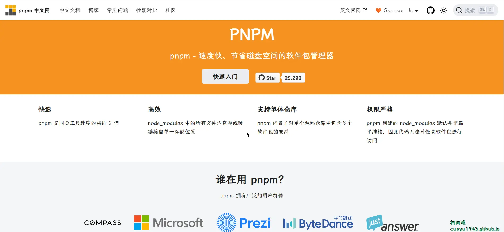
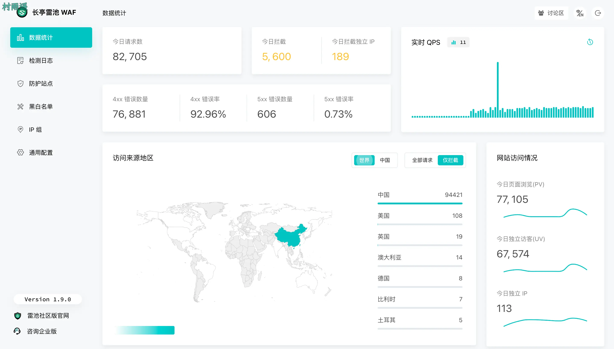
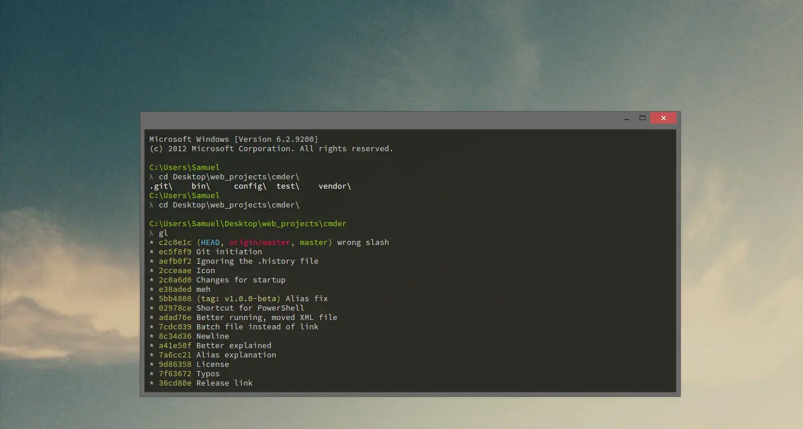
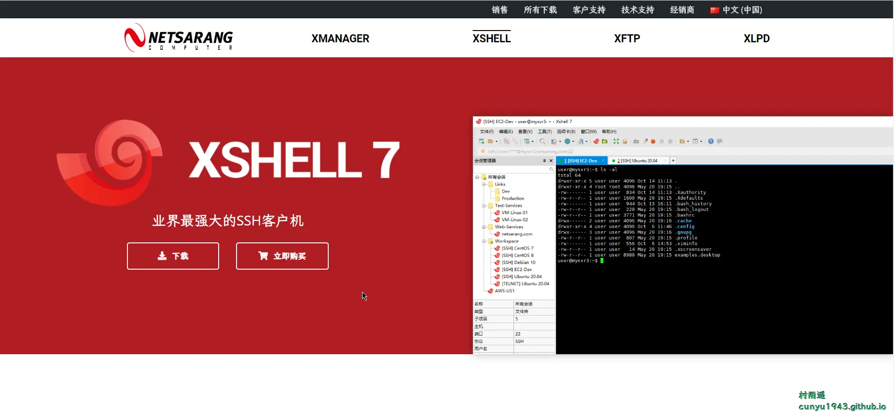
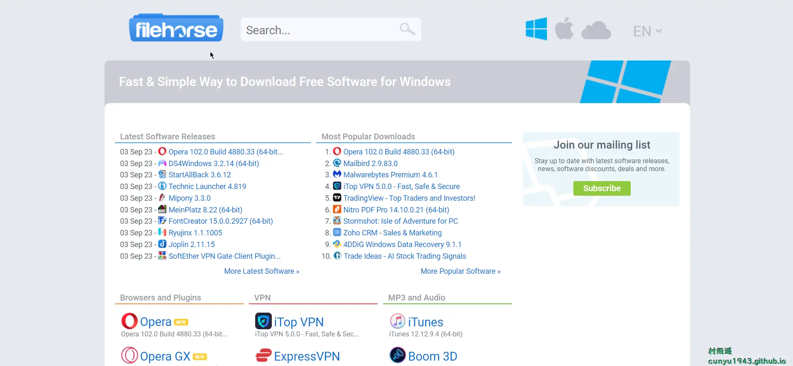
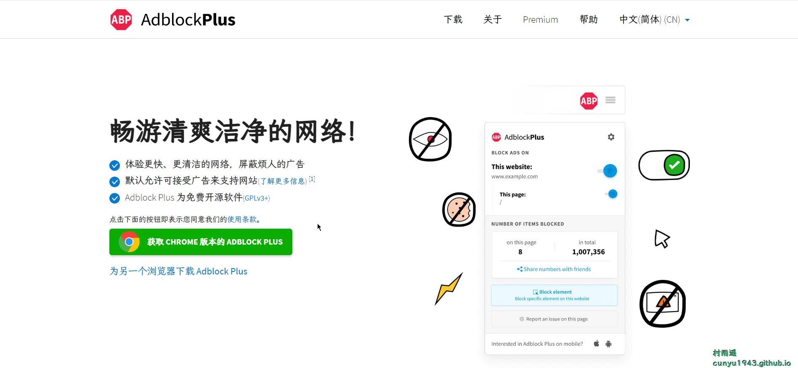
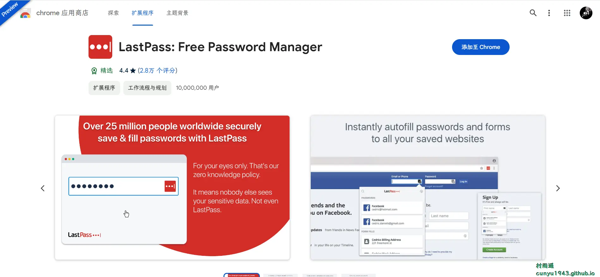
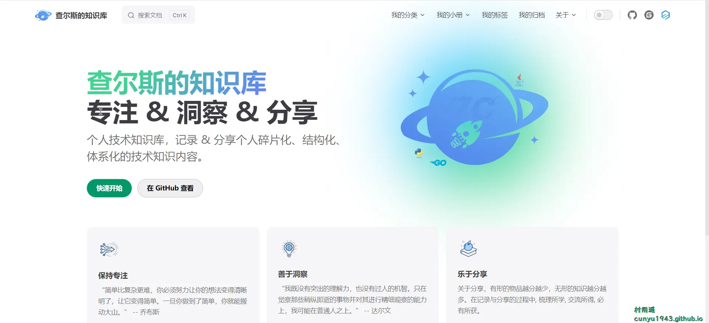
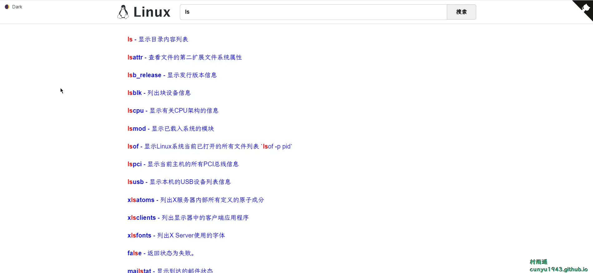
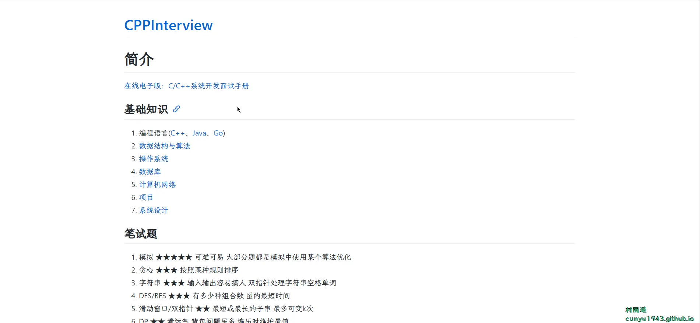

# 好物周刊#23：Win 12 来了！

::: info 共勉
不要哀求，学会争取。若是如此，终有所获。
:::
::: tip 原文

:::

## 一、项目

### 1. [pnpm](https://github.com/pnpm/pnpm)

快速的，节省磁盘空间的包管理工具，具有如下特点：

- 快速：`pnpm` 比其他包管理器快 2 倍
- 高效：`node_modules` 中的文件为复制或链接自特定的内容寻址存储库
- 支持 `monorepos`：`pnpm` 内置支持单仓多包
- 严格：`pnpm` 默认创建了一个非平铺的 `node_modules`，因此代码无法访问任意包

### 2. [雷池](https://github.com/chaitin/SafeLine)

一款足够简单、足够好用、足够强的免费 `WAF`。基于业界领先的语义引擎检测技术，作为反向代理接入，保护你的网站不受黑客攻击。

核心检测能力由智能语义分析算法驱动，专为社区而生，不让黑客越雷池半步。

### 3. [win12](https://github.com/tjy-gitnub/win12)

开发者看到 `Windows 12` 概念版后深受启发，决定做一个 `Windows12` 网页版。最重要的是，几个开发者还是初中生！

## 二、软件

### 1. [弹窗广告拦截器](http://adkiller.360drm.com/index.html)

弹窗广告拦截器是一款完全免费的弹窗广告拦截软件,智能屏蔽各种弹窗广告！

### 2. [Cmder](https://cmder.app/)

`Windows` 平台下美观又强劲的一款利器，为 `CMD` / `PowerShell` 提供绝佳用户体验。

### 3. [XShell](https://www.xshell.com/zh/xshell/)

非常优秀的终端软件，连接服务器必备，自称业界最强大的 `SHH` 客户机。

## 三、网站

### 1. [视觉效果集合](http://hepengwei.cn/#/html/visualDesign)

一个专注于前端视觉效果的集合应用，里面包含各种丰富的 `css` 动效、`canvas` 动画等上百个案例，而且是开源免费的。

### 2. [FileHorse](https://www.filehorse.com/)

提供了大量软件的下载和介绍，包括 `Windows` 和 `macOS` 平台。

### 3. [Product Hunt](https://www.producthunt.com/)

推荐每天新兴的移动应用程序、网站和技术产品等。

## 四、插件

### 1. [Momentum](https://chromewebstore.google.com/detail/laookkfknpbbblfpciffpaejjkokdgca)

将新标签页替换为个人仪表板，以帮助您集中注意力、保持井井有条并保持动力来实现您的目标。

页面包含待办事项列表、天气、每日照片和鼓舞人心的名言。

### 2. [Adblock Plus](https://chromewebstore.google.com/detail/adblock-plus-免费的广告拦截器/cfhdojbkjhnklbpkdaibdccddilifddb)

阻止 `YouTube™` 广告、弹出窗口并抵御恶意软件！

享受没有恼人广告的网络世界，插件会屏蔽以下内容

-   横幅 
-   `YouTube` 视频广告
-   `Facebook` 广告
-   弹出窗口
-   所有其他显眼的广告

### 3. [LastPass](https://chromewebstore.google.com/detail/lastpass-free-password-ma/hdokiejnpimakedhajhdlcegeplioahd)

全球知名在线密码管理工具之一，采用军事级加密算法，支持自动填充网站用户名和密码，与朋友分享登录信息等实用功能，且在全平台同步免费，无需订阅即可在手机、网页、电脑多端同步信息。

## 五、资料

### 1. [查尔斯的知识库](https://github.com/Charles7c/charles7c.github.io)

基于 `VitePress` 构建的个人知识库/博客。查尔斯的个人技术知识库，记录 & 分享个人碎片化、结构化、体系化的技术知识内容。

### 2. [Linux Command](https://github.com/jaywcjlove/linux-command)

`Linux` 命令大全搜索工具，内容包含 `Linux` 命令手册、详解、学习。目前仓库搜集了 580 多个 `Linux` 命令，是一个非盈利性的仓库。

### 3. [CPPInterview](https://github.com/SYaoJun/CPPInterview)

C/C++ 高频面试题合集，包含面试篇、笔试篇、书单、课程、刷题网站、面试问题六大模块。既有面试时需要掌握的基础知识和行业知识，也有笔试时遇到的高频算法类型和笔试技巧。

## ✍️ 说明

周刊专栏相关信息：

- **项目地址**：[Github](https://github.com/cunyu1943/JavaPark/) | [Gitee](https://gitee.com/cunyu1943/JavaPark/) ，觉得不错麻烦给我一个**Star**，感谢 ❤️
- **浏览地址**：公众号 | [电子书](https://cunyu1943.github.io/) | [电子书（国内）](https://cunyu1943.gitee.io/)

如果你阅读到这里，说明我的工作没有白费。如果你想推荐项目/网站/软件/资源，欢迎提交 **[issue](https://github.com/cunyu1943/JavaPark/issues)** 或者添加我 **个人微信：cunyu1943** 与我交流。

---

## 🎬️ 广告

当前大环境下，就业形势严峻，尤其针对即将毕业的大学生。作为一个技术求职者，求职前应该做好哪些准备呢，一些面试实战技巧也十分有必要！而刚好最近掘金出了一本《技术人求职指南》小册，相信一定会对在找工作的你有所帮助。

从求职到拿下 `Offer`，一本职场的全方位攻略，快来和我一起学习吧！

## ⏳ 联系

想解锁更多知识？不妨关注我的微信公众号：**村雨遥（id：JavaPark）**。

扫一扫，探索另一个全新的世界。

<Share colorful />
