# 好物周刊#25：PPT 超级市场

::: info 共勉
不要哀求，学会争取。若是如此，终有所获。
:::
::: tip 原文
https://mp.weixin.qq.com/s/vdKsUXuj5vdEDKso9OJ4eQ
:::

## 一、项目

### 1. [study](https://github.com/bage2014/study)

`Java` 全栈工程师学习笔记；`Spring`、`shiro`、`CAS`、`oauth2` 单点登录；`cache `、`Redis`; `web` 安全及解决思路；`mq`、`quartz`、`Docker`；`Docker` 各种组件实践等；`MyBatis`、`Spring`、`Spring Boot` 实践；分布式锁；基于分库分表等等。

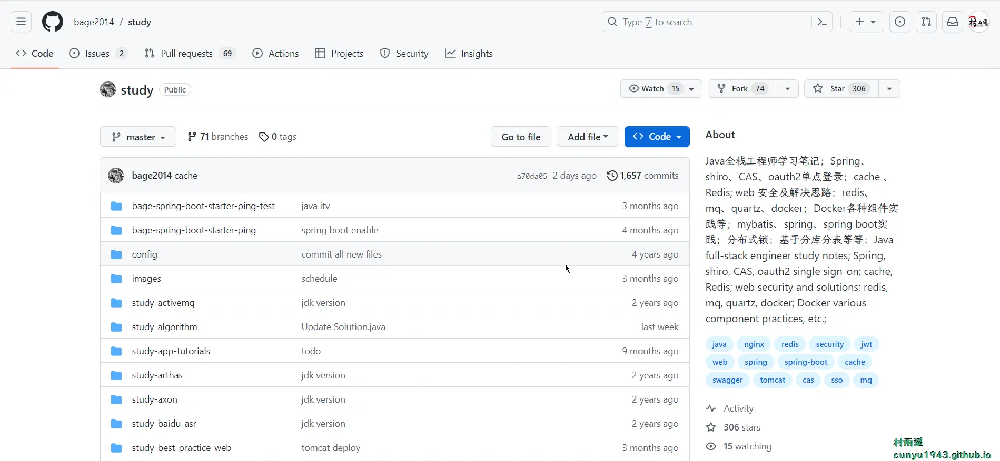

### 2. [MaaAssistantArknights](https://github.com/MaaAssistantArknights/MaaAssistantArknights)

一款明日方舟游戏小助手，基于图像识别技术，一键完成全部日常任务！

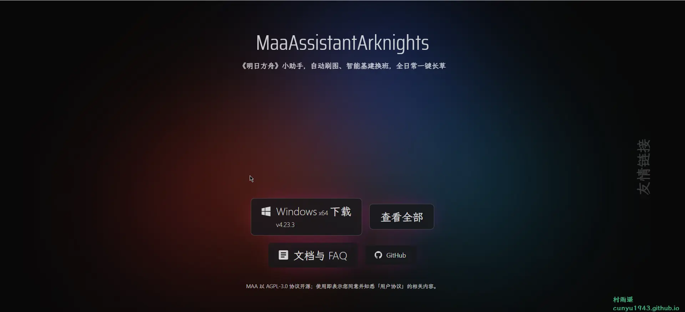

### 3. [Next Terminal](https://github.com/dushixiang/next-terminal)

一个简单好用安全的开源交互审计系统，支持 `RDP`、`SSH`、`VNC`、`Telnet`、`Kubernetes` 协议。目前支持的功能有：

-   授权凭证管理
-   资产管理（支持 `RDP`、`SSH`、`VNC`、`TELNET` 协议）
-   指令管理
-   批量执行命令
-   在线会话管理（监控、强制断开）
-   离线会话管理（查看录屏）
-   双因素认证
-   资产标签
-   资产授权
-   多用户&用户分组
-   计划任务
-   `ssh server`
-   登录策略
-   系统监控

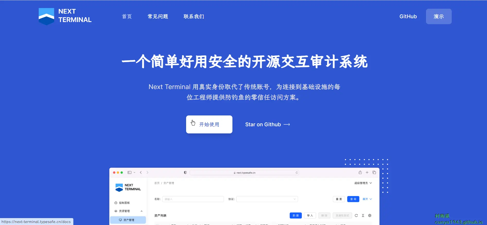

## 二、软件

### 1. [Flow Launcher](https://www.flowlauncher.com/)

快搜搜索文件和启动 `app`，取代 `Windows` 自带搜索的必备神器，类似于 `macOS` 中的 `Alfred`。

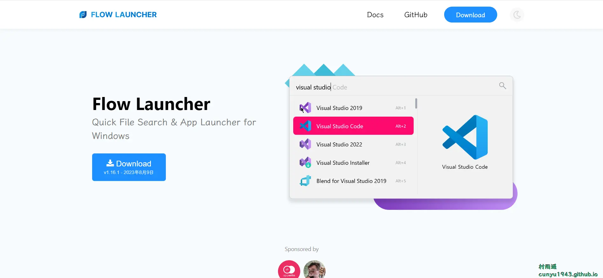

### 2. [Geek Uninstaller](https://geekuninstaller.com/)

是一款 100% 免费且高效、快速、小而便携电脑清理卸载软件，易于使用的用户界面，执行深度和快速扫描并删除所有残留信息。保持你的电脑干净！支持卸载 `Windows` 8/8.1/10 上的 `Windows` 应用商店应用。

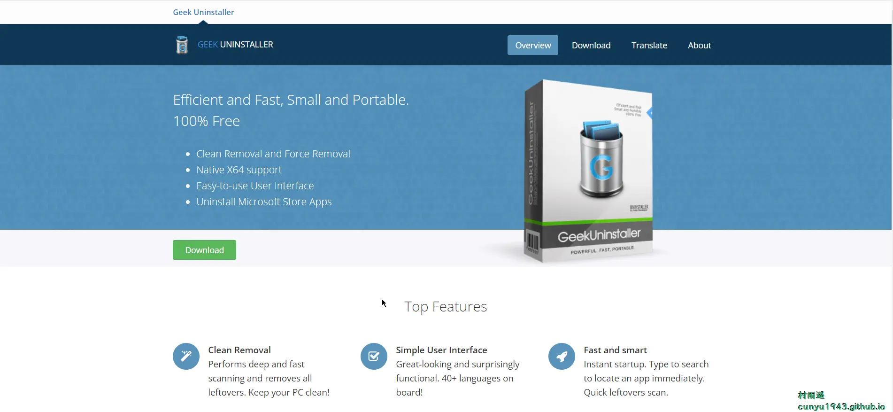

### 3. [OpenHashTab](https://github.com/namazso/OpenHashTab)

资源管理器右键文件->属性，即可查看文件 `MD5`、`SHA1` 等各类 `Hash` 信息。

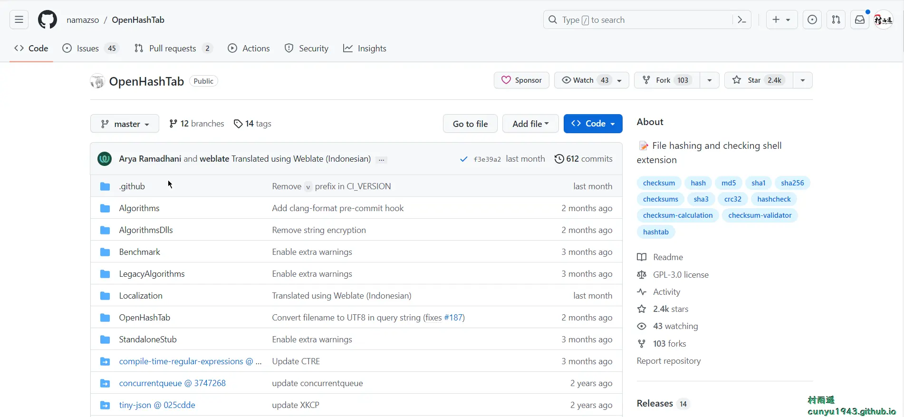

## 三、网站

### 1. [第 1 PPT](https://www.1ppt.com/)

这里有海量 `PPT` 素材，幻灯片背景图片，`PPT` 模板免费下载，专注 `PowerPoint` 素材下载！

而且支持在线预览，不用登录即可免费下载。

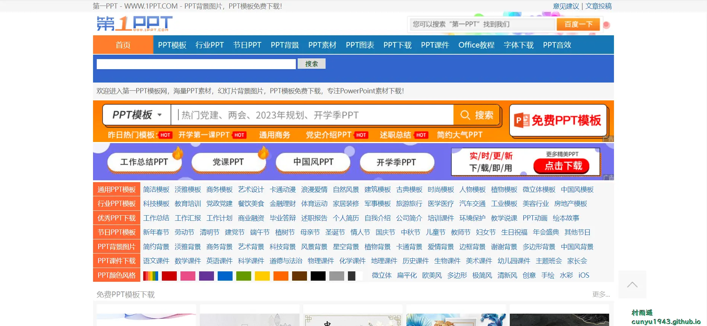

### 2. [PPT 超级市场](https://www.pptsupermarket.com/)

免费下载 `PPT` 模板与 `PPT` 作品，提供免费的 `PPT` 代做服务，提供一站式 `PPT`(模板、定制、工具、教程)服务，有了它，一切制作 `PPT` 的烦恼都将成为过去！

### 3. [爱给网](https://www.aigei.com/)

中国最大的数字娱乐免费素材下载网站,免费提供免费的音效配乐、3D模型、视频、游戏素材资源下载。

## 四、插件

### 1. [Microsoft 365](https://chromewebstore.google.com/detail/microsoft-365/ndjpnladcallmjemlbaebfadecfhkepb)

在浏览器中查看、编辑和创建文档。

专用于 `Chrome` – 无需安装 `Microsoft` 365 应用即可使用 `Word`、`Excel`、`PowerPoint`、`OneNote` 和 `Sway Online`。

熟练地创建文件 – 使用熟悉的格式和布局选项来完全忠实地表达你的想法。

随时随地开展工作 – 与 `OneDrive` 和 `OneDrive for Business` 集成，可从任意位置获取文件。

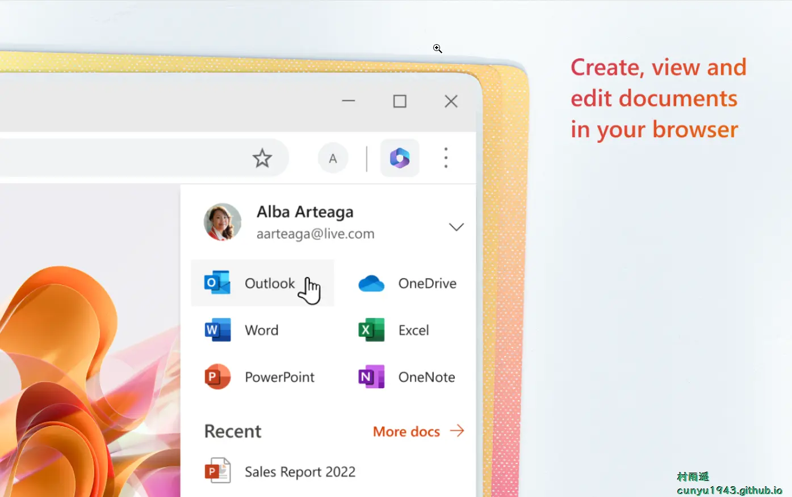

### 2. [关灯看视频](https://www.turnoffthelights.com/zh-cn/)

一个免费的开源浏览器扩展，允许用户将除 `HTML5` 视频以外的所有部分变暗。适用于所有网络浏览器，例如 `Google Chrome`、`Microsoft Edge` 等。

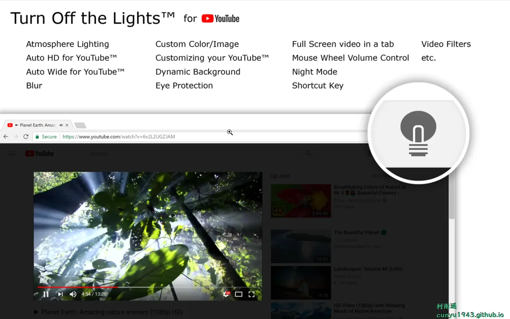

### 3. [Awesome Screenshot](https://www.awesomescreenshot.com/)

超级截图录屏大师是一款录屏神器，也是一款截屏神器．屏幕截图 & 图片编辑，屏幕录像 ＆ 视频编辑，所有这些截图，录屏功能，都被一气呵成的集成到插件和对应的网站服务中。支持如下功能：

-   **屏幕录像**

1.   对网页内容进行屏幕录像 
2.   对全桌面进行录屏
3.   对某一个软件进行录屏
4.   录摄像头
5.   支持高清录制
6.   支持下载为 `MP4` 格式
7.   视频编辑功能
8.   既可以保存到云端，也可以保存到本地

-   **屏幕截图和抓屏**

1.   截取网页全屏，不论网页多长，都可以将这个网页变成一张图片，方便编辑和分享
2.   选择部分屏幕截取
3.   对屏幕可视部分进行截图
4.   不但帮助保存截图，还可以保存该截图对应的 `URL`

-   **图片批注和编辑**

1.   选择你所需要的尺寸
2.   方框，圆圈，箭头等各种尺寸的批注

## 五、资料

### 1. [C# 文档](https://learn.microsoft.com/zh-cn/dotnet/csharp/)

面向新手开发人员、刚开始接触 `C#` 的开发人员、以及经验丰富的 `C#/.NET` 开发人员。

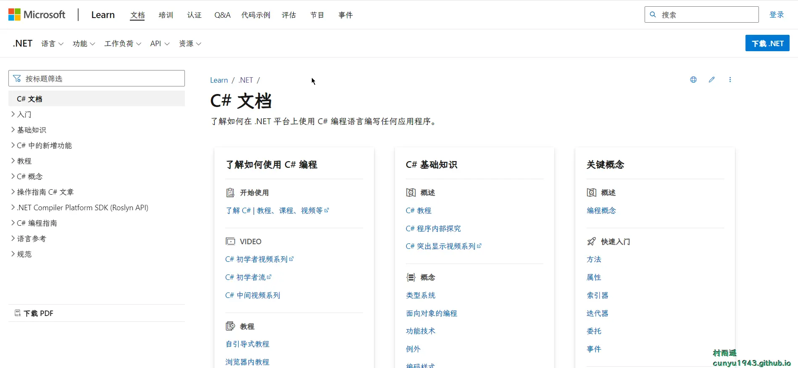

### 2. [.NET 文档](https://learn.microsoft.com/zh-cn/dotnet/)

了解如何使用 `.NET` 在任何使用 `C#`、`F#` 和 `Visual Basic` 的平台上创建应用程序。 浏览 `API` 引用、代码示例、教程以及其他内容。

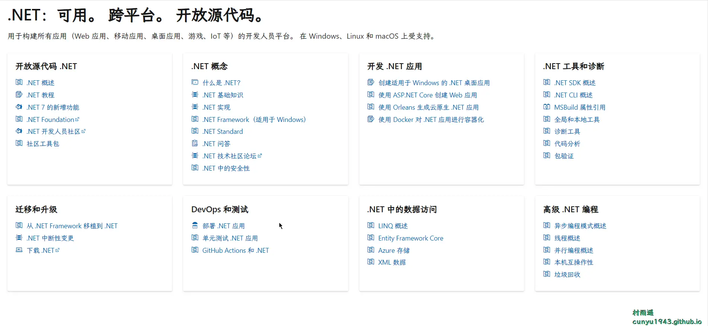

### 3. [独立开发变现周刊](https://github.com/ljinkai/weekly)

分享独立开发变现人物志、产品周刊、工具集，每周五发布。

## ✍️ 说明

周刊专栏相关信息：

- **项目地址**：[Github](https://github.com/cunyu1943/JavaPark/) | [Gitee](https://gitee.com/cunyu1943/JavaPark/) ，觉得不错麻烦给我一个**Star**，感谢 ❤️
- **浏览地址**：公众号 | [电子书](https://cunyu1943.github.io/) | [电子书（国内）](https://cunyu1943.gitee.io/)

如果你阅读到这里，说明我的工作没有白费。如果你想推荐项目/网站/软件/资源，欢迎提交 **[issue](https://github.com/cunyu1943/JavaPark/issues)** 或者添加我 **个人微信：cunyu1943** 与我交流。

---

## 🎬️ 广告
当前大环境下，就业形势严峻，尤其针对即将毕业的大学生。作为一个技术求职者，求职前应该做好哪些准备呢，一些面试实战技巧也十分有必要！而刚好最近掘金出了一本《技术人求职指南》小册，相信一定会对在找工作的你有所帮助。

从求职到拿下 `Offer`，一本职场的全方位攻略，快来和我一起学习吧！

## ⏳ 联系

想解锁更多知识？不妨关注我的微信公众号：**村雨遥（id：JavaPark）**。

扫一扫，探索另一个全新的世界。

<Share colorful />
