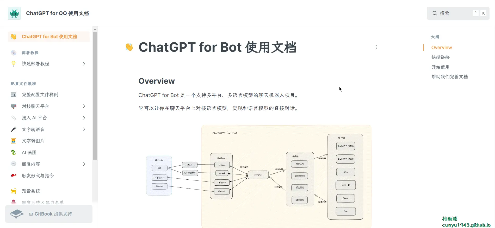
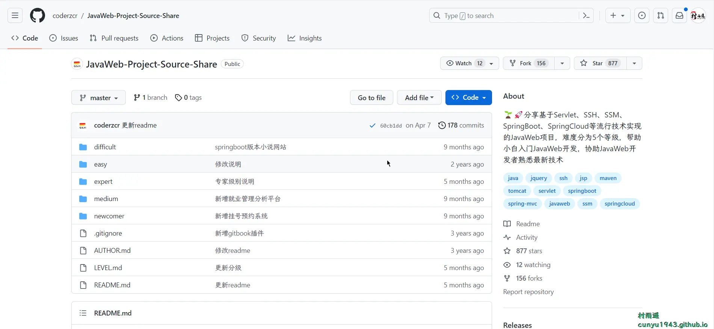
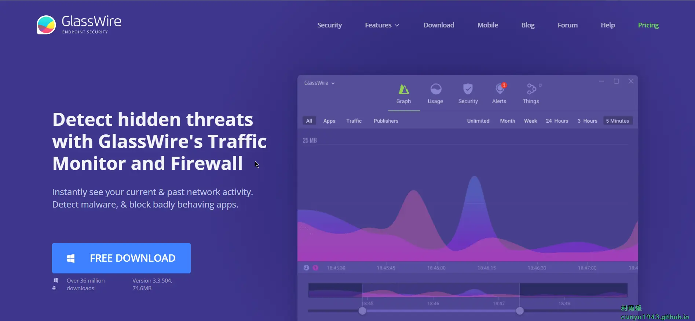
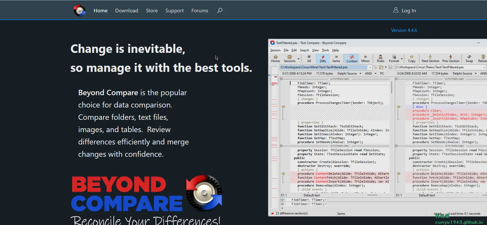
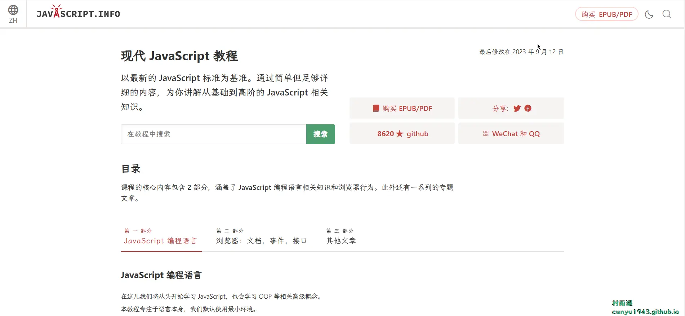
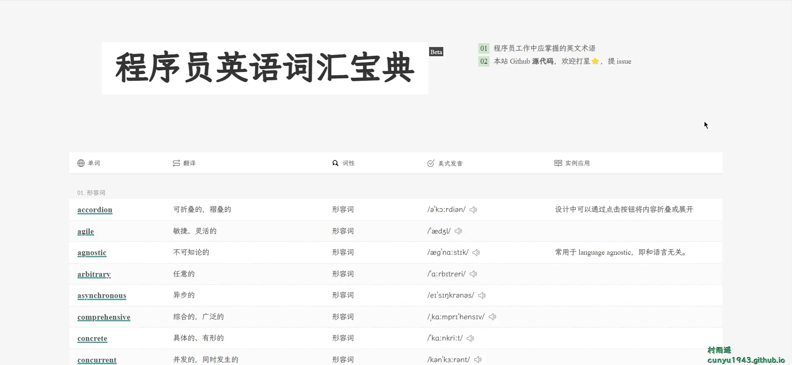
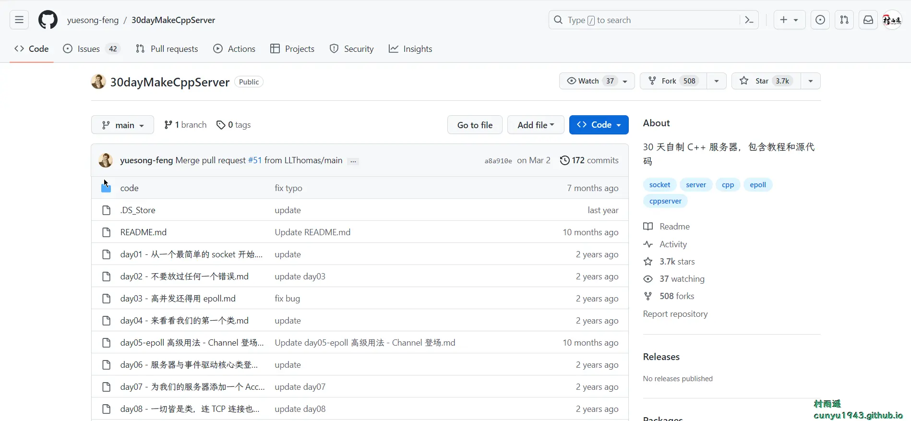

# 好物周刊#26：程序员英语词汇宝典

::: info 共勉
不要哀求，学会争取。若是如此，终有所获。
:::
::: tip 原文
https://mp.weixin.qq.com/s/UJ9eT3J2YNAUnY7uT9d_4Q
:::

## 一、项目

### 1. [ChatGPT for Bot](https://github.com/lss233/chatgpt-mirai-qq-bot)

一键部署！真正的 `AI` 聊天机器人！支持 `ChatGPT`、文心一言、讯飞星火、`Bing`、`Bard`、`ChatGLM`、`POE`，多账号，人设调教，虚拟女仆、图片渲染、语音发送 | 支持 `QQ`、`Telegram`、`Discord`、微信等平台。

### 2. [JavaWeb-Project-Source-Share](https://github.com/coderzcr/JavaWeb-Project-Source-Share)

分享基于 `Servlet`、`SSH`、`SSM`、`SpringBoot`、`SpringCloud` 等流行技术实现的 `JavaWeb` 项目，难度分为 5 个等级，帮助小白入门 `JavaWeb` 开发，协助 `JavaWeb` 开发者熟悉最新技术。

### 3. [南生论坛](https://github.com/maliangnansheng/bbs-springboot)

仿掘金之南生论坛基于 `SpringBoot` + `Vue` 框架实现前后端分离（大厂微服务架构设计；代码简洁、高效无冗余；注释详细易阅读），自适应手机端和电脑端，界面简洁美观，功能完善，性能高效。

## 二、软件

### 1. [GlassWire](https://www.glasswire.com/)

用户体验优秀的全能网络流量监控工具，同时具备防火墙功能。

### 2. [Beyond Compare](https://www.scootersoftware.com/)

一款专业的文本文件对比工具，可以高效的针对文件、文件夹、表格、`mp3`、图片、数据、注册表等文件并进行比较、合并、同步分析，并把相差的每一个字节用颜色加以表示，查看方便。

### 3. [BestTrace](https://www.ipip.net/product/client.html)

集 `ping`、`traceroute`、`IP` 归属地、地图于一体的网络测试工具。

## 三、网站

### 1. [PPTer 吧](https://www.ppter8.com/)

提供免费 `PPT` 模板、`PPT` 课件及国外 `PPT` 模版，相关 `PPT` 素材全部免费（`PNG` 免抠图、`PPT` 背景图片、`PPT` 专用的背景音乐、3D 模型、图标）。这里的 `PPT` 模板免费下载，致力成为受 `PPTer` 喜爱的 `PPT` 模板网站。

### 2. [PPT 汇](https://www.ppthui.com/)

`PPT` 模板网提供高品质 `PPT` 模板、`PPT` 背景、`PPT` 素材、`PPT` 课件等精美 `PPT` 模板免费下载资源。无需注册，完全免费，直接 `PPT` 模板免费下载。带来快速、高效、便捷的下载体验。

### 3. [优品 PPT](https://www.ypppt.com/)

一家专注于分享高质量的免费 `PPT` 模板下载网站，包括图表、背景图片、素材、教程等各类 `PPT` 模板相关资源。致力于打造国内最大最权威的 `PPT` 下载一站式服务平台。

## 四、插件

### 1. [Mote：语音笔记和反馈](https://chromewebstore.google.com/detail/mote：语音笔记和反馈/ajphlblkfpppdpkgokiejbjfohfohhmk)

快速、友好的语音消息。使用 `Mote` 可以轻松地将语音评论和音频内容添加到共享文档、作业、电子邮件和表单中。已集成到 `Google Docs`、`Slides`、`Sheets`、`Forms`、`Classroom` 和 `Gmail` 中，更加便于录制和播放。

### 2. [eJOY AI Dictionary](https://chromewebstore.google.com/detail/ejoy-ai-dictionary/amfojhdiedpdnlijjbhjnhokbnohfdfb)

翻译 `Netflix`, `Youtube`, `iFlix` 上的字幕，查字典，藉由游戏学习英语字典。

单击即可在看电影、短片、阅读新闻、浏览社交媒体或任何地方时获得译文。将新单词储存到字典，并且玩英文游戏牢记单词。

`eJOY` 还能帮您定义单字、英语成语、常用片语、最新俚语和搭配用词。

如果您正在加紧准备英文考试，`eJOY` 会帮您掌握字彙表。 `eJOY` 提供广泛主题字彙，包括托益、托福、雅思、`SAT`（学术能力检测）。当您加入新单词到字典后，您可以使用 `eJOY` 游戏永远记住您的字典，这都归功于最新的间隔重复演算法。

### 3. [Liner ChatGPT](https://chromewebstore.google.com/detail/liner-chatgpt%EF%BC%9Awebyoutube%E7%9A%84/bmhcbmnbenmcecpmpepghooflbehcack)

直接在页面上使用 `ChatGPT`，甚至在 `YouTube` 上！添加 `AI Copilot`，与您的个人 `AI` 助手/`AI` 伴侣一起完成更多工作。

无论内容的长度或难度如何，`LINER AI Copilot` 都将帮助您在短时间内消化网络上的大量信息。

## 五、资料

### 1. [现代 JavaScript 教程](https://github.com/javascript-tutorial/zh.javascript.info/)

依托于 `learn.javascript.ru` 而来，它是俄罗斯最大的 `JavaScript` 教程和学习平台之一，质量有保障，而且是在线学习，教程都是实时更新且免费的，不像书籍可能存在看的技术过时的问题。现代 `JavaScript` 教程是 `React` 官方文档中与 `MDN` 共同推荐的 `JavaScript` 学习教程，质量有保障。

### 2. [程序员英语词汇宝典](https://github.com/Wei-Xia/most-frequent-technology-english-words)

本列表中的单词是英语类计算机书籍、文档、文章中高频常见的技术词汇，也是程序员工作中常见的英语词汇，最终目的是希望程序员集合自身的英语基础，在掌握列表中的词汇后，可以无障碍阅读英语技术文章和文档。

### 3. [30 天自制 C++ 服务器](https://github.com/yuesong-feng/30dayMakeCppServer)

30 天自制 `C++` 服务器，包含教程和源代码。教程模仿《30 天自制操作系统》，面向零经验的新手，教你在 30 天内入门 `Linux` 服务器开发。教程更偏向实践，将会把重点放在如何写代码上，而不会花太多的篇幅讲解背后的计算机基础原理，涉及到的地方会给出相应书籍的具体章节。

## ✍️ 说明

周刊专栏相关信息：

- **项目地址**：[Github](https://github.com/cunyu1943/JavaPark/) | [Gitee](https://gitee.com/cunyu1943/JavaPark/) ，觉得不错麻烦给我一个**Star**，感谢 ❤️
- **浏览地址**：公众号 | [电子书](https://cunyu1943.github.io/) | [电子书（国内）](https://cunyu1943.gitee.io/)

如果你阅读到这里，说明我的工作没有白费。如果你想推荐项目/网站/软件/资源，欢迎提交 **[issue](https://github.com/cunyu1943/JavaPark/issues)** 或者添加我 **个人微信：cunyu1943** 与我交流。

---

## 🎬️ 广告
当前大环境下，就业形势严峻，尤其针对即将毕业的大学生。作为一个技术求职者，求职前应该做好哪些准备呢，一些面试实战技巧也十分有必要！而刚好最近掘金出了一本《技术人求职指南》小册，相信一定会对在找工作的你有所帮助。

从求职到拿下 `Offer`，一本职场的全方位攻略，快来和我一起学习吧！

## ⏳ 联系

想解锁更多知识？不妨关注我的微信公众号：**村雨遥（id：JavaPark）**。

扫一扫，探索另一个全新的世界。

<Share colorful />
