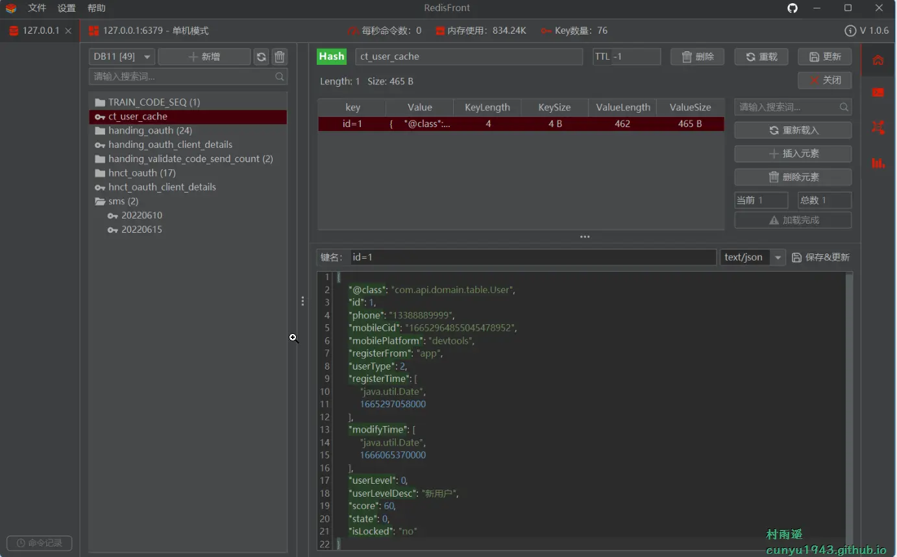
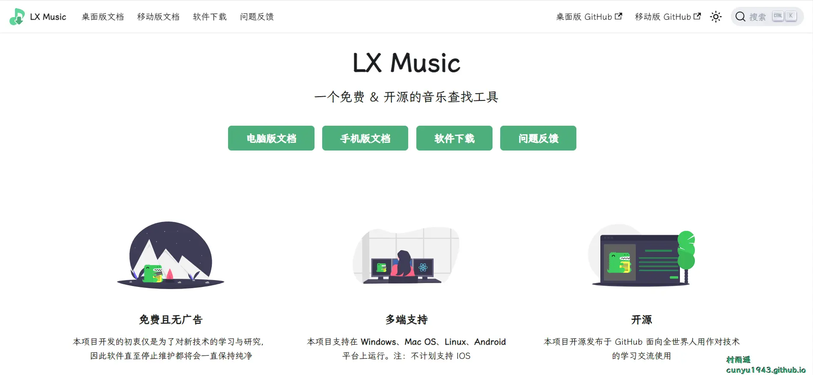
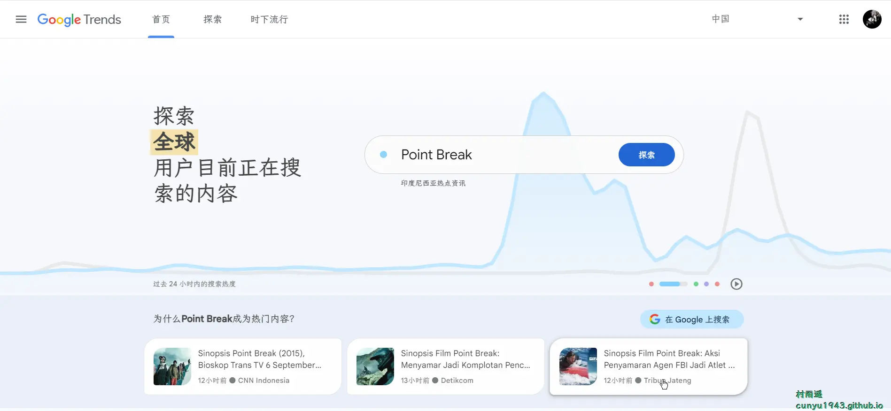
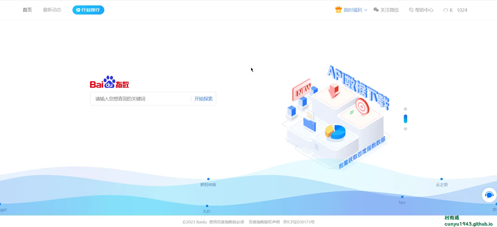
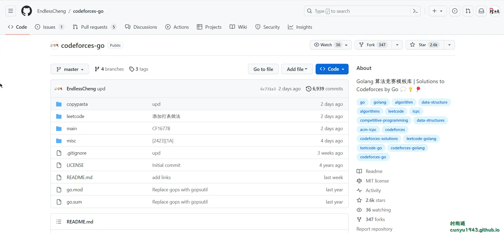
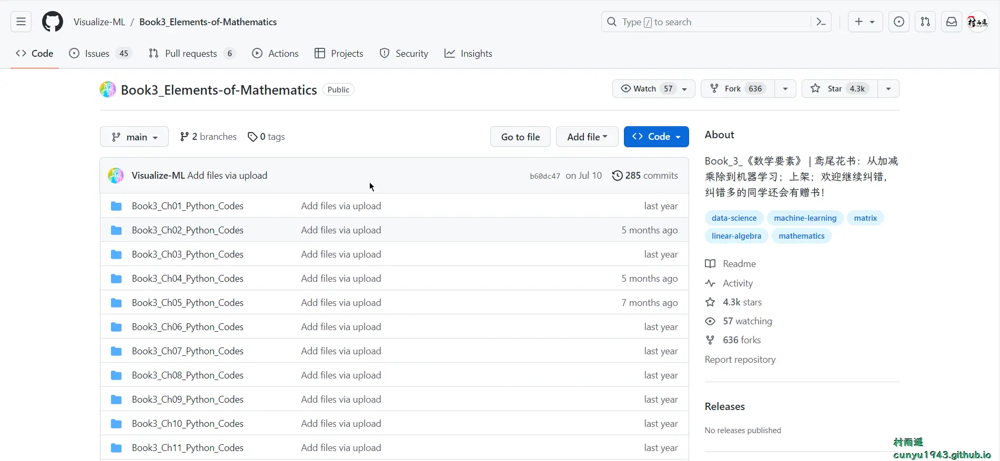

# 好物周刊#27：音乐助手

::: info 共勉
不要哀求，学会争取。若是如此，终有所获。
:::
::: tip 原文
https://mp.weixin.qq.com/s/c3pYaWXQQptNAYnuZFoGEQ
:::

## 一、项目

### 1. [lamp 快速开发平台](https://github.com/dromara/lamp-cloud)

`lamp-cloud` 基于 `Jdk11` + `SpringCloud` + `SpringBoot` 开发的微服务中后台快速开发平台，专注于多租户(`SaaS` 架构)解决方案，亦可作为普通项目（非 `SaaS` 架构）的基础开发框架使用，目前已实现插拔式数据库隔离、`SCHEMA` 隔离、字段隔离 等租户隔离方案。

### 2. [AgileBoot](https://github.com/valarchie/AgileBoot-Back-End)

规范易于二开的全栈基础快速开发脚手架。采用 `SpringBoot` + `Vue3` + `Typescript` + `Mybatis Plus` + `Redis` + 更面向对象的业务建模 + 面向生产的项目。

### 3. [RuoYi-Vue-Plus](https://github.com/dromara/RuoYi-Vue-Plus)

基于 `RuoYi-Vue` 集成 `Lombok` + `Mybatis-Plus` + `Undertow` + `knife4j` + `Hutool` + `Feign` 重写所有原生业务 定期与 `RuoYi-Vue` 同步。

## 二、软件

### 1. [MusicFree](https://github.com/maotoumao/MusicFree)

一个插件化、定制化、无广告的免费音乐播放器，目前只支持 `Android` 和 `Harmony OS`。具有以下特性：

-   插件化
-   插件支持搜索、播放、查看专辑等功能
-   定制化、无广告
-   隐私
-   歌词关联

### 2. [RedisFront](https://gitee.com/dromara/redisfront)

一款基于 `Java Swing` 开发的跨平台 `Redis` 桌面客户端工具，简单易用，功能完善，支持单机模式, 集群模式, 哨兵模式以及 `SSH` 隧道连接。

### 3. [洛雪音乐助手](https://github.com/lyswhut/lx-music-desktop)

一个基于 `Electron` + `Vue` 开发的音乐软件。使用到的技术栈：

- `Electron 15+`
- `Vue 3`

已支持如下平台：

- `Windows` 7 及以上
- `macOS`
- `Linux`

## 三、网站

### 1. [Google 指数](https://trends.google.com/trends/)

基于 `Google` 搜索数据的数据分享平台，可以展示不同关键词、主题、时间段或区域的搜索热度和趋势，还能查看时下流行每日/实时搜索趋势。

### 2. [百度指数](https://index.baidu.com/v2/index.html#/)

百度指数是以百度海量网民行为数据为基础的数据分享平台。在这里，你可以研究关键词搜索趋势、洞察网民兴趣和需求、监测舆情动向、定位受众特征。

### 3. [站长指数](https://index.chinaz.com/)

站长全网指数查询是以各大搜索引擎海量网民搜索行为数据为基础的数据分享平台。在这里，你可以研究关键词在各大搜索引擎的趋势、洞察网民需求变化、监测媒体舆情趋势、定位数字消费者特征；还可以从行业的角度，分析市场特点。

## 四、插件

### 1. [VideoTogether](https://chromewebstore.google.com/detail/videotogether/dpjiaamadbcfheiamdaamhgpomlkohbn)

一起看视频，和你的家人朋友一起在线看视频。插件特点：

-   支持任意设备
-   支持所有在线视频网站和本地视频
-   通过一行代码即可为自己的网站添加一起看功能

### 2. [Shazam](https://chromewebstore.google.com/detail/shazam%EF%BC%9A%E5%9C%A8%E6%B5%8F%E8%A7%88%E5%99%A8%E4%B8%AD%E7%9B%B4%E6%8E%A5%E8%AF%86%E5%88%AB%E6%AD%8C%E6%9B%B2/mmioliijnhnoblpgimnlajmefafdfilb?utm_source=ext_app_menu)

在浏览器中直接识别歌曲，只需轻轻一点即可识别。用它来发现艺人、歌词与视频无需任何费用。

### 3. [PrintFriendly](https://chromewebstore.google.com/detail/printfriendly-print-and-p/ohlencieiipommannpdfcmfdpjjmeolj)

一款网页打印或生成 `PDF` 的插件，会在打印之前删除垃圾广告，导航和无用浮窗从而实现页面优化，让你拥有最佳的打印阅读体验，如果经常需要打印网页，可以通过该插件让你的打印工作变得省时省力。

## 五、资料

### 1. [算法竞赛模板库](https://github.com/EndlessCheng/codeforces-go)

`Golang` 算法竞赛模板库，涵盖以下知识：

-   对该算法的基本介绍（核心思想、复杂度等）
-   参考链接或书籍章节（讲的比较好的资料）
-   模板代码（可以包含一些注释、使用说明）
-   模板补充内容（常见题型中的额外代码、建模技巧等）
-   相关题目链接（模板题、经典题、思维转换题等）

### 2. [AI_Tutorial](https://github.com/cbamls/AI_Tutorial)

全面整理高质量的人工智能、机器学习、大数据等技术资料。内容主要来自开源项目官网、综合技术网站（`AIQ` 、`InfoQ`、`Stackoverflow`、`Github` 等、国内外知名互联网公司技术博客 (`FAANG`、`Alibaba`、`Meituan etc`)、知名技术公众号 (`DatafunTalk`、阿里技术等)。

### 3. [数学要素](https://github.com/Visualize-ML/Book3_Elements-of-Mathematics)

为了让大家学数学、用数学，甚至爱上数学，作者颇费心机。尽量克服了传统数学教材的各种弊端，让大家学习时有兴趣、能看懂、有思考、更自信。丛书内容具有以下特点：

-   数学 + 艺术
-   零基础
-   知识网络
-   理论 + 实践
-   学习生态

## ✍️ 说明

周刊专栏相关信息：

- **项目地址**：[Github](https://github.com/cunyu1943/JavaPark/) | [Gitee](https://gitee.com/cunyu1943/JavaPark/) ，觉得不错麻烦给我一个**Star**，感谢 ❤️
- **浏览地址**：公众号 | [电子书](https://cunyu1943.github.io/) | [电子书（国内）](https://cunyu1943.gitee.io/)

如果你阅读到这里，说明我的工作没有白费。如果你想推荐项目/网站/软件/资源，欢迎提交 **[issue](https://github.com/cunyu1943/JavaPark/issues)** 或者添加我 **个人微信：cunyu1943** 与我交流。

---

## 🎬️ 广告
当前大环境下，就业形势严峻，尤其针对即将毕业的大学生。作为一个技术求职者，求职前应该做好哪些准备呢，一些面试实战技巧也十分有必要！而刚好最近掘金出了一本《技术人求职指南》小册，相信一定会对在找工作的你有所帮助。

从求职到拿下 `Offer`，一本职场的全方位攻略，快来和我一起学习吧！

## ⏳ 联系

想解锁更多知识？不妨关注我的微信公众号：**村雨遥（id：JavaPark）**。

扫一扫，探索另一个全新的世界。

<Share colorful />
