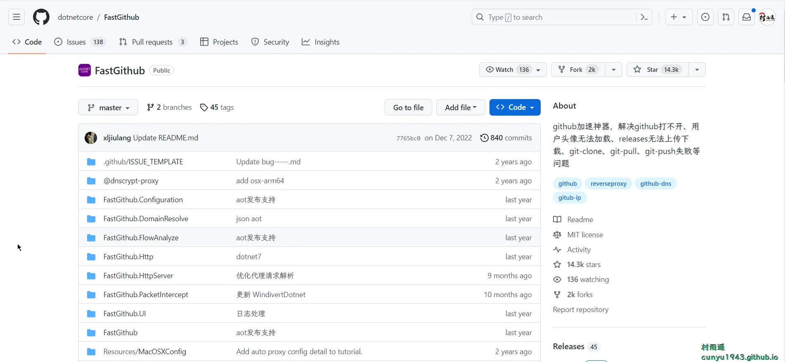
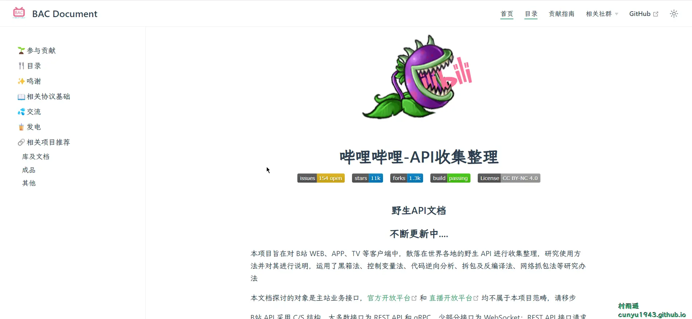
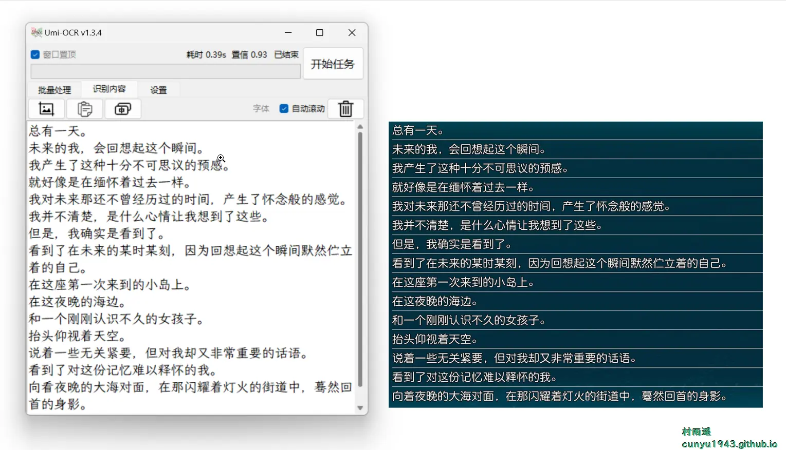
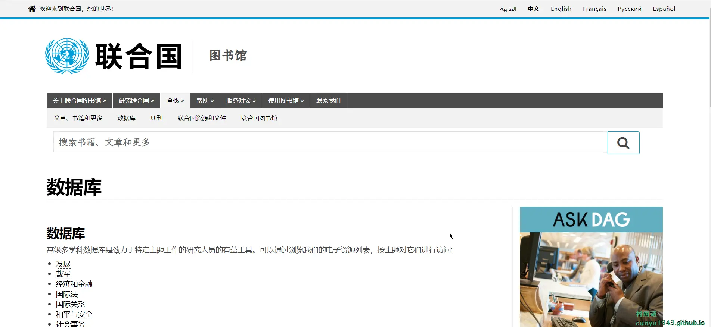
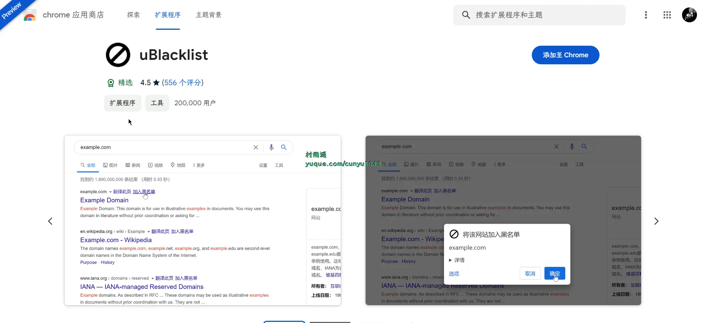
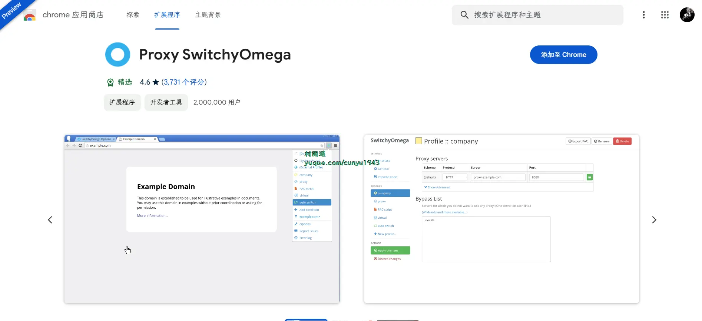
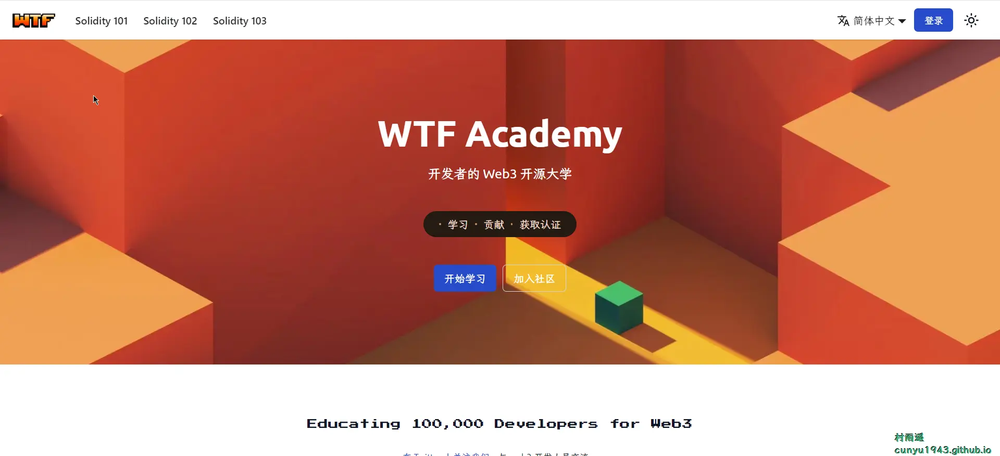
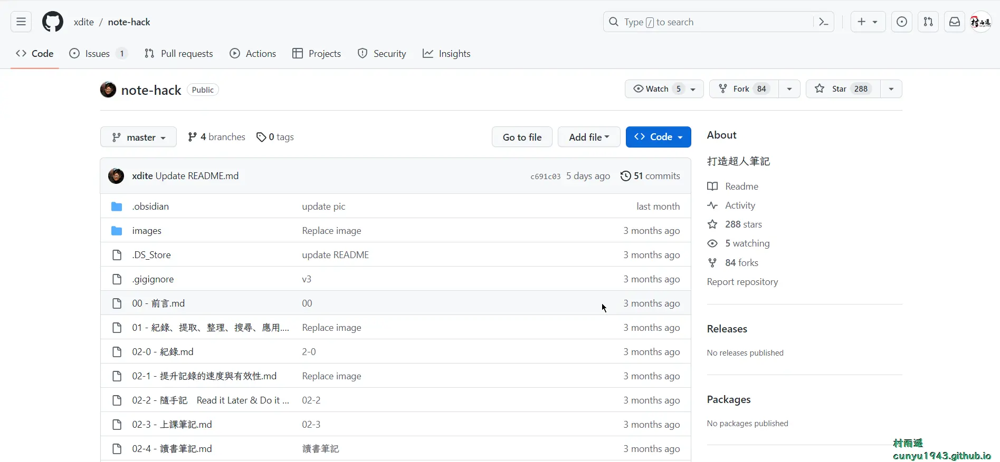

# 好物周刊#28：免费离线图片 OCR

::: info 共勉
不要哀求，学会争取。若是如此，终有所获。
:::
::: tip 原文
https://mp.weixin.qq.com/s/ZbFmBZ3z1uy6Ee1wnBy6kQ
:::

## 一、项目

### 1. [github-readme-activity-graph](https://github.com/ashutosh00710/github-readme-activity-graph)

动态生成的活动图表，显示您过去 31 天的 `GitHub` 活动。

### 2. [FastGithub](https://github.com/dotnetcore/FastGithub)

访问 `Github` 的加速神器，解决 `Github` 打不开、用户头像无法加载、`releases` 无法上传下载、`git-clone`、`git-pull`、`git-push` 失败等问题。

### 3. [bilibili-API-collect](https://github.com/SocialSisterYi/bilibili-API-collect)

对 B 站 `WEB`、`APP`、`TV` 等客户端中，散落在世界各地的野生 `API` 进行收集整理，研究使用方法并对其进行说明，运用了黑箱法、控制变量法、代码逆向分析、拆包及反编译法、网络抓包法等研究办法。

## 二、软件

### 1. [TAICHI-flet](https://github.com/cuifengcn/TAICHI-flet)

基于 `flet` 的一款 `Windows` 桌面应用，实现了浏览图片、音乐、小说、漫画、各种资源的功能。

### 2. [TikTokDownloader](https://github.com/JoeanAmier/TikTokDownloader)

完全开源，基于 `Requests` 模块实现；批量下载抖音账号发布、喜欢、收藏的作品；单独下载抖音链接或 TikTok 链接对应的作品；获取抖音直播推流地址；下载抖音直播视频；采集抖音作品评论数据；批量下载抖音合集作品；采集抖音账号详细数据；采集抖音用户 / 作品搜索结果；采集抖音热榜数据。

### 3. [Umi-OCR](https://github.com/hiroi-sora/Umi-OCR)

`OCR` 图片转文字识别软件，完全离线。截屏/批量导入图片，支持多国语言、合并段落、竖排文字。可排除水印区域，提取干净的文本，基于 `PaddleOCR` 。

## 三、网站

### 1. [国家数据](https://data.stats.gov.cn/)

数据源于国家统计局，包含了我国经济民生等多个方面的数据，包含普查数据、地区数据、部门数据、国际数据等多方面内容，并且在月度、季度、年度都有覆盖，十分全面。

### 2. [CEIC](https://www.ceicdata.com/zh-hans)

前所未有地覆盖全球超过 213 个国家和地区的经济数据（宏观经济、`GDP`、进出口、能源等）。`CEIC` 帮助您一站式获取来自上千个数据源的百万级的时间序列数据，客服团队帮助您寻找或解释您想要的数据信息。

### 3. [联合国数据库](https://www.un.org/zh/library/page/databases)

包含发展、裁军、经济和金融、国际法、国际关系、和平与安全、社会事务等多个方面的内容。

## 四、插件

### 1. [Magical](https://chromewebstore.google.com/detail/magical-ai-writer-autofil/iibninhmiggehlcdolcilmhacighjamp)

免费 `AI` 写作工具、文本扩展和自动填充扩展通过 `OpenAI` 工具（`ChatGPT`，`GPT4`）自动化重复任务。

使用 `AI` 和 `GPT4` 的强大力量自动化重复性任务。让 `Magical` 为您从任何站点或应用程序编写AI生成的消息、电子邮件和客户回复，所有这些都由 `GPT4` 提示驱动。保存您喜欢的消息作为模板，并使用我们的免费文本扩展器即可立即扩展它们。

告别在选项卡或应用程序之间切换以访问 `AI` 和 `GPT4`，欢迎使用轻松快捷的消息（电子邮件、聊天、内部邮件等）与客户、候选人或前景联系。

### 2. [uBlacklist](https://chromewebstore.google.com/detail/ublacklist/pncfbmialoiaghdehhbnbhkkgmjanfhe)

此浏览器扩展可以帮你在谷歌搜索结果中屏蔽一些你不想看到的网站。

你可以通过在搜索结果页面中直接屏蔽某个网站，也可以通过点击本扩展的图标将当前网站添加到黑名单。屏蔽规则同时支持「匹配模式」（比如 `*://*.example.com/*`）和「正则表达式」（比如 `/example\.(net|org)/`）的语法。

本浏览器扩展还提供了黑名单的同步功能，可以通过 `Google Drive` 和 `Dropbox` 将黑名单列表在不同设备之间同步。除此之外，你还可以通过订阅一些公开的黑名单列表，随时获取最新的网站黑名单。

### 3. [Proxy SwitchyOmega](https://chromewebstore.google.com/detail/proxy-switchyomega/padekgcemlokbadohgkifijomclgjgif)

轻松快捷地管理和切换多个代理设置，支持如下功能：

* 自动检测未加载的元素，并可通过弹出菜单一键设置使用代理。
* 支持需要用户名密码验证的代理服务器。
* 更灵活的代理配置：代理情景模式、多个自动切换模式以及多个规则列表。
* 新增多种切换条件类型，并改进原有的切换条件。
* PAC 脚本生成和切换的性能优化。
* 崭新的选项页面和下拉菜单，用户体验更佳。
* 许多错误修复以及改进。测试更充分。

## 五、资料

### 1. [WTF Solidity](https://github.com/AmazingAng/WTF-Solidity)

`Solidity` 极简入门教程，供小白们使用，每周更新 1-3 讲。

### 2. [Zotero 中文文档仓库](https://github.com/zotero-chinese/wiki)

`Zotero` 中文用户文档、中文开发文档、`CSL` 文档中文译文。

### 3. [打造超人笔记](https://github.com/xdite/note-hack)

一本关于如何有效记录和整理笔记的书籍。作者认为，笔记是一个看起来复杂但实际上比学习和阅读更简单的问题。通过拆解笔记的流程，作者发现主要问题的结构变得非常简单。此外，随着科技的发展，许多快速记录工具和笔记整理软件已经被发明出来，使笔记搜索变得更加容易。在本书中，作者探讨了如何通过做笔记和整理笔记来挖掘和整理自己对一个领域的各种答案。通过阅读本书，读者可以学习到如何使用各种工具和方法来提高自己的笔记能力，成为一个笔记超人。

## ✍️ 说明

周刊专栏相关信息：

- **项目地址**：[Github](https://github.com/cunyu1943/JavaPark/) | [Gitee](https://gitee.com/cunyu1943/JavaPark/) ，觉得不错麻烦给我一个**Star**，感谢 ❤️
- **浏览地址**：公众号 | [电子书](https://cunyu1943.github.io/) | [电子书（国内）](https://cunyu1943.gitee.io/)

如果你阅读到这里，说明我的工作没有白费。如果你想推荐项目/网站/软件/资源，欢迎提交 **[issue](https://github.com/cunyu1943/JavaPark/issues)** 或者添加我 **个人微信：cunyu1943** 与我交流。

---

## 🎬️ 广告
当前大环境下，就业形势严峻，尤其针对即将毕业的大学生。作为一个技术求职者，求职前应该做好哪些准备呢，一些面试实战技巧也十分有必要！而刚好最近掘金出了一本《技术人求职指南》小册，相信一定会对在找工作的你有所帮助。

从求职到拿下 `Offer`，一本职场的全方位攻略，快来和我一起学习吧！

## ⏳ 联系

想解锁更多知识？不妨关注我的微信公众号：**村雨遥（id：JavaPark）**。

扫一扫，探索另一个全新的世界。

<Share colorful />
