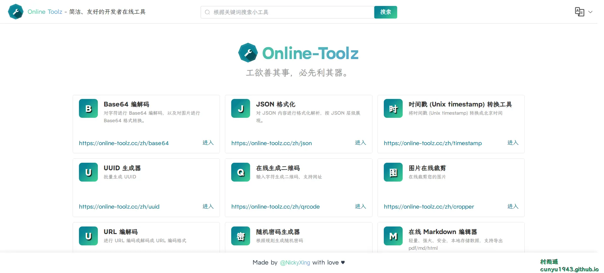
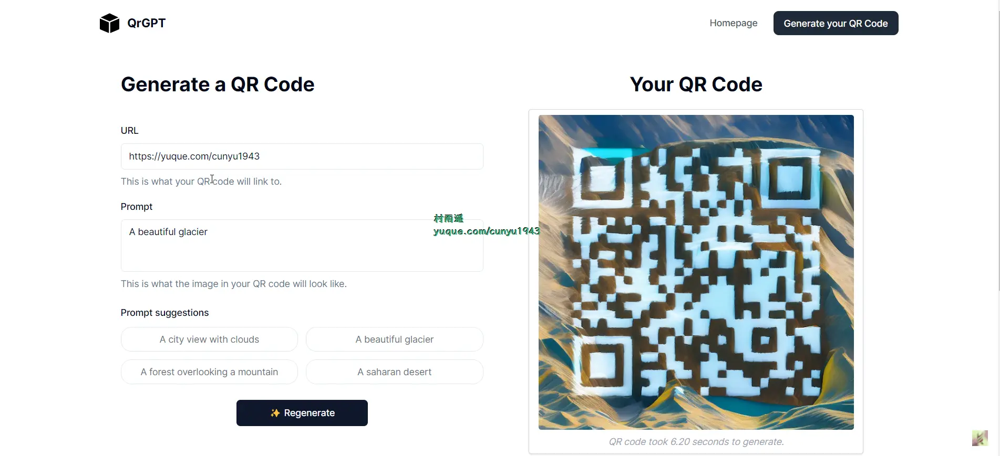
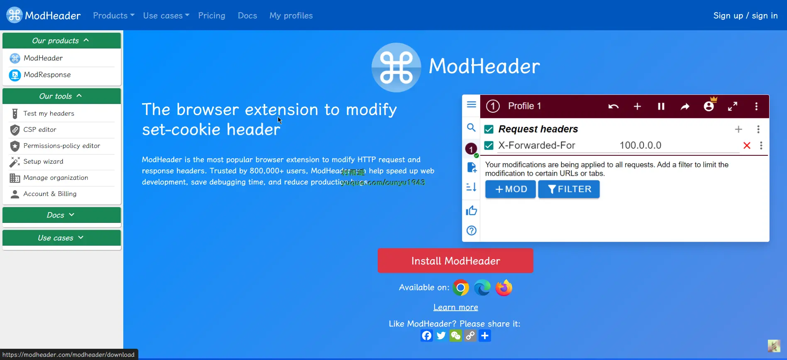
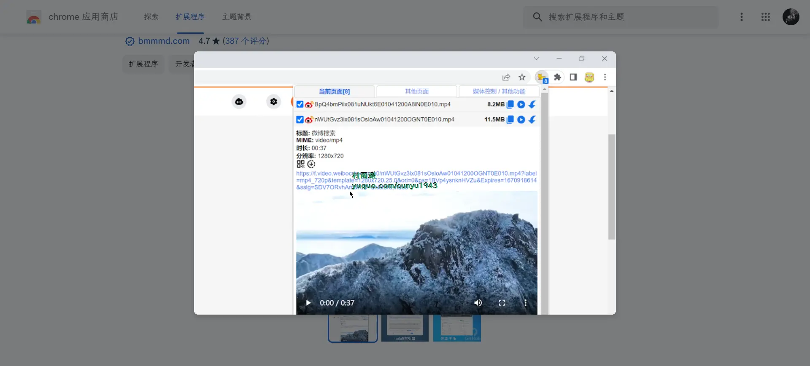
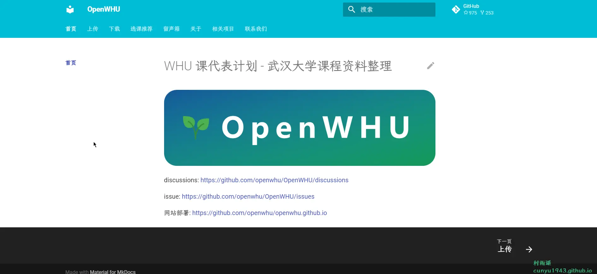

# 好物周刊#30：我在 Github 上名校

::: info 共勉
不要哀求，学会争取。若是如此，终有所获。
:::
::: tip 原文
https://mp.weixin.qq.com/s/8g2nIilC2CZFlGVq-US_gw
:::

## 一、项目

### 1. [Fighting Design](https://github.com/FightingDesign/fighting-design)

一款灵活、优质的组件库，可在 `vue3` 应用程序中快速构建交互界面。

### 2. [青龙](https://github.com/whyour/qinglong)

支持 `Python3`、`JavaScript`、`Shell`、`Typescript` 的定时任务管理平台，支持如下功能：

-   支持多种脚本语言
-   支持在线管理脚本、环境变量、配置文件
-   支持在线查看任务日志
-   支持秒级任务设置
-   支持系统级通知
-   支持暗黑模式
-   支持手机端操作

### 3.[LAMDA](https://github.com/rev1si0n/lamda)

`LAMDA` 是一个用于逆向及自动化的辅助框架，它设计为减少安全分析以及应用测试人员的时间及琐碎问题，以编程化的接口替代大量手动操作，它并不是一个单一功能的框架。

## 二、软件

### 1. [极速图片压缩器](https://github.com/Dreamer365/topspeed-image-compressor)

压缩速度极快的图片压缩软件，具有以下特点：

- 具有超快的压缩速度
- 支持压缩 `GB` 级别的超大体积的图片
- 支持 7 种图片格式
- 支持深、浅色主题模式
- 可对原始图片进行预览
- 可通过【鼠标拖拽】【点击选择】【`ctrl + v` 粘贴】 等多种方式添加图片
- 支持添加文件夹，可自动解析文件夹内所有符合要求的图片
- 实时显示压缩进度
- 完全在本地执行压缩，有无网络均可，不上传图片，充分保证隐私安全

### 2. [SKIP](https://github.com/GuoXiCheng/SKIP)

一款免费开源的安卓应用，旨在利用 `Android` 无障碍服务帮助用户快速点击 `APP` 开屏广告的跳过按钮，让你的使用体验更加流畅。

### 3. [LunaTranslator](https://github.com/HIllya51/LunaTranslator)

`Galgame` 翻译工具，支持剪贴板、`OCR`、`HOOK`，支持 40 余种翻译引擎。

## 三、网站

### 1. [FreeCodeCamp](https://www.freecodecamp.org/chinese/learn)

免费学习编程 - `Python`、`JavaScript`、`Java`、`Git` 等。

### 2. [Online-Toolz](https://online-toolz.cc/zh/)

简洁、友好的开发者在线工具。具有以下功能：

- `Base64` 编解码
- `JSON` 格式化
- 时间戳转换工具
- `UUID` 生成器
- 在线生成二维码
- 图片在线裁剪
- `URL` 编码
- 随机密码说生成器
- 在线 `Markdown` 编辑器

### 3. [qrGPT](https://github.com/Nutlope/qrGPT)

输入链接，输入提示关键词，就能在短短几秒能帮你生成漂亮的 `AI` 二维码。

## 四、插件

### 1. [ModHeader](https://chromewebstore.google.com/detail/modheader-modify-http-hea/idgpnmonknjnojddfkpgkljpfnnfcklj?hl=zh-CN)

用来自定义 `HTTP` 请求头或重写响应头，包含覆盖 `Chrome` 浏览器请求头的默认值。

### 2. [猫抓](https://chromewebstore.google.com/detail/猫抓/jfedfbgedapdagkghmgibemcoggfppbb?hl=zh-CN)

源嗅探扩展，能够帮助你筛选列出当前页面的资源。提供嗅探、缓存捕捉、视频录制等各种工具帮助抓取资源。可以在设置内添加想要抓取的资源类型，包括图片等资源。

### 3. [文档翻译](https://chromewebstore.google.com/detail/文档翻译-在线翻译-pdf、ppt/ekgbhhaimaahdlaiplkafkomhoblilel?hl=zh-CN)

只需一键即可翻译 `PDF`、`Word`、`Excel`、`PowerPoint` 和其他文档。

适用于办公和教育场景中的多种文档，如论文、合同、行业报告、产品文档、书籍、文件、演示文稿等，并提供高精度文档布局恢复能力。

- 支持上传翻译文件，并保存到 `Google Drive` 或下载到本地。
- 支持 `Word/PPT/Excel/PDF/PowerPoint` 等格式。
- 200 多种语言之间的互译，包括英语、西班牙语、法语、德语、阿拉伯语、俄语等等。 翻译准确，操作快捷。
- 该服务将保留所述文档的原始格式和布局。 即时结果。
- `PDF` 翻译器，`PPT` 翻译器，`PowerPoint` 翻译器，`Word` 翻译器，`Excel` 翻译器，翻译 `PPT`，翻译 `PowerPoint`，翻译 `Word`，翻译 `Excel`，未来将支持批处理模式。

## 五、资料

### 1. [武汉大学课程资料整理](https://github.com/openwhu/OpenWHU)

武汉大学课程资料整理，项目愿景：

1. 一定程度上消除信息不对称所带来的不公平现象。
2. 尊重并保护知识产权。
3. 以成为同学们学习中的辅助与参考为出发点，坚决反对抄袭。
3. 保持团队由在校生管理，定期维护。
4. 计划存活期间永久保证：公益、免费、开源。

### 2. [广东工业大学计算机学院课程攻略](https://github.com/brenner8023/gdut-course)

广东工业大学计算机学院课程攻略 - 毕业设计、校招、课程设计、实验、经验分享、论文模板、试卷、习题解答等等。

### 3. [北航课程作业资料共享平台](https://github.com/TheBloodthirster/BUAA_Course_Sharing)

北京航空航天大学 (北航) 课程作业资料共享计划。

## ✍️ 说明

周刊专栏相关信息：

- **项目地址**：[Github](https://github.com/cunyu1943/JavaPark/) | [Gitee](https://gitee.com/cunyu1943/JavaPark/) ，觉得不错麻烦给我一个**Star**，感谢 ❤️
- **浏览地址**：公众号 | [电子书](https://cunyu1943.github.io/) | [电子书（国内）](https://cunyu1943.gitee.io/)

如果你阅读到这里，说明我的工作没有白费。如果你想推荐项目/网站/软件/资源，欢迎提交 **[issue](https://github.com/cunyu1943/JavaPark/issues)** 或者添加我 **个人微信：cunyu1943** 与我交流。

---

## 🎬️ 广告

当前大环境下，就业形势严峻，尤其针对即将毕业的大学生。作为一个技术求职者，求职前应该做好哪些准备呢，一些面试实战技巧也十分有必要！而刚好最近掘金出了一本《技术人求职指南》小册，相信一定会对在找工作的你有所帮助。

从求职到拿下 `Offer`，一本职场的全方位攻略，快来和我一起学习吧！

## ⏳ 联系

想解锁更多知识？不妨关注我的微信公众号：**村雨遥（id：JavaPark）**。

扫一扫，探索另一个全新的世界。

<Share colorful />