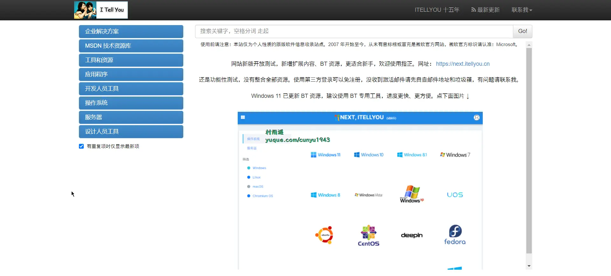

# 好物周刊#31：在线格式转换

::: info 共勉
不要哀求，学会争取。若是如此，终有所获。
:::
::: tip 原文

:::

## 一、项目

### 1. [Soybean Admin](https://github.com/honghuangdc/soybean-admin)

一个基于 `Vue3`、`Vite3`、`TypeScript`、`NaiveUI`、`Pinia` 和 `UnoCSS` 的清新优雅的中后台模版，它使用了最新流行的前端技术栈，内置丰富的主题配置，有着极高的代码规范，基于文件的路由系统以及基于 `Mock` 的动态权限路由，开箱即用的中后台前端解决方案，也可用于学习参考。

### 2. [vue-vite](https://github.com/chao921125/vue-vite)

`vue3` + `vite4` + `vue-router` + `pinia`，动态路由、权限管理、`vw` 适配，路由切换 `PC` 与移动端，学习商用均可，配置简单，各种实用的插件库及对应示例。

### 3. [Pake](https://github.com/tw93/Pake)

利用 `Rust` 轻松构建轻量级多端桌面应用，支持 `Mac`/ `Windows`/`Linux`，具有以下特性：

-    相比传统的 `Electron` 套壳打包，要小将近 20 倍，5M 上下。
-   `Pake` 的底层使用的 `Rust Tauri` 框架，性能体验较 `JS` 框架要轻快不少，内存小很多。
-   不是单纯打包，实现了快捷键的透传、沉浸式的窗口、拖动、样式改写、去广告、产品的极简风格定制。
-   只是一个很简单的小玩具，用 `Rust` 替代之前套壳网页打包的老思路，其实 `PWA` 也很好。

## 二、软件

### 1. [Chat2DB](https://github.com/chat2db/Chat2DB)

一款开源免费的多数据库客户端工具，支持 `windows`、mac 本地安装，也支持服务器端部署，web 网页访问。 和传统的数据库客户端软件 Navicat、DBeaver 相比 Chat2DB 集成了 AIGC 的能力，能够将自然语言转换为 SQL， 也可以将 SQL 转换为自然语言，可以给出研发人员 SQL 的优化建议，极大的提升人员的效率，是 AI 时代数据库研发人员的利器， 不懂 SQL 的运营或业务也可以轻松使用快速查询业务数据、生成报表的能力。

### 2. [学无止下载器](https://github.com/PyJun/Mooc_Downloader)

学无止下载器，慕课下载器，`Mooc` 网课下载，慕课网，中国大学，网易云课堂，有道精品课，腾讯课堂，中公网校，学浪，抖音课堂，小鹅通，千聊，超星学习通，学银在线，智慧职教，智慧树，学堂在线，爱课程，B 站下载；支持视频，课件同时下载。

### 3. [Dash](https://kapeli.com/dash)

强大到你无法想象的 `API` 离线文档软件，目前仅支持 `macOS`，程序员居家必备神器。

## 三、网站

### 1. [MSDN](https://msdn.itellyou.cn/)

提供了纯净的原版 `Windows` 系统惊喜，而且版本齐全，支持免费下载。除此之外，还有开发者工具、工具和资源、开发人员工具、服务器、设计人员工具等诸多资源提供下载。

### 2. [大学资源网](https://www.dxzy163.com/)

大学资源网致力于为每个希望提升自己能力的人提供学习平台，通过这个平台每个人都有平等提高自己能力的机会，主要学习资源有：大学课程、中学课程、小学课程、管理课程培训等视频教程！

### 3. [Convertio](https://convertio.co/zh/)

在线转换文件的简单工具。支持超过 309 种不同的文档、图像、电子表格、电子书、文档、演示文稿、音频和视频格式。具有以下特点：

-   支持超 300 种格式
-   快速简便
-   云端处理
-   自定义设置
-   安全保障
-   支持所有设备

## 四、插件

### 1. [全文书签](https://chromewebstore.google.com/detail/全文书签/nemjnpfmngeipdjjjecgjgeognbcmkbl?hl=zh-CN)

可以全文搜索的书签和历史记录。

-   🔍 更好的浏览历史搜索工具。 
-   💾 存储并索引所有访问记录，并全文检索，再也不怕找不到看过的某个网页。 
-   🦉 给微博加书签并且可以被搜索！ 
-   🥇 全文检索结果展示在搜索引擎结果页面（支持 `baidu`/`bing`/`google`）。 
-   📎 同时支持在浏览器地址栏搜索（输入关键字 `kw` 后输入你想要搜索的东西） 
-   📜 你也可以点击地址栏右侧的拓展小图标在 `popup` 界面进行搜索以获得更多结果，并对结果进行排序。 
-   😺 所有东西存储在本地，没有账号，没有云存储，没有隐私问题，完全免费。（当你使用 `Ask GPT` 功能时会发送数据给 `OpenAI API`） 
-   ✉️ 支持发送书签页面或浏览历史到自定义 `API`。

### 2. [极速翻译](https://chromewebstore.google.com/detail/极速翻译/pmjagijikomfjjoafjbdeojcinngkcpe?hl=zh-CN)

一款专业的翻译扩展，支持划词翻译、全文翻译、在线翻译、截图翻译、翻译发音，修复谷歌翻译在中国大陆无法使用的问题，自动识别语言，支持上百种语言互译，帮助用户无障碍阅读外文文献。

### 3. [新简录屏](https://chromewebstore.google.com/detail/新简录屏-新一代在线录屏演示工具/dihjfiakmdjknpoejlnocicebohlijpg?hl=zh-CN)

新一代在线录屏演示工具，支持人像模式的屏幕录制，适合团队、销售、电商、在线课堂等各种类型场景！并且提供超长的使用时长，以及几乎无限的存储空间！而这些目前仅需要您现在安装插件即可享用，无需付费以及更多繁琐的订阅操作！支持如下核心功能：

-   流畅使用，一键开始
-   云端录制，内存无忧
-   自由水印，谨防盗版
-   多种格式，快速标注
-   异步协作，加速理解

## 五、资料

### 1. [深入浅出 Webpack](https://github.com/gwuhaolin/dive-into-webpack)

本书是国内第一本系统全面讲解 `Webpack` 的图书，涵盖了 `Webpack` 的入门、配置、实战、优化、原理。

-   第 1 章教你从 0 开始学会使用 `Webpack`；
-   第 2 章详细的讲解了 `Webpack` 提供的常用配置项；
-   第 3 章结合实际项目中常见的场景给出最佳实践；
-   第 4 章罗列出了各种优化 `Webpack` 的手段；
-   第 5 章剖析了 `Webpack` 原理以及如何开发 `Plugin` 和 `Loader`。

除了深入讲解 `Webpack`，本书还附带介绍了 `ES6`、`TypeScript`、`PostCSS`、`Prepack`、离线缓存、单页应用、`CDN` 等 `Web` 开发相关的技能。

无论是对 `Webpack` 一无所知的初学者，还是经验丰富的工程师，相信都能通过本书进一步提高对 `Webpack` 的理解，让你在 `Web` 开发中更加熟练的运用 `Webpack`。

### 2. [PassJava 学习教程](https://github.com/Jackson0714/PassJava-Platform)

一款面试刷题的 `Spring Cloud` 开源系统。零碎时间利用小程序查看常见面试题，夯实 `Java` 基础。 该项目可以教会你如何搭建 `SpringBoot` 项目，`Spring Cloud` 项目。 采用流行的技术，如 `SpringBoot`、`MyBatis`、`Redis`、 `MySql`、 `MongoDB`、 `RabbitMQ`、`Elasticsearch`，采用 `Docker` 容器化部署。

### 3. [Go 语言圣经](https://github.com/gopl-zh/gopl-zh.github.com)

《The Go Programming Language》 中文版本，仅供学习交流之用。

## ✍️ 说明

周刊专栏相关信息：

- **项目地址**：[Github](https://github.com/cunyu1943/JavaPark/) | [Gitee](https://gitee.com/cunyu1943/JavaPark/) ，觉得不错麻烦给我一个**Star**，感谢 ❤️
- **浏览地址**：公众号 | [电子书](https://cunyu1943.github.io/) | [电子书（国内）](https://cunyu1943.gitee.io/)

如果你阅读到这里，说明我的工作没有白费。如果你想推荐项目/网站/软件/资源，欢迎提交 **[issue](https://github.com/cunyu1943/JavaPark/issues)** 或者添加我 **个人微信：cunyu1943** 与我交流。

---

## 🎬️ 广告

当前大环境下，就业形势严峻，尤其针对即将毕业的大学生。作为一个技术求职者，求职前应该做好哪些准备呢，一些面试实战技巧也十分有必要！而刚好最近掘金出了一本《技术人求职指南》小册，相信一定会对在找工作的你有所帮助。

从求职到拿下 `Offer`，一本职场的全方位攻略，快来和我一起学习吧！

## ⏳ 联系

想解锁更多知识？不妨关注我的微信公众号：**村雨遥（id：JavaPark）**。

扫一扫，探索另一个全新的世界。

<Share colorful />