# 好物周刊#33：手写公式识别

::: info 共勉
不要哀求，学会争取。若是如此，终有所获。
:::
::: tip 原文
https://mp.weixin.qq.com/s/fmmb_1yKUPediAcJkM3L3A
:::

## 一、项目

### 1. [森林](https://github.com/rymcu/forest)

一款现代化的知识社区后台项目，使用 `SpringBoot` + `Shiro` + `MyBatis` + `JWT` + `Redis` 实现。支持如下特性：

- 浏览帖子
- 回帖
- 货币
- 发帖
- 登录
- 注册
- 内容编辑器

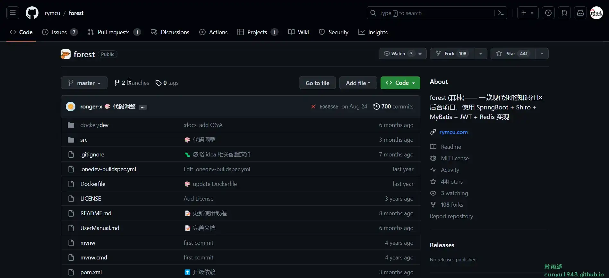

### 2. [星云](https://github.com/rymcu/nebula)

一款现代化的知识社区前台项目，使用 `Vue` + `NuxtJS` + `Element-UI` 实现，和森林是互为前后端的关系，两者搭配使用效果更佳。

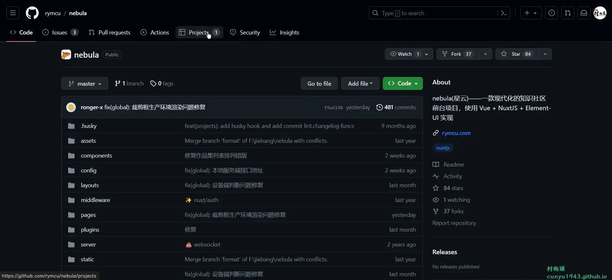

### 3. [GB/T 7714—2015 相关的 CSL 样式](https://github.com/redleafnew/Chinese-STD-GB-T-7714-related-csl)

GB/T 7714 相关的 `csl` 以及 `Zotero` 使用技巧及教程，写论文文献管理必备！

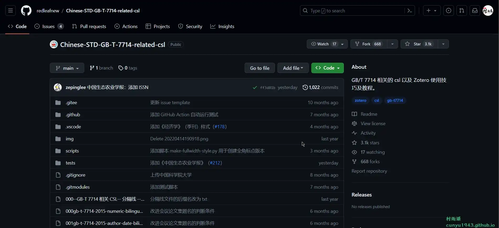

## 二、软件

### 1. [AnyTXT Searcher](https://anytxt.net/)

一款功能强大的文件内容搜索应用程序，就像本地磁盘 `Google` 搜索引擎一样，并且比 `Windows` 搜索和 `Windows findstr` 命令快得多。`Anytxt` 是您最好的桌面文件内容全文搜索引擎和最好的 `Google` 桌面搜索替代品。

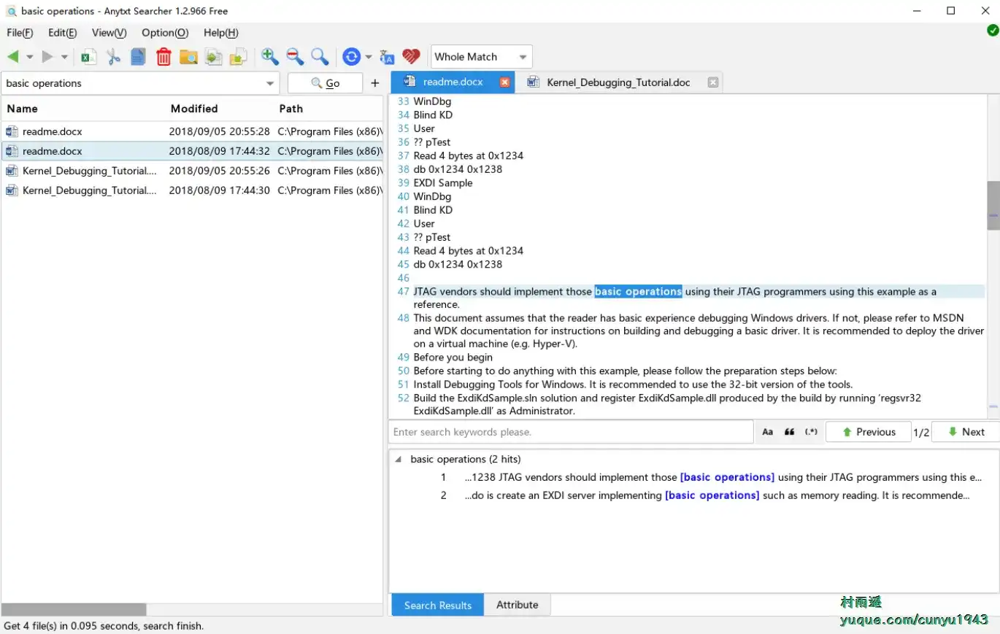

### 2. [Bandizip](https://cn.bandisoft.com/bandizip/)

一个强大的多功能压缩文件管理工具，可提供很快的解压缩速度和其他各种实用功能。

支持的主要功能如下：
- 支持的操作系统: `Windows 7/8/8.1/10/11 (32bit/64bit/arm64)`
- 集压缩/解压/浏览/编辑为一体的压缩包管理器
- 可以提取包括 `RAR/ISO/7Z/ZIP` 在内的 30 多种格式
- 可以创建拥有密码和压缩分卷的压缩包
- 支持多个的处理器核心进行高速的解压缩操作
- 对 `Windows` 11 上下文菜单的支持

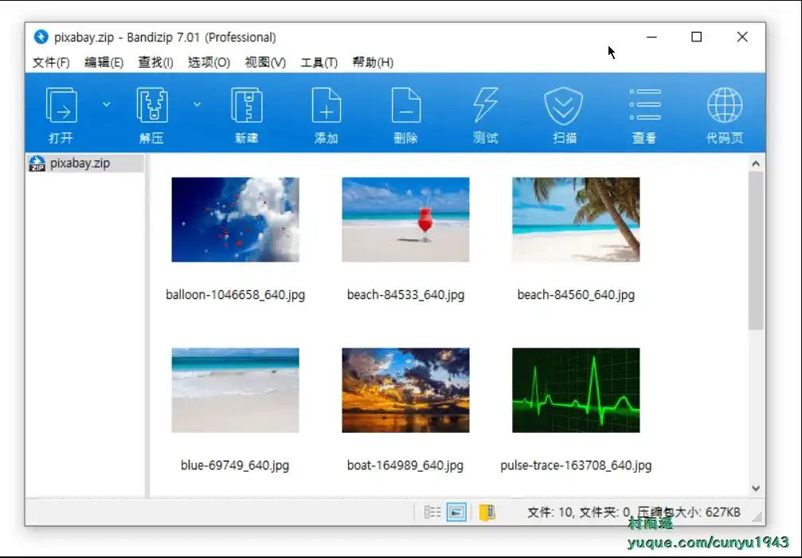

### 3. [Honeyview](https://cn.bandisoft.com/honeyview/)

一款快速的图片查看器，主要功能有：

- 轻量而快速
- 可以显示包括 `GPS` 信息在内的 `JPEG` 格式的 `EXIF` 信息
- 对图像格式进行批量转换和调整大小
- 支持显示 `GIF` 和 `WebP` 动图
- 无需解压即可直接查看压缩包中的图像

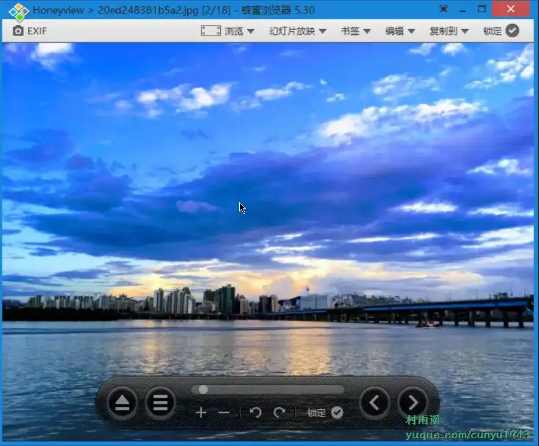

## 三、网站

### 1. [你注册过哪些网站](https://www.reg007.com/)

手机换号，如何保护您的数据？只需输入手机号，就能找回您使用原手机号注册或绑定过的各种应用，进行注销或解绑操作。
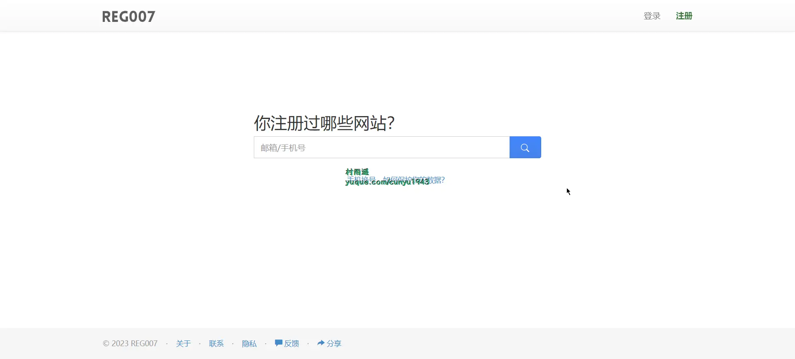

### 2. [MyScript](https://webdemo.myscript.com/)

你还在苦恼复杂的数学公式和化学方程式没办法用电脑打出来吗？有了这个神器，就可以轻松地以手绘的方式画出来，交给电脑自动帮你转化。

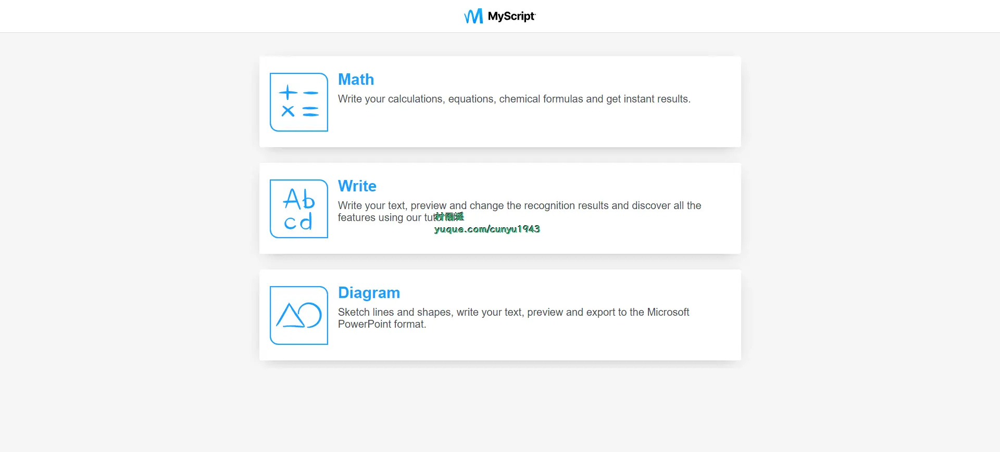

### 3. [网络威胁](https://cybermap.kaspersky.com/cn)

通过该网站，能够直观看到全球黑客的攻击活动情况，查看各个国家被攻击的数据。

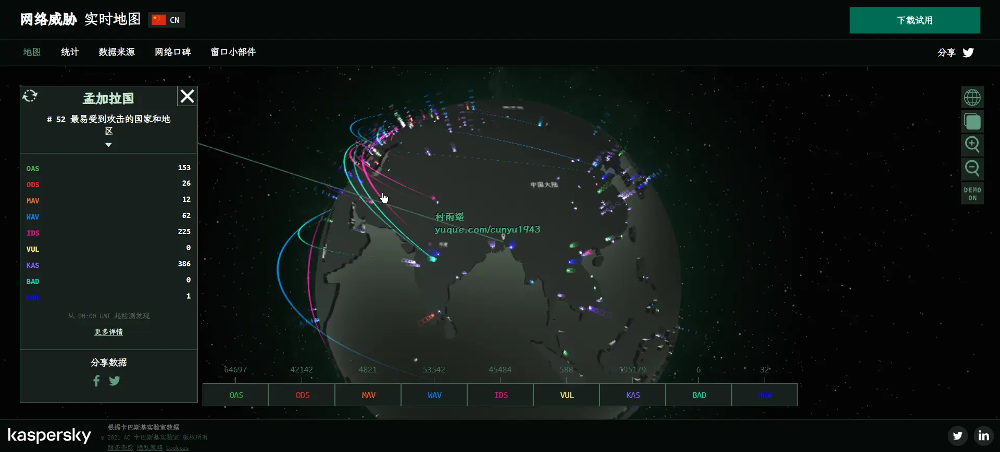

## 四、插件

### 1. [1Block](https://chromewebstore.google.com/detail/1block-best-adblocker-for/jajikjbellknnfcomfjjinfjokihcfoi?hl=zh-CN)

快速、高效、注重隐私的广告拦截器。

旨在与最新的 `Manifest V3` 架构无缝协作，是您的一站式解决方案，可提供更干净、更快、更愉快的浏览体验。

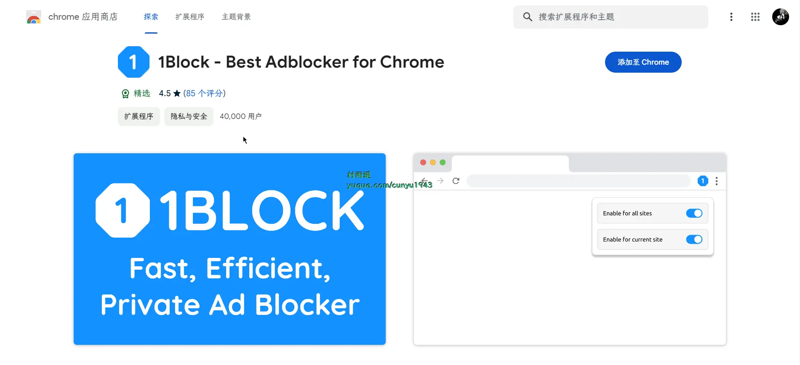

### 2. [网站拦截器](https://chromewebstore.google.com/detail/网站拦截器-拦截站点和焦点模式/pgoeobojimoocdnilcajmjihiabcmabn)

阻止网站，专注于网站拦截器。 设置自定义阻止列表和密码保护。

用网站拦截器防止分心并保持注意力! 使用自定义封锁列表和密码保护来控制你的互联网使用。

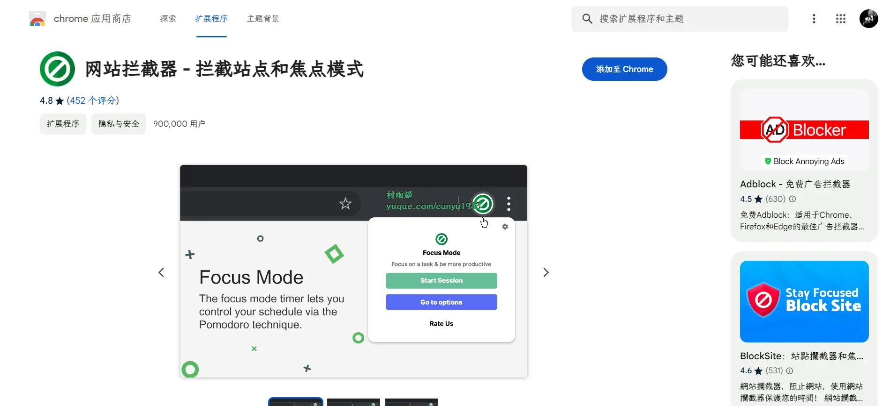

### 3. [Adblock](https://chromewebstore.google.com/detail/adblock-免费广告拦截器/dgjbaljgolmlcmmklmmeafecikidmjpi)

适用于 `Chrome`、`Firefox` 和 `Edge` 的最佳广告拦截器。在 `YouTube`、网站上屏蔽广告，享受无广告的浏览体验。

与其他广告拦截器相比，`Adblock` 使用的内存更少，并能处理大多数广告拦截的规避脚本。其时尚和现代的界面使其易于使用，其跟踪保护功能通过阻止常见的第三方跟踪系统来确保你的隐私。社交媒体过滤器甚至可以帮助你从网页上删除不需要的社交媒体小部件。

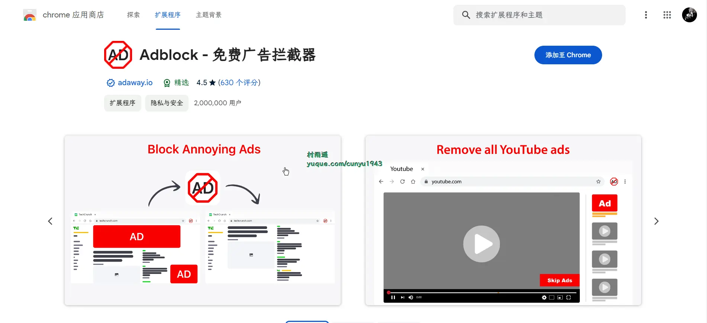

## 五、资料

### 1. [BypassAntiVirus](https://github.com/TideSec/BypassAntiVirus)

远控免杀系列文章及配套工具，汇总测试了互联网上的几十种免杀工具、113 种白名单免杀方式、8 种代码编译免杀、若干免杀实战技术，并对免杀效果进行了一一测试，为远控的免杀和杀软对抗免杀提供参考。

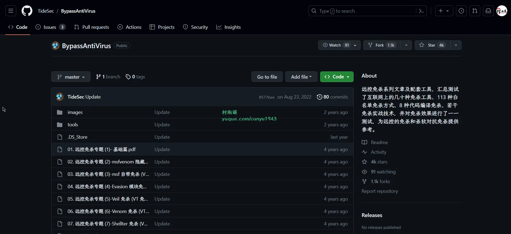

### 2. [Nerf 学习笔记](https://github.com/yangkang2021/nerf-learn)

记录了作者对于 `Nerf（神经辐射场）` 各种算法、应用、软件等的学习过程。

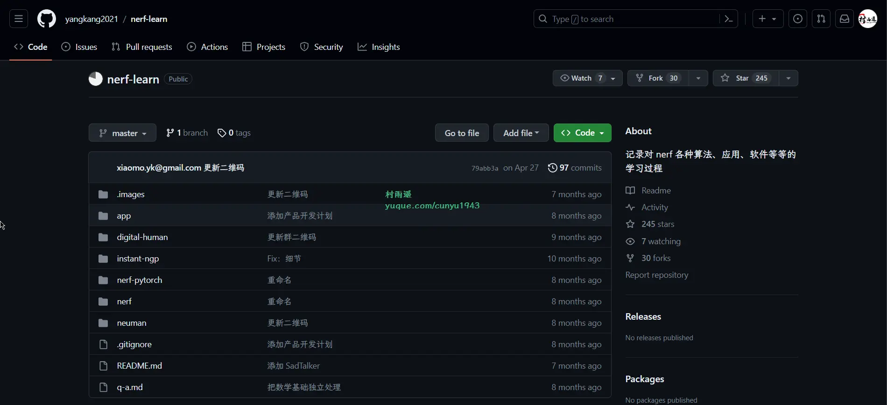

### 3. [Web](https://github.com/Daotin/Web)

从零开始学 `Web` 前端系列图文教程，从零开始一步步带你进入前端的世界。

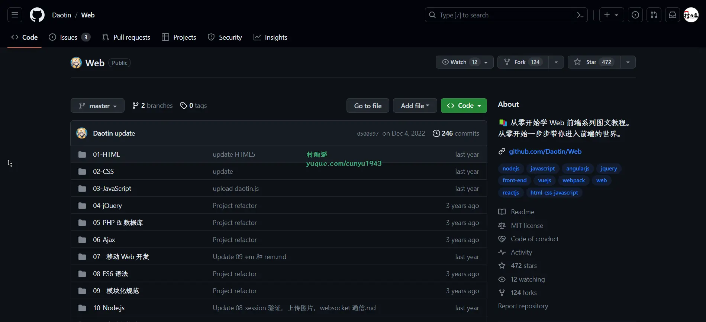

## ✍️ 说明

周刊专栏相关信息：

- **项目地址**：[Github](https://github.com/cunyu1943/JavaPark/) | [Gitee](https://gitee.com/cunyu1943/JavaPark/) ，觉得不错麻烦给我一个**Star**，感谢 ❤️
- **浏览地址**：公众号 | [电子书](https://cunyu1943.github.io/) | [电子书（国内）](https://cunyu1943.gitee.io/) | [语雀](https://yuque.com/cunyu1943)

如果你阅读到这里，说明我的工作没有白费。如果你想推荐项目/网站/软件/资源，欢迎提交 **[issue](https://github.com/cunyu1943/JavaPark/issues)** 或者添加我 **个人微信：cunyu1943** 与我交流。

---

## 🎬️ 广告

想必作为一名程序猿，多多少少会接触到语雀，在这里有许多优秀的内容，如果你还没有注册，那赶紧去注册一个吧。
而且现在官方送福利了，只要你是新注册的用户，注册后在会员信息页填写邀请码 **`VUFNKN`** 即可领取 30 天语雀会员。
> 🚩 [注册地址](https://www.yuque.com/about)

## ⏳ 联系

想解锁更多知识？不妨关注我的微信公众号：**村雨遥（id：JavaPark）**。

扫一扫，探索另一个全新的世界。

<Share colorful />