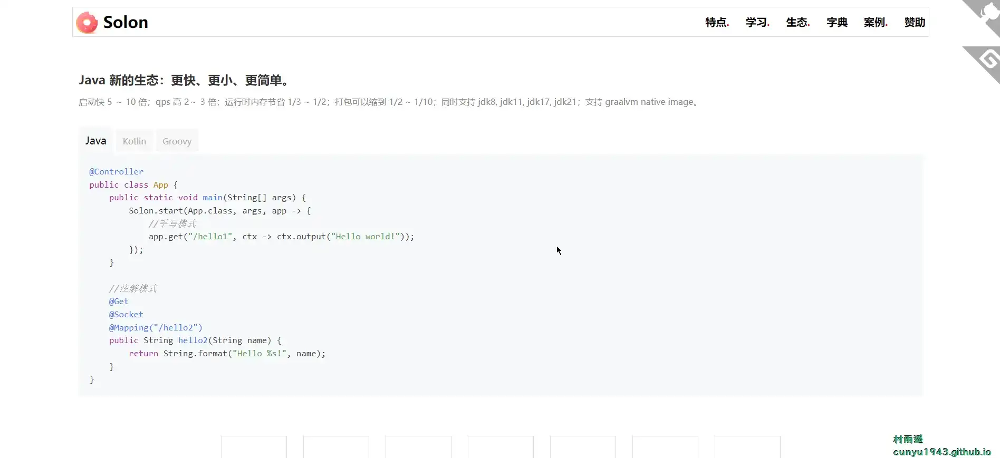
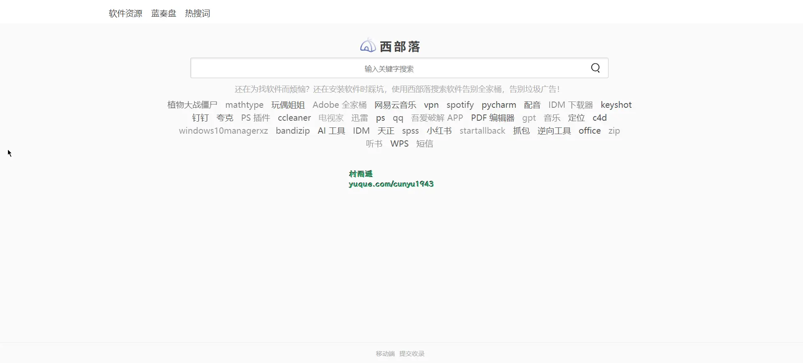
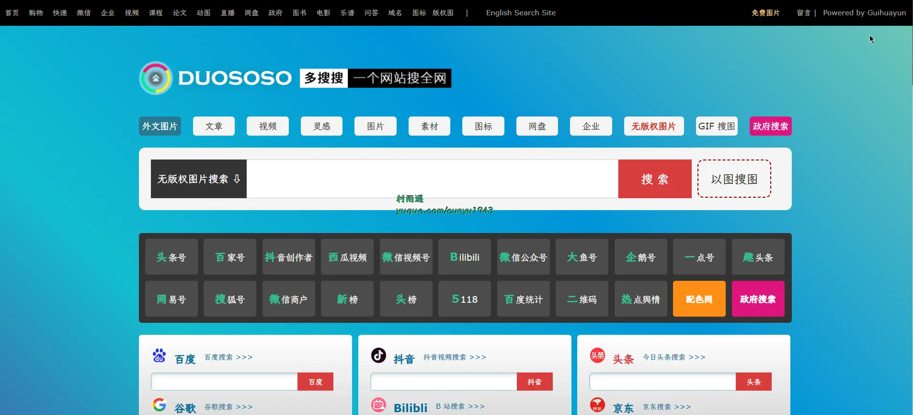
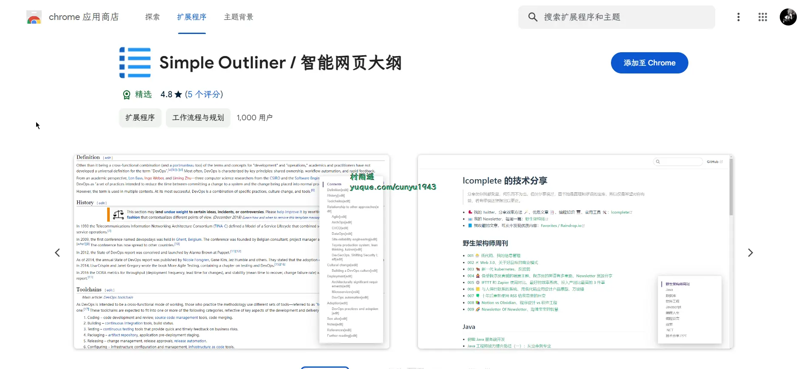
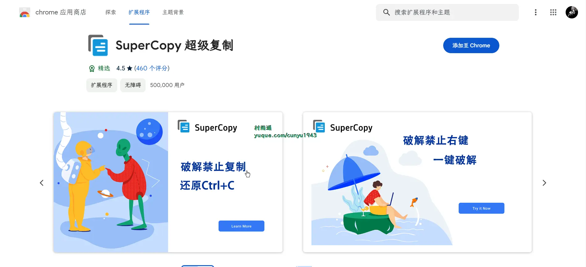
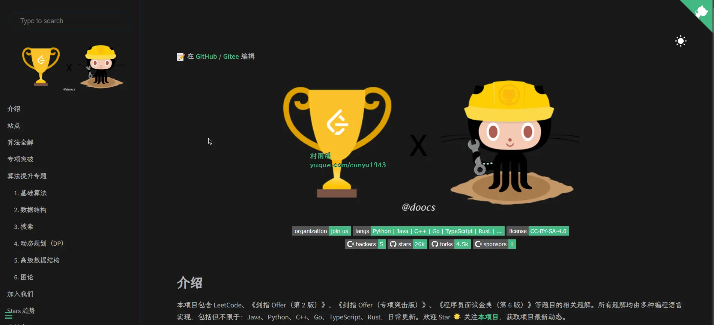
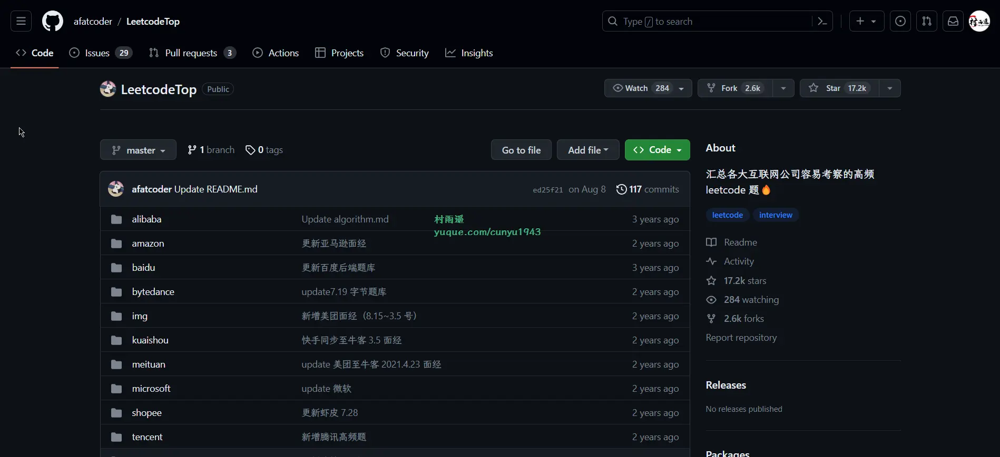

# 好物周刊#34：超级复制神器

::: info 共勉
不要哀求，学会争取。若是如此，终有所获。
:::
::: tip 原文
https://mp.weixin.qq.com/s/2vrjZvW4gT_EqMpzEx6kNg
:::

## 一、项目

### 1. [Solon](https://github.com/noear/solon)

`Java` 新的生态型应用开发框架，更小、更快、更简单！

从零开始构建。有自己的标准规范与开放生态。组合不同的生态插件应对不同需求，方便定制，快速开发：

- 克制、简洁、高效、开放、生态
- 支持 `JDK8`、`JDK11`、`JDK17`、`JDK21`
- `Http`、`WebSocket`、`Socket` 三种信号统一的开发体验（俗称：三源合一）
- 支持 “注解” 与 “手动” 两种模式，按需自由操控
- `Not Servlet`，可以适配任何基础通讯框架（最小 0.3m 运行 `rpc` 架构）
- 独特的 `IOC/AOP` 容器设计。不会因为插件变多而启动变很慢
- 支持 `Web`、`Data`、`Job`、`Remoting`、`Cloud` 等任何开发场景
- 兼顾 `Handler` + `Context` 和 `Listener` + `Message` 两种架构模式
- 强调插件式扩展，可扩展可切换；适应不同的应用场景
- 支持 `GraalVm Native Image` 打包
允许业务插件 “热插”、“热拔”、“热管理”

### 2. [敏感词检测](https://github.com/bosnzt/wordscheck)

敏感词检测，违禁词过滤，敏感词过滤，敏感词库，一键启动，本地运行，私有化部署，1 分钟接入完成，支持 `docker`，支持在线 `api`。

### 3. [wechatDownload](https://github.com/xiaoguyu/wechatDownload)

微信公号文章下载工具，使用 `Electron` + `Typescript` 技术栈搭建。支持如下功能：

- 单篇文章下载
- 批量下载
- 监控下载
- 保存到 `MySQL`
- 线程配置

## 二、软件

### 1. [CopyTranslator](https://github.com/CopyTranslator/CopyTranslator)

复制即翻译的外文辅助阅读翻译解决方案，具有如下特点：

- **复制翻译**：只需复制文本到剪贴板，下一秒即可查看翻译结果，享受所见即所得的快感。
- **优化翻译**：解决多余的断句和换行带来的乱码问题，翻译结果更符合阅读习惯。
- **拖拽复制**：无限接近划译的系统级开源实现，拖拽选中即可复制翻译。 

### 2. [Rubick](https://github.com/rubickCenter/rubick)

使用 electron 构建的开源、免费效率工具。更轻便、更简洁、更安全的插件化桌面端工具箱。具有以下特点：

- 更加轻量：仅仅包含插件运行所需 `API`
- 更加安全：支持基于 `webdav` 的多端数据同步，支持内网部署，从不获取任何用户数据，插件使用更加安全
- 更加便捷：插件托管于 `npm` 仓库
- 更加自由：代码完全开源，可以二次开发定制化

### 3. [火绒安全](https://www.huorong.cn/person5.html)

一款 `Windows` 操作系统下的个人电脑安全软件。主要功能有清除恶意软件、扫描电脑病毒、修补系统漏洞、清理系统垃圾、火绒剑、安全防护功能、自定义规则等。

产品具有以下特点：
- 干净：无任何具有广告推广性质的弹窗和捆绑等打扰用户行为
- 轻巧：占用资源少，不影响日常办公、游戏
- 简单：一键下载，安装后使用默认配置即可获得安全防护
- 易用：产品性能历经数次优化，兼容性好，运行流畅

## 三、网站

### 1. [西部落](https://www.xibuluo.com/)

西部落软件搜索平台通过收录各类优质的软件下载网站索引，让用户快速找到对的软件的同时，也让用户告别流氓全家桶软件和捆绑安装广告软件的困扰。

### 2. [多搜搜](https://duososo.com/)

多搜搜为您提供搜索工具聚合，包括无版权图片搜索、人工智能图片搜索，`Gif` 搜索，图标搜索，电影海报搜索，无版权免费图片搜索，学习搜索，课程搜索，学术搜索，图书搜索，问答搜索，乐谱搜索，娱乐搜索，视频搜索，影视搜索，购物搜索，直播搜索，网盘搜索，企业查询，政府搜索，域名搜索，招聘搜索。

### 3. [OmoFun 动漫](https://www.omofun.xyz/)

每日动漫更新在线观看 `omofun` 动漫番剧，追番二次元 `omofun` 传送门。

## 四、插件

### 1. [智能网页大纲](https://chromewebstore.google.com/detail/simple-outliner-智能网页大纲/ppdjhggfcaenclmimmdigbcglfoklgaf)

自动生成网页大纲、目录，支持 `Inoreader` 和 `Feedly`。

### 2. [QR 码生成与识别](https://chromewebstore.google.com/detail/qr码生成与识别/cbimgpnbgalffiohilfglgkkhpegpjlo)

轻松为网址、链接、文本生成 `QR` 码，同时支持右键菜单、本地文件和摄像头扫码。

核心功能：生成与识别 `QR` 码。所有功能完全在浏览器本地执行，扩展不会将任何数据发送到服务器，不收集任何信息。

### 3. [超级复制](https://chromewebstore.google.com/detail/supercopy-超级复制/onepmapfbjohnegdmfhndpefjkppbjkm)

在禁止复制、禁止右键、禁止选择的站点，一键复制，一键粘贴，一键选择，启用右键，启用复制，启用选择，启用粘贴。

主要特性：

1、一键破解 `js` 方式的禁止复制网站。

2、一键破解 `css` 方式的禁止复制网站。

3、具有记忆功能，下次打开相同页面自动破解禁止复制。

4、具有联想功能，打开同站点其他页面自动破解禁止复制。

## 五、资料

### 1. [Front End Roadmap](https://github.com/objtube/front-end-roadmap)

一个帮助新手、初级、中级前端开发者不断精进学习的网站，前端学习路上，不再迷茫。

### 2. [leetcode](https://github.com/doocs/leetcode)

项目包含 `LeetCode`、《剑指 Offer（第 2 版）》、《剑指 Offer（专项突击版）》、《程序员面试金典（第 6 版）》等题目的相关题解。所有题解均由多种编程语言实现，包括但不限于：`Java`、`Python`、`C++`、`Go`、`TypeScript`、`Rust`，日常更新。

### 3. [LeetcodeTop](https://github.com/afatcoder/LeetcodeTop)

汇总各大互联网公司容易考察的高频 `leetcode` 题。

相对于力扣官方企业题库，本仓库有以下优点

- 免费开放：汇总的高频题目免费分享给大家
- 分类精细：按公司、部门、岗位进行分类，方便大家更针对性地准备面试
- 题源可靠：全网收录题目考察情况，渠道不限于牛客、`CSDN` 博客、热心网友分享等
- 本土特色：汇总办公地位于中国大陆的互联网企业

## ✍️ 说明

周刊专栏相关信息：

- **项目地址**：[Github](https://github.com/cunyu1943/JavaPark/) | [Gitee](https://gitee.com/cunyu1943/JavaPark/) ，觉得不错麻烦给我一个**Star**，感谢 ❤️
- **浏览地址**：公众号 | [电子书](https://cunyu1943.github.io/) | [电子书（国内）](https://cunyu1943.gitee.io/) | [语雀](https://yuque.com/cunyu1943)

如果你阅读到这里，说明我的工作没有白费。如果你想推荐项目/网站/软件/资源，欢迎提交 **[issue](https://github.com/cunyu1943/JavaPark/issues)** 或者添加我 **个人微信：cunyu1943** 与我交流。

---

## 🎬️ 广告

当前大环境下，就业形势严峻，尤其针对即将毕业的大学生。作为一个技术求职者，求职前应该做好哪些准备呢，一些面试实战技巧也十分有必要！而刚好最近掘金出了一本《技术人求职指南》小册，相信一定会对在找工作的你有所帮助。

从求职到拿下 `Offer`，一本职场的全方位攻略，快来和我一起学习吧！

## ⏳ 联系

想解锁更多知识？不妨关注我的微信公众号：**村雨遥（id：JavaPark）**。

扫一扫，探索另一个全新的世界。

<Share colorful />