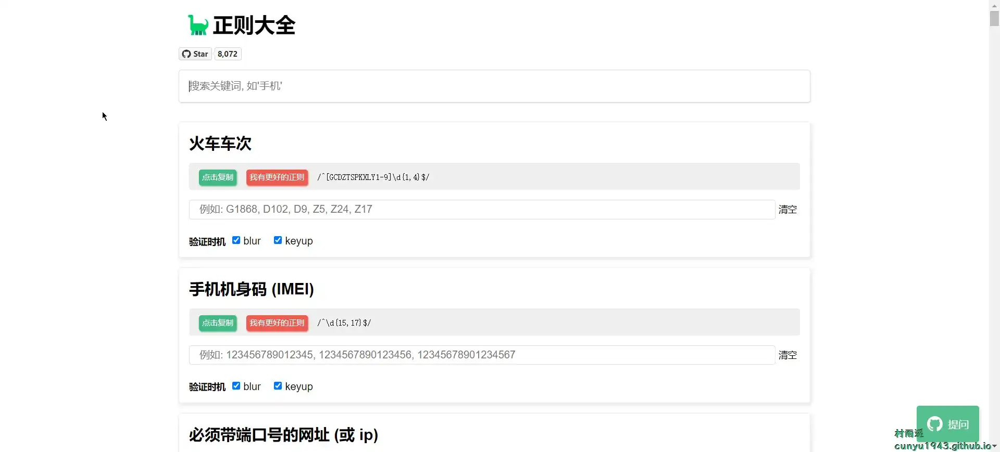
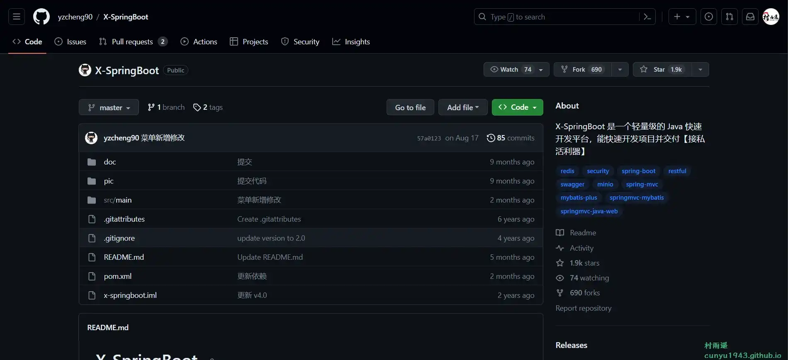

# 好物周刊#35：

::: info 共勉
不要哀求，学会争取。若是如此，终有所获。
:::
::: tip 原文

:::

## 一、项目

### 1. [正则大全](https://github.com/any86/any-rule)

常用正则大全，支持 `web`/`vscode`/`idea`/`Alfred Workflow` 多平台。

### 2. [X-SpringBoot](https://github.com/yzcheng90/X-SpringBoot)

一个轻量级的 `Java` 快速开发平台，基于各大开源项目组合而来，用于快速构建中小型 `API`、`RESTful API` 项目，该项目已经有过多个真实项目的实践，稳定、简单、快速，使我们摆脱那些重复劳动。具有以下特点：

- 本项目已大量重构，精简了大量代码减少第三方依赖，最干净的脚手架。
- 引入了 `Lombok` 大量简化了代码
- 引入了 `MyBatis Plus` 大量简化了 `SQL`
- 引入 `Hutool` 工具包 规范工具类
- 引入 `minio` 分布式文件系统
- 引入 `autoFull` 自动填充绑定框架，多表关联不用写 `sql`
- 前后端完全脱离，前端代码可单独部署
- 自定义 `Spring Security` 支持获取 `token`

### 3. [hexo-theme-redefine](https://github.com/EvanNotFound/hexo-theme-redefine)

基于 `Keep` 早期版本，改了样式以及增加了各种功能，主打现代设计 / 简洁界面，让你可以专注于文章创作。

## 二、软件

### 1. [Pot](https://github.com/pot-app/pot-desktop)

一个跨平台的划词翻译和 `OCR` 软件，支持如下功能：

- 划词翻译	
- 输入翻译	
- 外部调用
- 剪切板监听模式	
- 截图 `OCR`	
- 截图翻译

### 2. [Easydict](https://github.com/tisfeng/Easydict)

一个简洁优雅的词典翻译 `macOS App`。开箱即用，支持离线 `OCR` 识别，支持有道词典，苹果系统词典，苹果系统翻译，`ChatGPT`，`DeepL`，`Google`，`Bing`，百度和火山翻译。

### 3. [方方格子](http://www.ffcell.com/)

`Excel` 工具箱，包含了上百个使用功能：文本处理、批量录入、删除工具、合并转换、重复值工具、数据对比、高级排序、颜色排序、合并单元格排序、 聚光灯、宏收纳箱等。

## 三、网站

### 1. [StrawBerry Icon](https://chuangzaoshi.com/icon/)

一款为开发者和创造者设计的免费开源小众图标库，设计师独立绘制，免费开源。

### 2. [图标搜索网](https://www.easyicon.cc/)

提供超过六十万个 `SVG`、`PNG`、`ICO`、`ICNS` 图标搜索、图标下载服务。

### 3. [IconStore](https://iconstore.co/)

`IconStore` 是一个由才华横溢的设计师创建的免费矢量(`SVG`)图标库，可供下载用于商业用途。

## 四、插件

## 五、资料

### 1. [nlp_paper_study](https://github.com/km1994/nlp_paper_study)

主要记录 `NLP` 算法工程师相关的顶会论文研读笔记。

### 2. [C++ 那些事](https://github.com/Light-City/CPlusPlusThings)

一个适合初学者从入门到进阶的仓库，解决了面试者与学习者想要深入 `C++` 及如何入坑 `C++` 的问题。除此之外，本仓库拓展了更加深入的源码分析，多线程并发等的知识，是一个比较全面的 `C++` 学习从入门到进阶提升的仓库。

### 3. [interview](https://github.com/huihut/interview)

`C/C++` 技术面试基础知识总结，包括语言、程序库、数据结构、算法、系统、网络、链接装载库等知识及面试经验、招聘、内推等信息。

## ✍️ 说明

周刊专栏相关信息：

- **项目地址**：[Github](https://github.com/cunyu1943/JavaPark/) | [Gitee](https://gitee.com/cunyu1943/JavaPark/) ，觉得不错麻烦给我一个**Star**，感谢 ❤️
- **浏览地址**：公众号 | [电子书](https://cunyu1943.github.io/) | [电子书（国内）](https://cunyu1943.gitee.io/) | [语雀](https://yuque.com/cunyu1943)

如果你阅读到这里，说明我的工作没有白费。如果你想推荐项目/网站/软件/资源，欢迎提交 **[issue](https://github.com/cunyu1943/JavaPark/issues)** 或者添加我 **个人微信：cunyu1943** 与我交流。

---

## 🎬️ 广告

当前大环境下，就业形势严峻，尤其针对即将毕业的大学生。作为一个技术求职者，求职前应该做好哪些准备呢，一些面试实战技巧也十分有必要！而刚好最近掘金出了一本《技术人求职指南》小册，相信一定会对在找工作的你有所帮助。

从求职到拿下 `Offer`，一本职场的全方位攻略，快来和我一起学习吧！

## ⏳ 联系

想解锁更多知识？不妨关注我的微信公众号：**村雨遥（id：JavaPark）**。

扫一扫，探索另一个全新的世界。

<Share colorful />