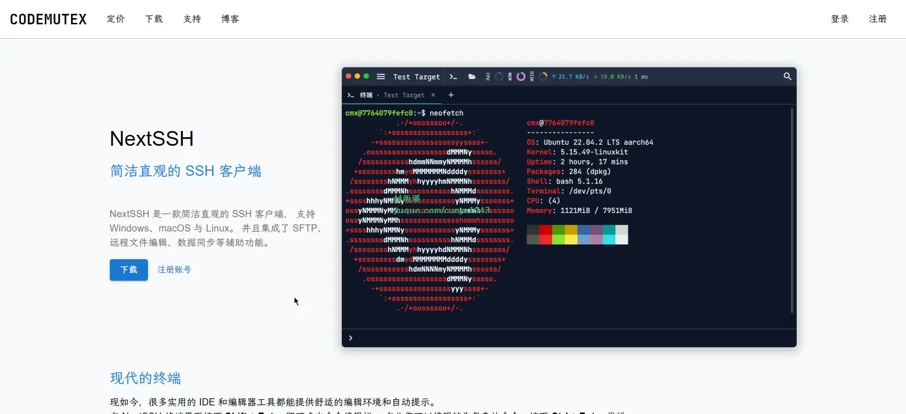
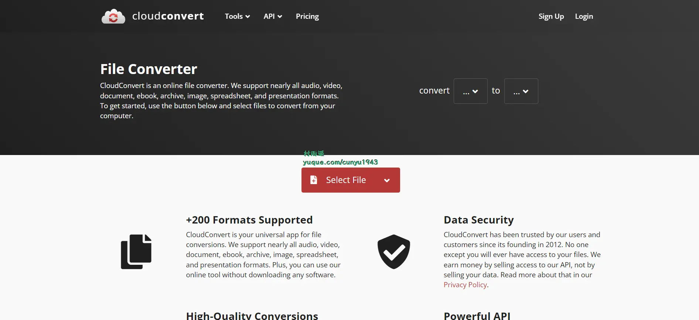
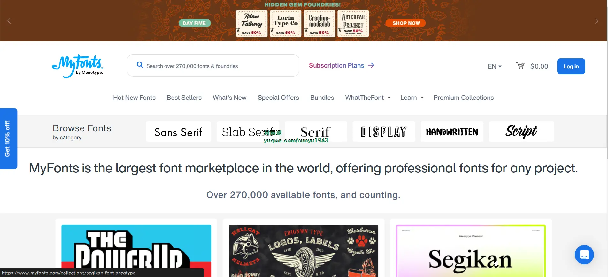
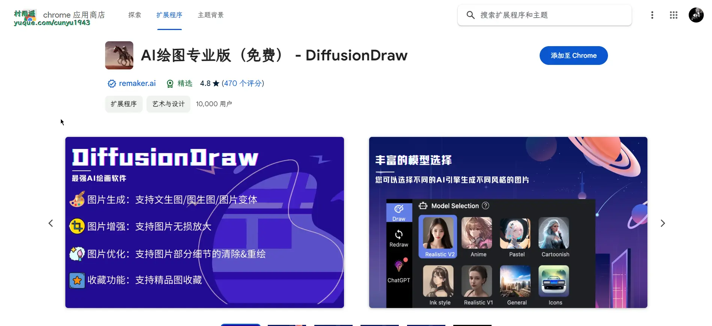
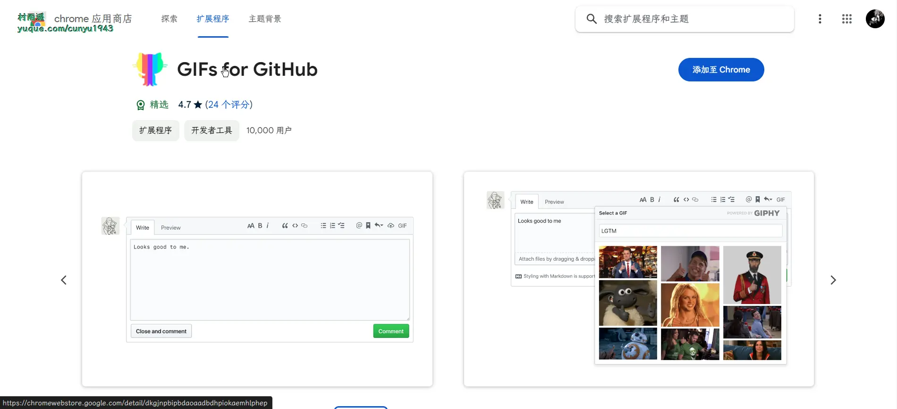
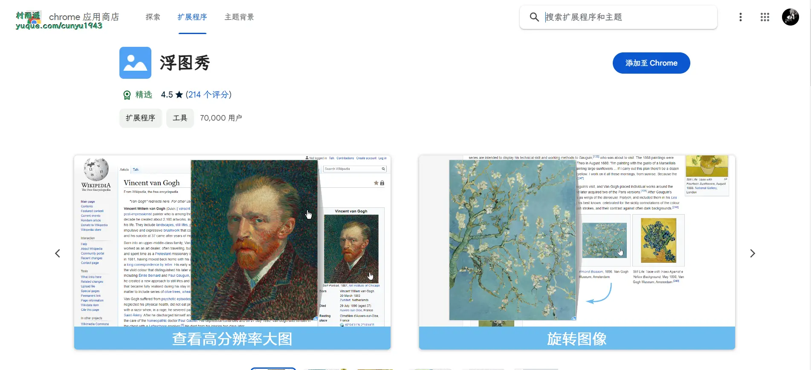
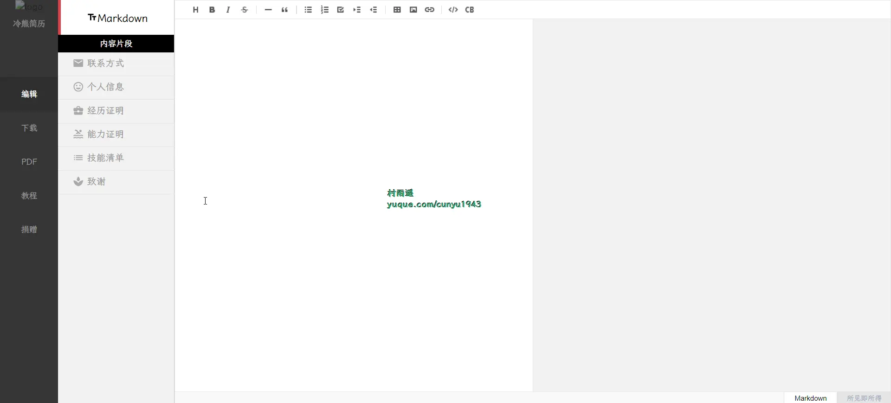
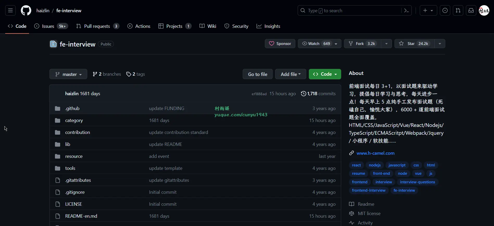
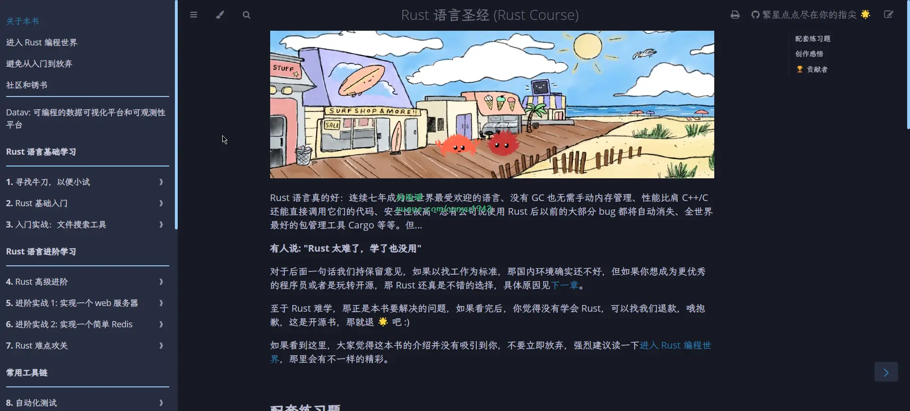

# 好物周刊#36：程序员简历

::: info 共勉
不要哀求，学会争取。若是如此，终有所获。
:::
::: tip 原文
https://mp.weixin.qq.com/s/z2ahY98Jwq-O8sBxTz9oTw
:::

## 一、项目

### 1. [SmartDNS](https://github.com/pymumu/smartdns)

一个运行在本地的 `DNS` 服务器，它接受来自本地客户端的 `DNS` 查询请求，然后从多个上游 `DNS` 服务器获取 `DNS` 查询结果，并将访问速度最快的结果返回给客户端，以此提高网络访问速度。 `SmartDNS` 同时支持指定特定域名 `IP` 地址，并高性匹配，可达到过滤广告的效果；支持 `DOT` (`DNS over TLS`) 和 `DOH` (`DNS over HTTPS`)，更好的保护隐私。

### 2. [Github520](https://github.com/521xueweihan/GitHub520)

让你 “爱” 上 `GitHub`，无需安装即可解决访问时图裂、加载慢的问题。

### 3. [Screw](https://github.com/pingfangushi/screw)

简洁好用的数据库表结构文档生成器。具有以下特点：
- 简洁、轻量、设计良好
- 多数据库支持
- 多种格式文档
- 灵活扩展
- 支持自定义模板

目前已支持如下数据库：
 - `MySQL`
 - `MariaDB`
 - `TIDB`
 - `Oracle`
 - `SqlServer`
 - `PostgreSQL`
 - `Cache DB（2016）`

## 二、软件

### 1. [树图](https://shutu.cn/)

新一代 “AI 智能” 思维导图。上传文档，AI 一键总结归纳为导图；输入想法，AI 一键生成思维导图；海量导图模板与素材的应用、文件跨平台云同步、多人同时在线协作，助力学习、工作的效率提升。

### 2. [NextSSH](https://codemutex.com/)

一款简洁直观的 `SSH` 客户端， 支持 `Windows`、`macOS` 与 `Linux`。 并且集成了 `SFTP`、远程文件编辑、数据同步等辅助功能。

### 3. [IDM](https://www.internetdownloadmanager.com/)

一款独特的下载工具，它不仅拥有续传功能并且可以提升你的下载速度最多达 5 倍。`IDM` 可以充分利用您的下载速度快速下载资源，支持所有的浏览器下载！

## 三、网站

### 1. [CloudConvert](https://cloudconvert.com/)

云端在线图片格式转换网站，支持 200+ 种格式，具有数据安全、转换质量高、功能强大的特点。

### 2. [360 查字体](https://fonts.safe.360.cn/)

查询字体版权，能否用于商业用途，避免侵权纠纷。

### 3. [MyFonts](https://www.myfonts.com/)

世界上最大的字体市场，这里有最新时尚的商业英文字体，能为任何项目提供专业字体，超过 270000 种可用字体，而且还在不断增加。

## 四、插件

### 1. [AI 绘图专业版（免费）](https://chromewebstore.google.com/detail/ai绘图专业版（免费）-diffusiondraw/cmjfnhommnnaihollaikfdblblpmibep)

专注 `AI` 图像生成，内置 `Midjourney` 等多种图像模型，两步快速得到创意图像，适用于艺术设计、品牌推广、广告创意、电商展示等领域。主要具有如下功能：

-   文生图：利用智能算法将文本转化为艺术风格图像，实现快速创作。
-   图生图：通过先进 `AI` 技术，重新组合、融合图像，创造全新的创意图像。
-   图像变形：利用 `AI` 技术对图像进行变形处理，赋予作品独特的视觉效果。
-   图像无损放大：使用高级放大算法，实现图像的无损放大，保持高质量细节。
-   图像局部重绘：通过 `AI` 技术局部绘制图像，修复损坏区域或增添细节。
-   图像内容去除：智能识别并自动移除图像中不需要的元素，简化编辑过程。
-   自带提示语生成器：内置生成器产生创作灵感，助您开启创意之旅。
-   `AI` 图像生成高级参数设置：提供丰富的参数设置，让您更精准地掌控图像生成过程。
-   `AI` 引擎类型丰富：支持多种风格的图像生成，包括彩色动漫、写实、油墨风、二次元、动画风、AI生成 `APP` 图标等。

### 2. [Gifs for Github](https://chromewebstore.google.com/detail/gifs-for-github/dkgjnpbipbdaoaadbdhpiokaemhlphep)

轻松搜索 `GIPHY`，将 `GIF` 添加到任何 `GitHub` 评论框中。

### 3. [浮图秀](https://chromewebstore.google.com/detail/浮图秀/mgpdnhlllbpncjpgokgfogidhoegebod)

一款帮助用户快速查看页面中缩略图对应“大图”的浏览器插件。对于所支持的网站，用户鼠标悬停在缩略图时即可看到相应的高分辨率图片。目前支持的网站包括京东、天猫、淘宝、知乎、微博等 140 余个网站/域名并在不断扩展中。

## 五、资料

### 1. [ResumeSample](https://github.com/geekcompany/ResumeSample)

程序员简历模板系列。包括 `PHP` 程序员简历模板、`iOS` 程序员简历模板、`Android` 程序员简历模板、`Web` 前端程序员简历模板、`Java` 程序员简历模板、`C/C++` 程序员简历模板、`NodeJS` 程序员简历模板、架构师简历模板以及通用程序员简历模板。

### 2. [fe-interview](https://github.com/haizlin/fe-interview)

前端面试每日 3+1，以面试题来驱动学习，提倡每日学习与思考，每天进步一点！每天早上 5 点纯手工发布面试题（死磕自己，愉悦大家），6000+ 道前端面试题全面覆盖。

### 3. [Rust 语言圣经](https://github.com/sunface/rust-course)

涵盖从入门到精通所需的 `Rust` 知识，目录及内容都经过深思熟虑的设计，同时语言生动幽默，行文流畅自如，摆脱技术书籍常有的机器味和晦涩感。

## ✍️ 说明

周刊专栏相关信息：

- **项目地址**：[Github](https://github.com/cunyu1943/JavaPark/) | [Gitee](https://gitee.com/cunyu1943/JavaPark/) ，觉得不错麻烦给我一个**Star**，感谢 ❤️
- **浏览地址**：公众号 | [电子书](https://cunyu1943.github.io/) | [电子书（国内）](https://cunyu1943.gitee.io/) | [语雀](https://yuque.com/cunyu1943)

如果你阅读到这里，说明我的工作没有白费。如果你想推荐项目/网站/软件/资源，欢迎提交 **[issue](https://github.com/cunyu1943/JavaPark/issues)** 或者添加我 **个人微信：cunyu1943** 与我交流。

---

## 🎬️ 广告

当前大环境下，就业形势严峻，尤其针对即将毕业的大学生。作为一个技术求职者，求职前应该做好哪些准备呢，一些面试实战技巧也十分有必要！而刚好最近掘金出了一本《技术人求职指南》小册，相信一定会对在找工作的你有所帮助。

从求职到拿下 `Offer`，一本职场的全方位攻略，快来和我一起学习吧！

## ⏳ 联系

想解锁更多知识？不妨关注我的微信公众号：**村雨遥（id：JavaPark）**。

扫一扫，探索另一个全新的世界。

<Share colorful />