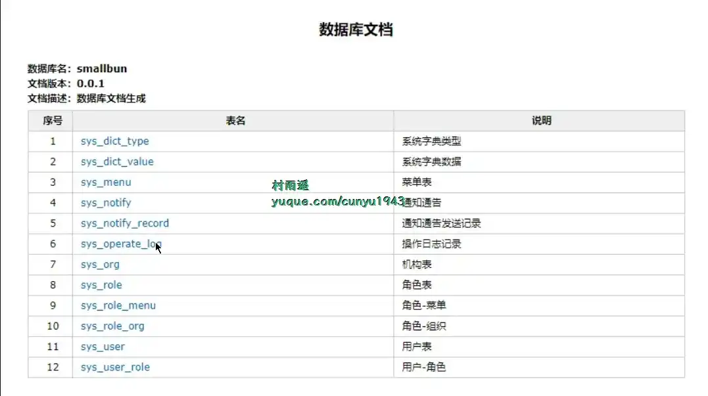

# 好物周刊#36：

::: info 共勉
不要哀求，学会争取。若是如此，终有所获。
:::
::: tip 原文

:::

## 一、项目

### 1. [SmartDNS](https://github.com/pymumu/smartdns)

一个运行在本地的 `DNS` 服务器，它接受来自本地客户端的 `DNS` 查询请求，然后从多个上游 `DNS` 服务器获取 `DNS` 查询结果，并将访问速度最快的结果返回给客户端，以此提高网络访问速度。 `SmartDNS` 同时支持指定特定域名 `IP` 地址，并高性匹配，可达到过滤广告的效果；支持 `DOT` (`DNS over TLS`) 和 `DOH` (`DNS over HTTPS`)，更好的保护隐私。

### 2. [Github520](https://github.com/521xueweihan/GitHub520)

让你 “爱” 上 `GitHub`，无需安装即可解决访问时图裂、加载慢的问题。

### 3. [Screw](https://github.com/pingfangushi/screw)

简洁好用的数据库表结构文档生成器。具有以下特点：
- 简洁、轻量、设计良好
- 多数据库支持
- 多种格式文档
- 灵活扩展
- 支持自定义模板

目前已支持如下数据库：
 - `MySQL`
 - `MariaDB`
 - `TIDB`
 - `Oracle`
 - `SqlServer`
 - `PostgreSQL`
 - `Cache DB（2016）`

## 二、软件

### 1. [树图](https://shutu.cn/)

新一代 “AI 智能” 思维导图。上传文档，AI 一键总结归纳为导图；输入想法，AI 一键生成思维导图；海量导图模板与素材的应用、文件跨平台云同步、多人同时在线协作，助力学习、工作的效率提升。

### 2. [NextSSH](https://codemutex.com/)

一款简洁直观的 `SSH` 客户端， 支持 `Windows`、`macOS` 与 `Linux`。 并且集成了 `SFTP`、远程文件编辑、数据同步等辅助功能。

## 三、网站

## 四、插件

## 五、资料

## ✍️ 说明

周刊专栏相关信息：

- **项目地址**：[Github](https://github.com/cunyu1943/JavaPark/) | [Gitee](https://gitee.com/cunyu1943/JavaPark/) ，觉得不错麻烦给我一个**Star**，感谢 ❤️
- **浏览地址**：公众号 | [电子书](https://cunyu1943.github.io/) | [电子书（国内）](https://cunyu1943.gitee.io/) | [语雀](https://yuque.com/cunyu1943)

如果你阅读到这里，说明我的工作没有白费。如果你想推荐项目/网站/软件/资源，欢迎提交 **[issue](https://github.com/cunyu1943/JavaPark/issues)** 或者添加我 **个人微信：cunyu1943** 与我交流。

---

## 🎬️ 广告

当前大环境下，就业形势严峻，尤其针对即将毕业的大学生。作为一个技术求职者，求职前应该做好哪些准备呢，一些面试实战技巧也十分有必要！而刚好最近掘金出了一本《技术人求职指南》小册，相信一定会对在找工作的你有所帮助。

从求职到拿下 `Offer`，一本职场的全方位攻略，快来和我一起学习吧！

## ⏳ 联系

想解锁更多知识？不妨关注我的微信公众号：**村雨遥（id：JavaPark）**。

扫一扫，探索另一个全新的世界。

<Share colorful />