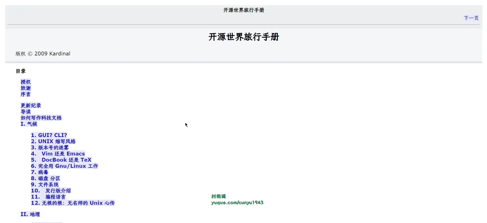

# 好物周刊#41：

::: info 共勉
不要哀求，学会争取。若是如此，终有所获。
:::
::: tip 原文

:::

## 一、项目

## 二、软件

### 1. [PixPin](https://pixpinapp.com/)

集截图/贴图/长截图/文字识别/标注功能于一身。

功能强大使用简单的截图/贴图工具，帮助你提高效率。

### 2. [团子翻译器](https://github.com/PantsuDango/Dango-Translator)

一款生肉翻译软件，通过 OCR 识别屏幕特定范围内的文字，然后将识别到的文字调取各种翻译源，并实时输出翻译结果。

软件具有如下特点：

- 搭载了离线 OCR
- 搭载了在线 OCR 和漫画 OCR
- 实现自动模式，实时识别区域内的文本并翻译
- 配置了 15 种翻译源
- 账号系统，能够自动云端保存配置
- 另有图片翻译功能，实现对生肉漫画图片自动识别、翻译、消字、嵌字

### 3. [Apipost](https://www.apipost.cn/)

集 API 设计、API 调试、API 文档、自动化测试为一体的 API 研发协同平台，支持 grpc、http、websocket、socketio、socketjs 类型接口调试，支持私有化部署。

## 三、网站

### 1. [熊猫搜索](https://xmsoushu.com/)

熊猫搜索，熊猫搜书，聚合电子书、文档搜索引擎，一站式搜索导航，方便快速导航搜索全网资源，读书学习必备导航站。

### 2. [ChatPaper](https://github.com/kaixindelele/ChatPaper)

全流程加速科研，利用 chatgpt 进行论文全文总结 + 专业翻译 + 润色 + 审稿 + 审稿回复。

### 3. [MACYY](https://www.macyy.cn/)

Mac 破解软件分享中心。

## 四、插件

## 五、资料

### 1. [开源世界旅行手册](https://i.linuxtoy.org/docs/guide/index.html)

本书分为四个部分：气候、地理、景观、地质。

气候篇中的内容为课外读物，包括一些杂谈随笔，可以增长知识。

地理篇为必修课，它是这本书的核心，包含一些基本教程。这一部分的内容，建议熟读。

景观篇为选修课，里面的内容为实用的解决方案，但并不是每个人都需要。

地质篇的内容为开源运动史。

### 2. [Zephyr OS 文档](https://github.com/chunhuajiang/zephyr-doc)

Zephyr Project 官方文档的中文翻译版。

## ✍️ 说明

周刊专栏相关信息：

- **项目地址**：[Github](https://github.com/cunyu1943/JavaPark/) | [Gitee](https://gitee.com/cunyu1943/JavaPark/) ，觉得不错麻烦给我一个**Star**，感谢 ❤️
- **浏览地址**：公众号 | [电子书](https://cunyu1943.github.io/) | [电子书（国内）](https://cunyu1943.gitee.io/) | [语雀](https://yuque.com/cunyu1943)

如果你阅读到这里，说明我的工作没有白费。如果你想推荐项目/网站/软件/资源，欢迎提交 **[issue](https://github.com/cunyu1943/JavaPark/issues)** 或者添加我 **个人微信：cunyu1943** 与我交流。

## ⏳ 联系

想解锁更多知识？不妨关注我的微信公众号：**村雨遥（id：JavaPark）**。

扫一扫，探索另一个全新的世界。

<Share colorful />