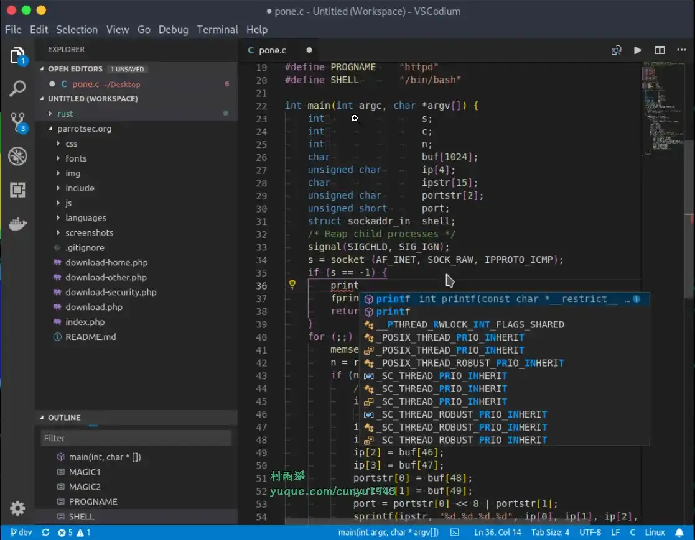
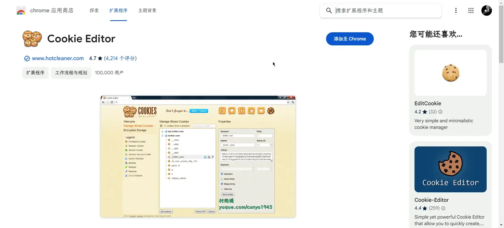
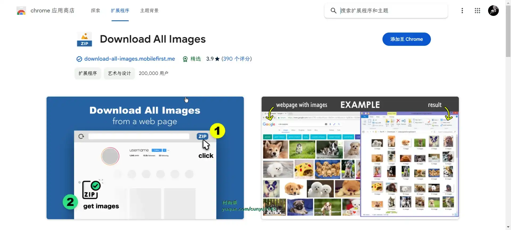

# 好物周刊#46：

::: info 共勉
不要哀求，学会争取。若是如此，终有所获。
:::
::: tip 原文

:::

## 一、项目

## 二、软件

### 1. [VSCodium](https://vscodium.com/)

基于 `VS Code`，由社区驱动、授权免费许可的二进制发行版。

## 三、网站

## 四、插件

### 1. [Cookie Editor](https://chromewebstore.google.com/detail/cookie-editor/iphcomljdfghbkdcfndaijbokpgddeno?hl=zh-CN)

功能强大的 Cookie 管理器，支持编辑、新增、导入、导出 Cookie。

### 2. [Download All Images](https://chromewebstore.google.com/detail/download-all-images/ifipmflagepipjokmbdecpmjbibjnakm?hl=zh-CN)

安装后，一键点击即可自动将当前页面的所有图片打包成 zip 下载到本地，无需单独操作。

## 五、资料

## ✍️ 说明

周刊专栏相关信息：

- **项目地址**：[Github](https://github.com/cunyu1943/JavaPark/) | [Gitee](https://gitee.com/cunyu1943/JavaPark/) ，觉得不错麻烦给我一个**Star**，感谢 ❤️
- **浏览地址**：公众号 | [电子书](https://cunyu1943.github.io/) | [电子书（国内）](https://cunyu1943.gitee.io/) | [语雀](https://yuque.com/cunyu1943)

如果你阅读到这里，说明我的工作没有白费。如果你想推荐项目/网站/软件/资源，欢迎提交 **[issue](https://github.com/cunyu1943/JavaPark/issues)** 或者添加我 **个人微信：cunyu1943** 与我交流。

---

## ⏳ 联系

想解锁更多知识？不妨关注我的微信公众号：**村雨遥（id：JavaPark）**。

扫一扫，探索另一个全新的世界。

<Share colorful />

