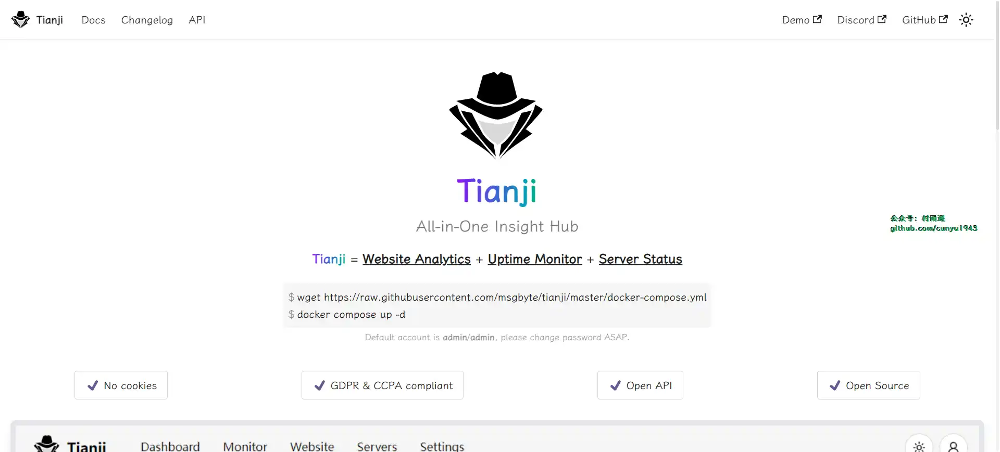
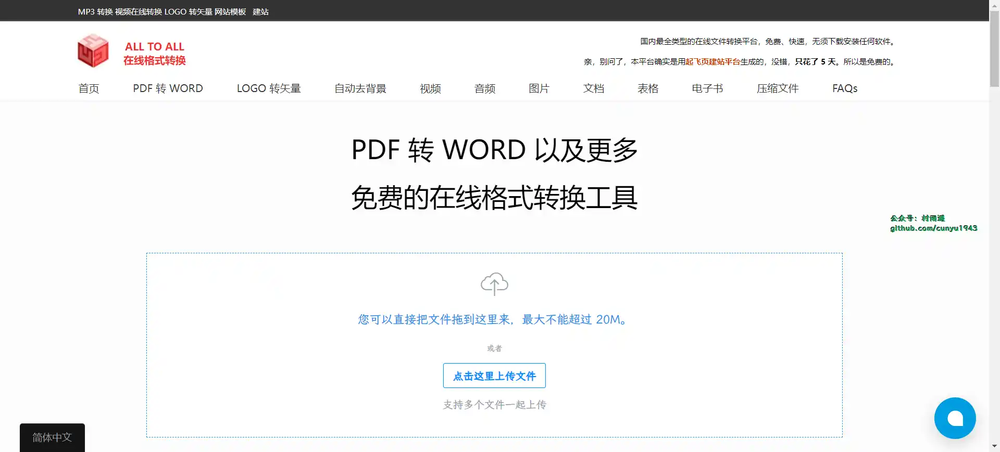
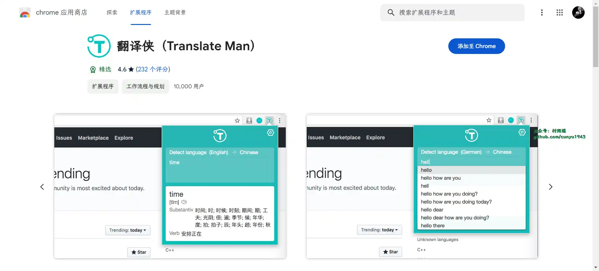

# 好物周刊#47：

::: info 共勉
不要哀求，学会争取。若是如此，终有所获。
:::
::: tip 原文

:::

## 一、项目

### 1. [Tianji](https://github.com/msgbyte/tianji)

`All-in-One` 的数据洞察中心，同时具备网站分析器 + 状态监控器 + 服务状态上报的功能。

## 二、软件

## 三、网站

### 1. [All To All](https://www.alltoall.net/)

国最全面的格式转换平台。支持约 200 多种格式的文件转换，包括：视频、音频、图片、字体等多媒体文件，以及常见的 `office` 文件、`PDF`、电子书等文档。

### 2. [致美化](https://zhutix.com/)

致美化是国内最专业的视觉美化研究平台，聚集了超过 50 万的活跃用户，你可以在此个性化你的设备，探索及下载丰富多彩的电脑主题、壁纸、图标、皮肤等酷炫的美化素材及教程。

### 3. [Win 7](https://www.newxitong.com/)

专注于 `Win7` 系列作品是吻妻出品，一直专注于 `win7`，致力于分享最新最好用的 `Windows7` 纯净旗舰版系统下载，而吻妻是一位有态度，有原则的不随波逐流的系统爱好者。

## 四、插件

### 1. [翻译侠](https://chromewebstore.google.com/detail/翻译侠（translate-man）/fapgabkkfcaejckbfmfcdgnfefbmlion)

支持划词翻译，即指即译，自动识别语言，支持上百种语言，专为国内用户优化，采用谷歌翻译接口，人性化界面。

## 五、资料

## ✍️ 说明

周刊专栏相关信息：

- **项目地址**：[Github](https://github.com/cunyu1943/JavaPark/) | [Gitee](https://gitee.com/cunyu1943/JavaPark/) ，觉得不错麻烦给我一个**Star**，感谢 ❤️
- **浏览地址**：公众号 | [电子书](https://cunyu1943.github.io/) | [电子书（国内）](https://cunyu1943.gitee.io/) | [语雀](https://yuque.com/cunyu1943)

如果你阅读到这里，说明我的工作没有白费。如果你想推荐项目/网站/软件/资源，欢迎提交 **[issue](https://github.com/cunyu1943/JavaPark/issues)** 或者添加我 **个人微信：cunyu1943** 与我交流。

---

## ⏳ 联系

想解锁更多知识？不妨关注我的微信公众号：**村雨遥（id：JavaPark）**。

扫一扫，探索另一个全新的世界。

<Share colorful />

