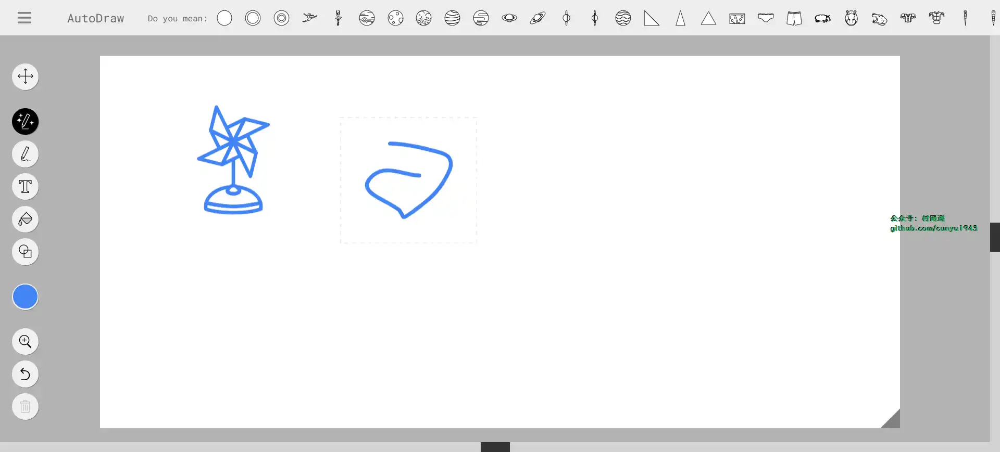
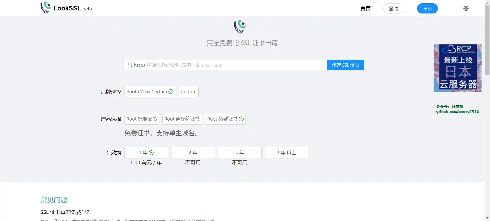
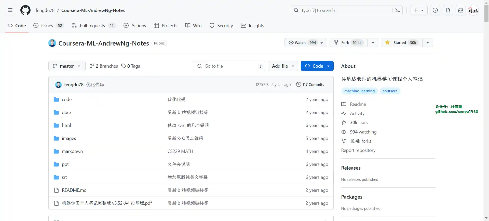

# 好物周刊#48：

::: info 共勉
不要哀求，学会争取。若是如此，终有所获。
:::
::: tip 原文

:::

## 一、项目

## 二、软件

## 三、网站

### 1. [AutoDraw](https://www.autodraw.com/)

### 2. [LookSSL](https://www.lookssl.com/)

`SSL` 证书申请网站，既可以申请免费的，也可以支持单主域名和多个扩展域名的标准证书，还支持申请泛主域名和多个扩展域名的泛域名证书。

### 3. [51LA](https://www.51.la/)

专注网站统计与数据分析行业 20 年，以数据统计分析为核心，驱动产品设计与运营策略，深入挖掘用户和产品需求，赋能商业决策。旗下拥有 51.LA  网站统计等多个数据分析平台，目前累计超过千万应用提供流量统计服务，致力于为开发者及中小企业提供专业的数据服务工具和解决方案。

## 四、插件

## 五、资料

### 1. [吴恩达机器学习笔记](https://github.com/fengdu78/Coursera-ML-AndrewNg-Notes)

吴恩达老师的机器学习课程个人笔记

## ✍️ 说明

周刊专栏相关信息：

- **项目地址**：[Github](https://github.com/cunyu1943/JavaPark/) | [Gitee](https://gitee.com/cunyu1943/JavaPark/) ，觉得不错麻烦给我一个**Star**，感谢 ❤️
- **浏览地址**：公众号 | [电子书](https://cunyu1943.github.io/) | [电子书（国内）](https://cunyu1943.gitee.io/) | [语雀](https://yuque.com/cunyu1943)

如果你阅读到这里，说明我的工作没有白费。如果你想推荐项目/网站/软件/资源，欢迎提交 **[issue](https://github.com/cunyu1943/JavaPark/issues)** 或者添加我 **个人微信：cunyu1943** 与我交流。

---

## ⏳ 联系

想解锁更多知识？不妨关注我的微信公众号：**村雨遥（id：JavaPark）**。

扫一扫，探索另一个全新的世界。

<Share colorful />

