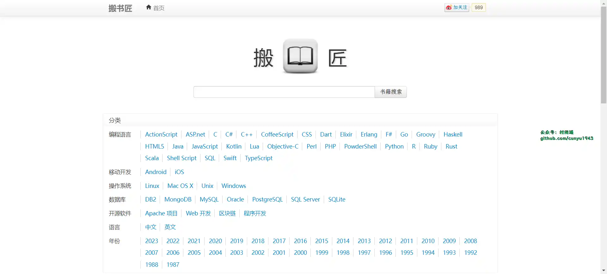
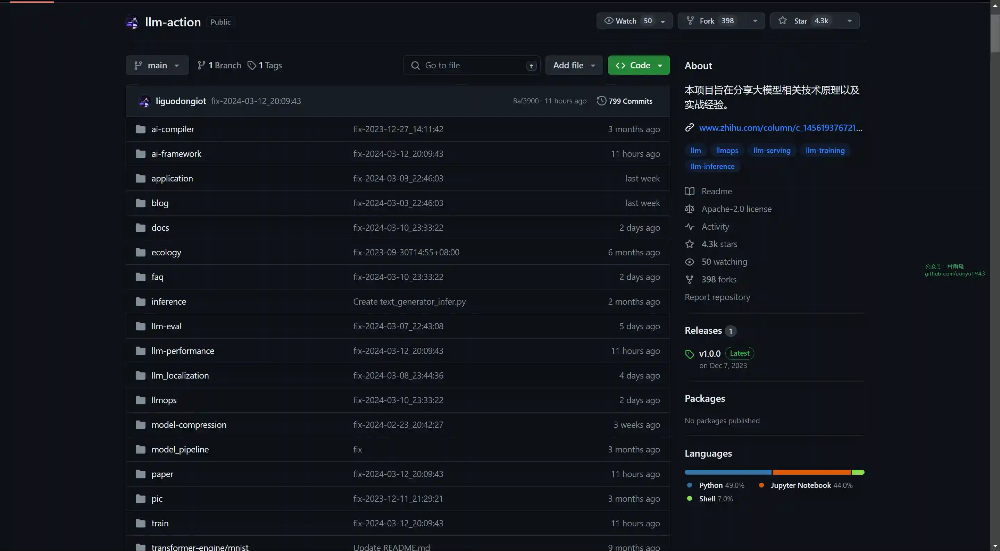
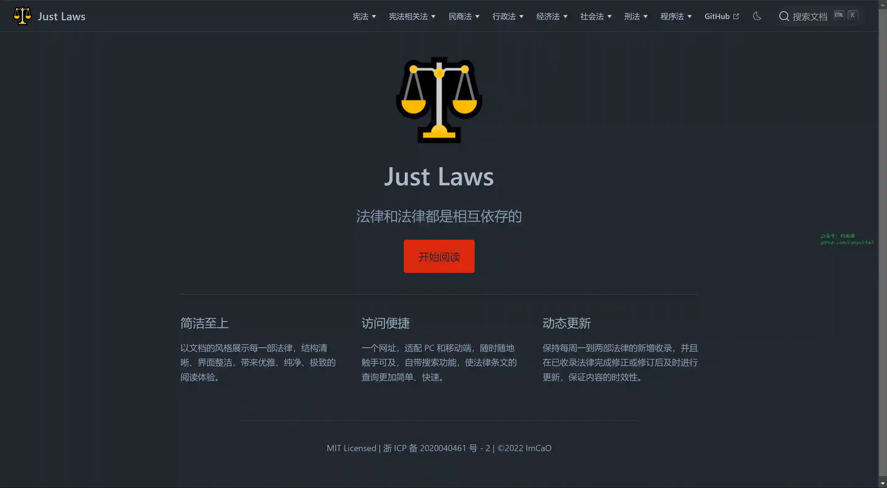
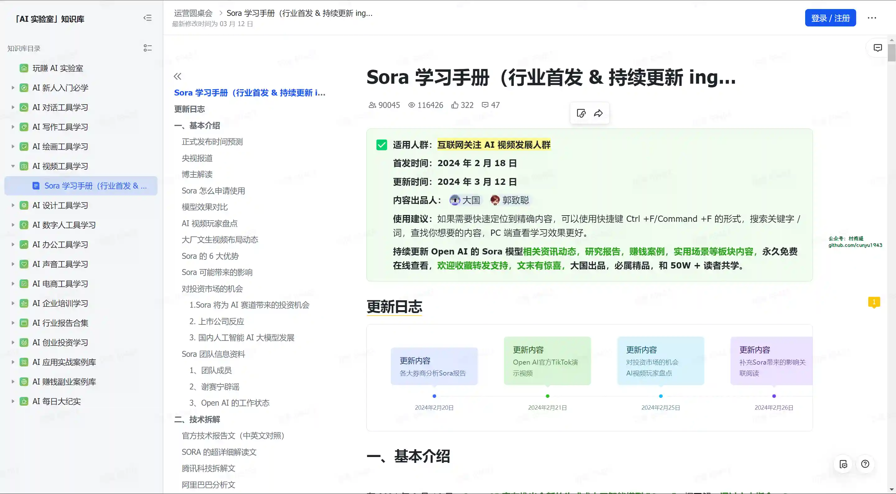

# 好物周刊#50：

::: info 共勉
不要哀求，学会争取。若是如此，终有所获。
:::
::: tip 原文

:::

## 一、项目

## 二、软件

## 三、网站

### 1. [面试狗](https://interview.dog)

面试神器|辅助面试|面试助手，史上最强面试辅助工具。实时面试助手，快速识别面试官问题，自动回答。

### 2. [3D 卡通头像](https://peeps.ui8.net/)

### 3. [搬书匠](http://www.banshujiang.cn/)

汇聚国内外计算机类图书，主要有编程语言、移动开发、操作系统、数据库、开源软件等类目。

## 四、插件

## 五、资料

### 1. [LLM-Action](https://github.com/liguodongiot/llm-action)

分享大模型相关技术原理以及实战经验，`Slogan` 是让天下没有难学的大模型。

### 2. [Just Laws](https://github.com/ImCa0/just-laws)

一个简洁、便捷的中国法律文库。具有如下特点：

-   简洁至上

    以文档的风格展示每一部法律，结构清晰、界面整洁，带来优雅、纯净、极致的阅读体验。

-   访问便捷

    一个网址，适配 `PC` 和移动端，随时随地触手可及，自带搜索功能，使法律条文的查询更加简单、快速。

-   动态更新

    保持每周一到两部法律的新增收录，并且在已收录法律完成修正或修订后及时进行更新，保证内容的时效性。

### 3. [Sora 学习手册](https://yunyinghui.feishu.cn/wiki/BaCEwe3AliqYERkc9dVcfW0BnXg)

基于飞书文档发布，持续更新 `Sora` 模型的相关资讯动态、研究报告、实用场景等模块内容，承诺永久免费在线查看。

## ✍️ 说明

周刊专栏相关信息：

- **项目地址**：[Github](https://github.com/cunyu1943/JavaPark/) | [Gitee](https://gitee.com/cunyu1943/JavaPark/) ，觉得不错麻烦给我一个**Star**，感谢 ❤️
- **浏览地址**：公众号 | [电子书](https://cunyu1943.github.io/) | [电子书（国内）](https://cunyu1943.gitee.io/) | [语雀](https://yuque.com/cunyu1943)

如果你阅读到这里，说明我的工作没有白费。如果你想推荐项目/网站/软件/资源，欢迎提交 **[issue](https://github.com/cunyu1943/JavaPark/issues)** 或者添加我 **个人微信：cunyu1943** 与我交流。

---

## ⏳ 联系

想解锁更多知识？不妨关注我的微信公众号：**村雨遥（id：JavaPark）**。

扫一扫，探索另一个全新的世界。

<Share colorful />

