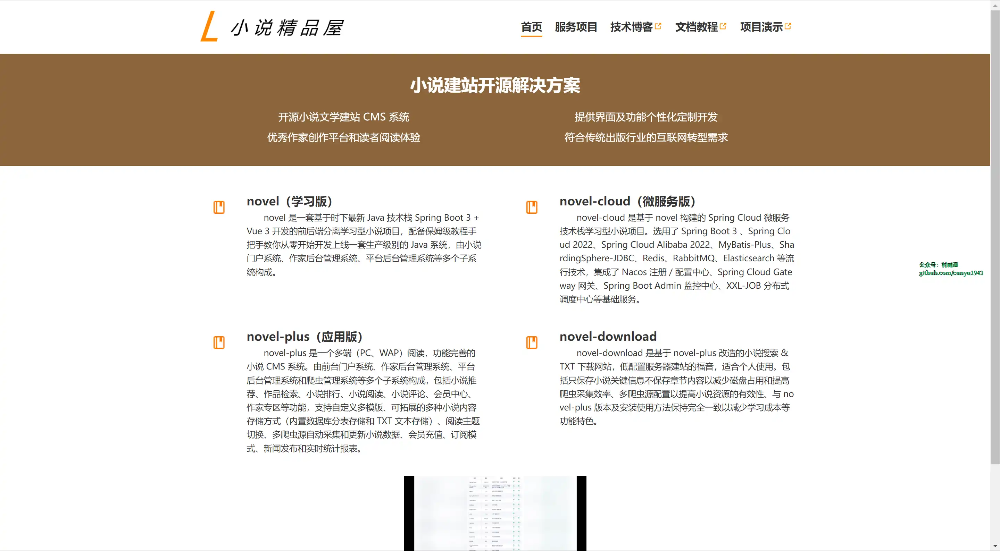
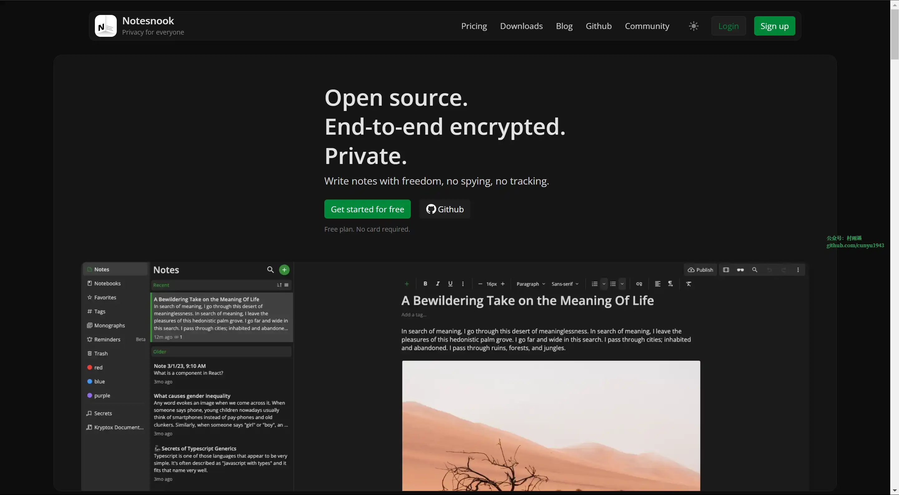
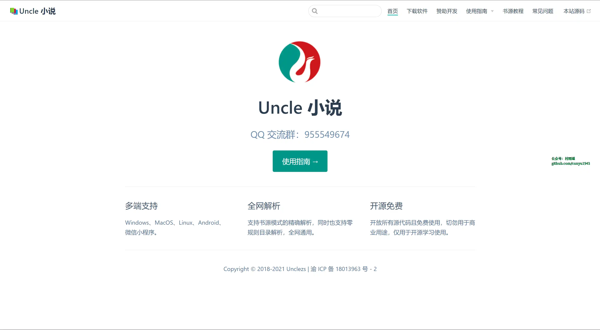
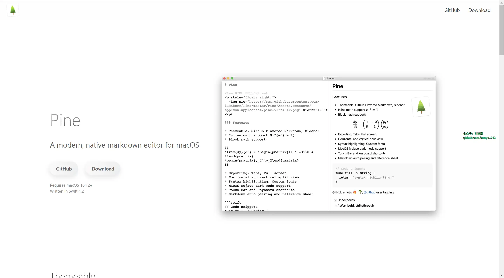
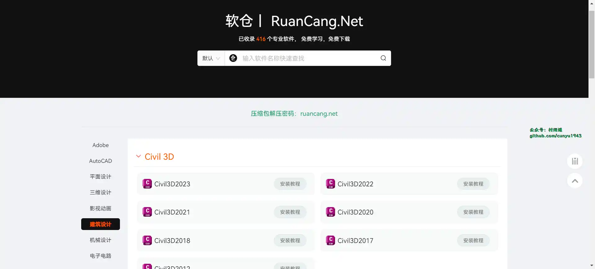
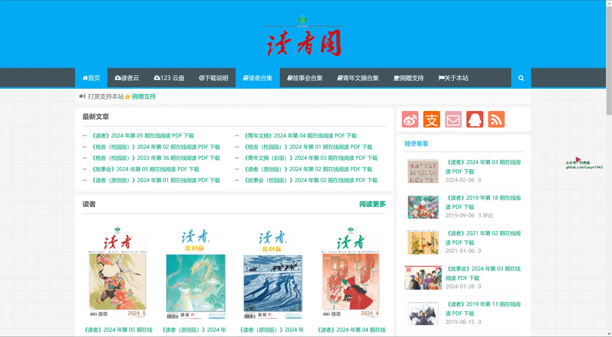
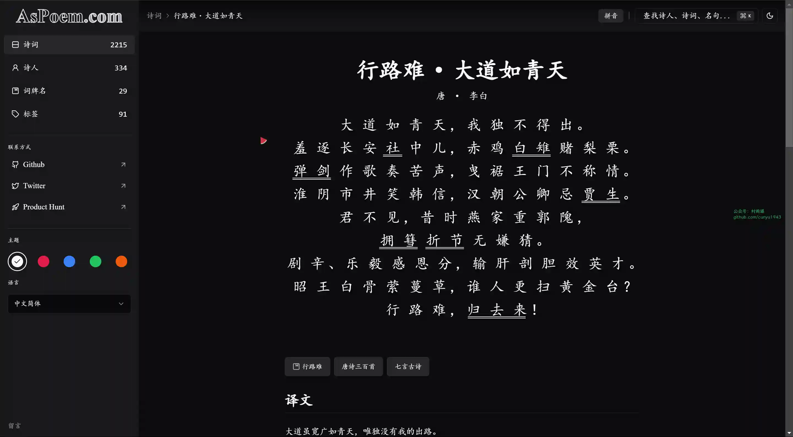
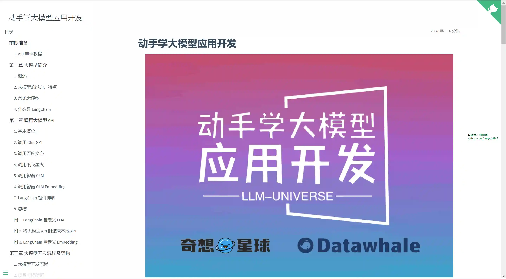
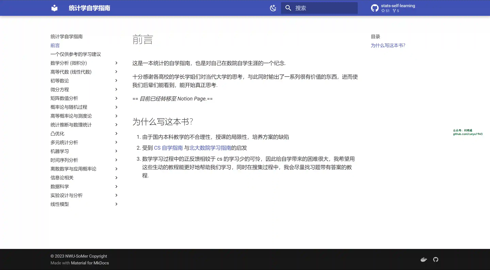
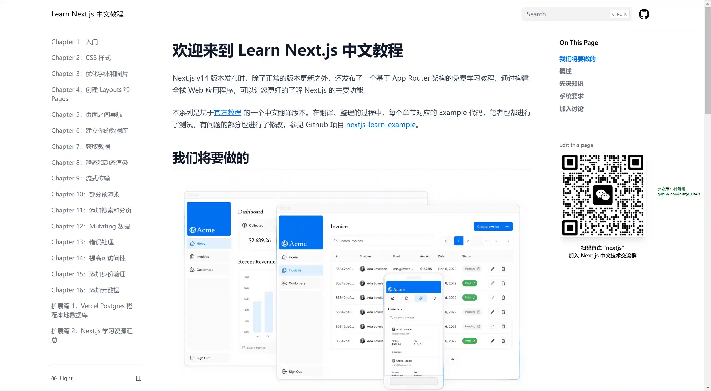

# 好物周刊#51：

::: info 共勉
不要哀求，学会争取。若是如此，终有所获。
:::
::: tip 原文

:::

## 一、项目

### 1. [novel-cloud](https://github.com/201206030/novel-cloud)

一套基于时下最新 Java 技术栈 `Spring Boot 3` + `Vue 3` 开发的前后端分离学习型小说项目，配备保姆级教程手把手教你从零开始开发上线一套生产级别的 `Java` 系统，由小说门户系统、作家后台管理系统、平台后台管理系统等多个子系统构成。包括小说推荐、作品检索、小说排行榜、小说阅读、小说评论、会员中心、作家专区、充值订阅、新闻发布等功能。

`novel-cloud` 是 `novel` 项目的微服务版本，基于 `Spring Cloud 2022` & `Spring Cloud Alibaba 2022` 构建，数据结构、后端接口和 `novel` 项目保持完全一致，`Vue 3` 开发的前端能无缝对接这两个项目。

## 二、软件

### 1. [Notesnook](https://github.com/streetwriters/notesnook)

一款开源的，支持端到端加密的的笔记软件，可以把它当作开源版本的 `Evernote`。

### 2. [Uncle 小说](https://github.com/uncle-novel/uncle-novel)

一个全网小说下载器及阅读器，目录解析与书源结合，支持有声小说与文本小说，可下载 `mobi`、`epub`、`txt` 格式文本小说。

### 3. [Pine](https://github.com/lukakerr/Pine)

一个轻量级的 `macOS` `Markdown` 编辑器,不同于传统文档编辑器，它更专注于写作者本身，在保持简洁的同时，它还通过以文档为核心的设计理念和兼具灵活性与专业性的数十项功能，赋予用户极高的效率与最大的可能性，同时还与 `Apple` 的原生设计风格融会贯通。

## 三、网站

### 1. [软仓](https://www.ruancang.net/)

软件收录仓库，截至目前已收录 **416** 个专业软件，提供免费学习，免费下载。

### 2. [读者阁](https://duzhege.cn/)

`PDF` 原貌版电子杂志免费在线阅读、下载。

### 3. [AsPoem](https://aspoem.com/zh-Hans)

现代化的中国诗词学习网站，提供全站搜索、拼音标注、注释和白话文翻译等功能。无论您对唐诗宋词感兴趣还是想深入学习，都是您的理想选择，从这里开始您的诗歌之旅！

## 四、插件

## 五、资料

### 1. [动手学大模型应用开发](https://github.com/datawhalechina/llm-universe)

一个面向小白开发者的大模型应用开发教程，旨在结合个人知识库助手项目，通过一个课程完成大模型开发的重点入门，主要内容包括：

-   大模型简介
-   如何调用大模型 `API`
-   大模型开发流程及架构
-   数据库搭建
-   `Prompt` 设计
-   迭代验证
-   前后端开发

### 2. [统计学自学指南](https://github.com/XuankaiWang/XuankaiWang.github.io)

一本统计的自学指南，也是作者对自己在数院自学生涯的一个纪念。

### 3. [Next.js 中文教程](https://github.com/qufei1993/nextjs-learn-cn)

基于官方教程的一个中文翻译版本。在翻译、整理的过程中，每个章节对应的 `Example` 代码，笔者也都进行了测试，有问题的部分也进行了修改。

## ✍️ 说明

周刊专栏相关信息：

- **项目地址**：[Github](https://github.com/cunyu1943/JavaPark/) | [Gitee](https://gitee.com/cunyu1943/JavaPark/) ，觉得不错麻烦给我一个**Star**，感谢 ❤️
- **浏览地址**：公众号 | [电子书](https://cunyu1943.github.io/) | [电子书（国内）](https://cunyu1943.gitee.io/) | [语雀](https://yuque.com/cunyu1943)

如果你阅读到这里，说明我的工作没有白费。如果你想推荐项目/网站/软件/资源，欢迎提交 **[issue](https://github.com/cunyu1943/JavaPark/issues)** 或者添加我 **个人微信：cunyu1943** 与我交流。

---

## ⏳ 联系

想解锁更多知识？不妨关注我的微信公众号：**村雨遥（id：JavaPark）**。

扫一扫，探索另一个全新的世界。

<Share colorful />

